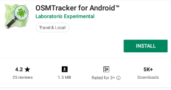
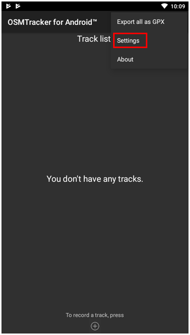
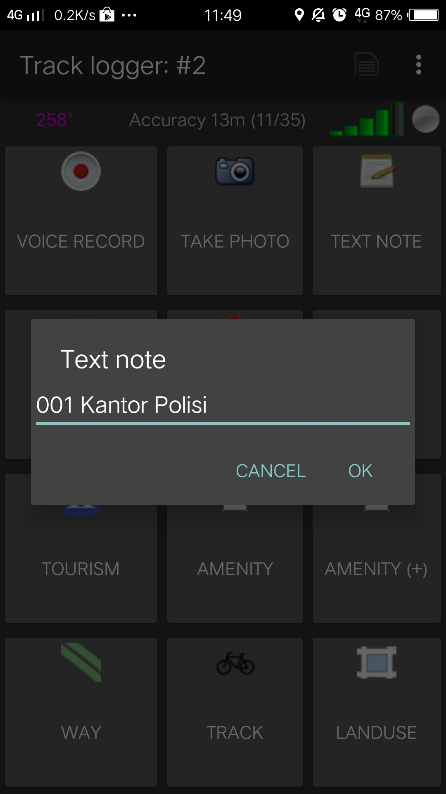
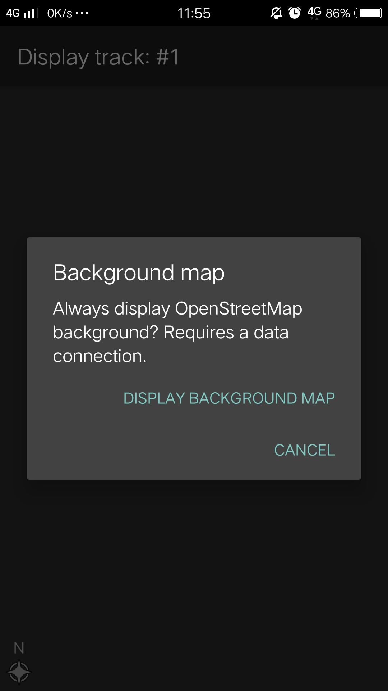
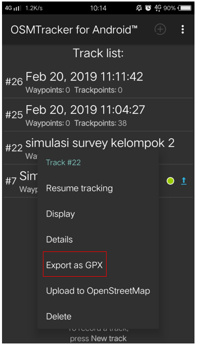
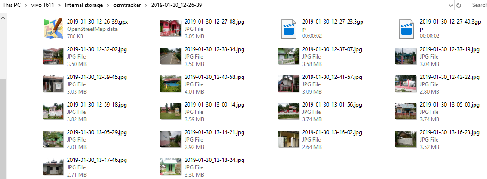
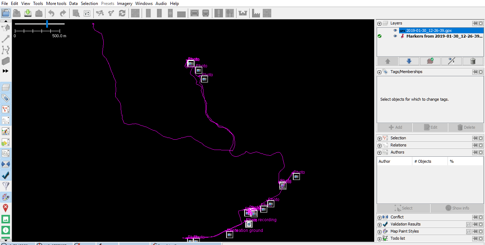

# Menggunakan Aplikasi _OSMTracker_
**Tujuan Pembelajaran:**

*   Menjelaskan _OSMTracker_ sebagai salah satu alat mengambil rute perjalanan dan pengambilan gambar objek
*   Mengoperasikan cara pengaturan awal untuk _OSMTracker_
*   Menerapkan cara penggunaan _OSMTracker_

### 1. Apa itu _OSMTracker_?

_OSMTracker_ adalah sebuah aplikasi android yang memungkinkan kita untuk mengambil data saat melakukan saat survei lapangan. Sama seperti GPS, _OSMTracker_ mampu untuk merekam _waypoint_ dan juga _track_ survei. Jika Anda ingin mengetahui tentang penggunaan GPS untuk survei lapangan, silakan Anda lihat Modul **Penggunaan GPS**. Salah satu keunggulan yang dimiliki oleh _OSMTracker_ adalah adanya fitur pengambilan foto objek pada saat melakukan survei. Foto ini akan mempermudah Anda pada saat melakukan pemetaan sehingga Anda dapat melihat kembali objek apa yang telah Anda survei. Hasil dari titik dan jalur survei yang telah diambil dapat diubah ke dalam bentuk _file_ _.gpx_ sehingga Anda dapat dengan mudah membuka data hasil survei Anda menggunakan aplikasi JOSM ataupun dapat langsung mengunggahnya ke dalam _OpenStreetMap_. 

Untuk dapat menggunakan _OSMTracker_ Anda harus melakukan instalasi terlebih dahulu melalui _Playstore_. Anda dapat membuka aplikasi _Google Playstore_ di perangkat _smartphone_ Anda kemudian ketik _“OSMTracker”_ pada kolom pencarian.

<i>Aplikasi OSMTracker dapat Anda download di Google Playstore</i>

Jika sudah selesai terpasang, silakan Anda buka aplikasi _OSMTracker_ pada _smartphone_ Anda.

<i>Tampilan awal aplikasi OSMTracker</i>

### 2. Pengaturan Awal _OSMTracker_
Sebelum Anda dapat menggunakan _OSMTracker_, ada beberapa pengaturan dasar yang harus Anda lakukan. Untuk dapat masuk ke dalam menu pengaturan silakan Anda pilih menu tombol 
 di sebelah kanan atas kemudian pilih **_Settings_**. 

<i>Memilih menu Settings di aplikasi OSMTracker</i>

Pada halaman _settings_ ada beberapa pengaturan yang perlu diperhatikan, seperti:

<i>Beberapa pengaturan pada halaman Settings</i>

1. _GPS logging interval_
    Pengaturan ini menentukan seberapa sering _OSMTracker_ merekam _track_ Anda. Semakin kecil angkanya maka semakin sering _OSMTracker_ akan melakukan perekaman. Pengaturan awal adalah 0 detik, artinya setiap saat _OSMTracker_ akan secara terus menerus melakukan perekaman trek. Hal ini tentunya akan sangat menghabiskan baterai perangkat _smartphone_ Anda. Ubahlah interval perekaman sesuai kebutuhan, misalnya menjadi 2 detik. 

2. _External storage (SD) directory_
    Pengaturan ini dilakukan untuk menentukan dimana Anda akan menyimpan seluruh hasil survei di dalam perangkat _smartphone_. _OSMTracker_ secara otomatis akan membuat folder baru bernama _“osmtracker”_ di penyimpanan internal perangkat Anda. Anda tidak perlu mengganti pengaturan ini apabila tidak perlu. 

3. _One directory per track_
    Jika Anda mengaktifkan fitur ini, maka setiap _track_ yang Anda simpan akan membentuk sebuah folder baru di dalam folder _OSMTracker_.

4. _Filename for named track_
    Pengaturan ini menetapkan bagaimana pola nama _file_ dari hasil survei Anda. Pengaturan awal adalah nama _track_, tanggal dimulai, dan waktu pengambilan. Anda bisa mengabaikan pengaturan ini jika Anda tidak ingin mengubah pola penamaan _file_ Anda. 

5. _Screen always on_
    Dengan mengaktifkan fitur ini, Anda akan membiarkan perangkat _smartphone_ Anda untuk terus menyala ketika Anda menggunakan _OSMTracker_. Namun perlu diingat bahwa jika Anda mengaktifkan fitur ini maka baterai _smartphone_ Anda juga akan semakin cepat habis. 

6. _Background map_
    Pengaturan ini digunakan untuk menampilkan _background_ peta pada tampilan _track_ Anda. Aktifkan pengaturan ini sehingga Anda dapat melihat hasil _track_ Anda dengan tampilan peta sebagai latar belakangnya. 

7. _Map tile provider_
    Anda bisa mengubah tampilan latar belakang peta Anda melalui fitur ini. 
    
 Setelah semua pengaturan telah selesai dilakukan, Anda telah siap menggunakan _OSMTracker_. Jangan lupa untuk mengaktifkan fitur _Location_ atau GPS yang ada di _smartphone_ Anda. Setelah itu, silakan Anda kembali ke tampilan menu utama _OSMTracker_. Jika Anda baru pertama kali menggunakan _OSMTracker_ maka halaman utama Anda masih akan kosong. Seluruh hasil survei yang telah Anda lakukan nantinya akan muncul di halaman utama. 

### 3. Pengoperasian Dasar _OSMTracker_
1. **Merekam Rute Perjalanan**
    Untuk dapat mulai melakukan perekaman rute perjalanan atau perekaman jalur, silakan Anda pilih tombol bertanda **+** yang ada di sebelah kanan atas layar. Setelah itu akan muncul tampilan _Track Logger_.

    

    
<i>Tombol dengan icon + yang digunakan untuk melakukan perekaman jalur atau merekam perjalanan Anda</i>

    Satu hal penting yang perlu Anda perhatikan adalah tingkat keakurasian GPS. Seluruh fitur yang ada di _track logger_ tidak akan dapat Anda akses jika _smartphone_ Anda belum mendapatkan sinyal GPS dengan baik. Usahakan mendapatkan akurasi GPS semaksimal mungkin (_accuracy_ di bawah 10 meter) untuk menghindari kesalahan perekaman posisi yang dilakukan pada saat survei. Indikator sinyal GPS dapat dilihat pada _signal bar_ yang ada di sebelah kanan atas layar _OSMTracker_ Anda (lihat gambar). Sinyal akan semakin baik apabila indikator _signal bar_ semakin penuh dan berwarna hijau, sedangkan sinyal semakin buruk jika indikator ini masih belum terisi. Semakin penuh indikator sinyal akan semakin baik penangkapan sinyal GPS Anda. Untuk mendapatkan sinyal yang baik, posisikan diri Anda berada di luar ruangan dan tidak terhalang benda apapun seperti atap bangunan atau pepohonan lebat. 

    

    
<i>Fitur track logger belum bisa diakses karena smartphone belum menangkap GPS dengan baik (Kiri); Fitur track logger dapat diakses setelah smartphone menangkap GPS (Kanan)</i>

    Ketika GPS sudah berhasil menangkap sinyal dengan baik, maka yang perlu Anda lakukan adalah mulai berjalan sesuai dengan rute survei Anda. Setelah Anda menekan tombol + dan _smartphone_ Anda telah menangkap GPS dengan baik, maka _OSMTracker_ secara otomatis telah merekam rute perjalanan atau jalur perjalanan Anda. 

2. **Merekam Objek dengan Titik dan Gambar**
    Ada beragam tombol yang terdapat di dalam _track logger_, namun untuk mengambil titik survei atau _waypoint_, Anda cukup menggunakan 2 tombol berikut: 

    

    
<i>Halaman Track Logger pada OSMTracker</i>

    1. _Text Note_
        **_Text note_** digunakan untuk mengambil titik atau _waypoint_ pada saat melakukan survei. Jika Anda sudah berada di titik yang ingin Anda rekam, Anda cukup menekan tombol ini kemudian isi dengan keterangan yang Anda inginkan. Sebagai contoh, Anda dapat menggunakan penomoran diikuti dengan keterangan objeknya. 

        

        
<i>Contoh penggunaan Text Note untuk merekam titik survei</i>

    2. _Take Photo_
        **_Take Photo_** digunakan untuk mengambil gambar objek yang Anda survei. Anda dapat mengambil gambar secara langsung menggunakan kamera ataupun dapat mengambilnya dari galeri foto Anda. 

        

        
<i>Anda dapat memilih untuk mengambil foto langsung menggunakan kamera atau memilih foto dari galeri foto Anda</i>

3. **Menghentikan Sementara dan Memulai Kembali Mode Rekam Rute Perjalanan**

    Untuk berhenti melakukan perekaman trek, Anda dapat mengikuti langkah-langkah berikut:

    1. Pada halaman _Track logger_, silakan Anda kembali ke halaman utama, kemudian temukan satu _file track_ yang telah Anda kumpulkan. Pada _file_ tersebut silakan Anda tekan dan tahan beberapa saat hingga muncul menu tambahan. 

        

        
<i>Pilihan untuk menghentikan perekaman jalur (Stop tracking)</i>

    2. Pilih menu _**Stop tracking.**_
    3. Anda juga dapat menggunakan tombol 
 yang berada di sebelah kanan atas halaman _Track logger_ Anda untuk berhenti melakukan perekaman dan menyimpan hasil perekaman Anda. 

    Jika Anda ingin melanjutkan kembali perekaman trek yang sudah Anda kumpulkan, langkah-langkah yang perlu Anda lakukan adalah: 

    1. Pada _file_ yang ingin Anda lanjutkan _track_-nya silakan Anda tekan dan tahan beberapa saat hingga muncul menu tambahan

        

        
<i>Pilihan untuk melanjutkan kembali perekaman jalur (Resume tracking)</i>

    2. Kemudian pilih **_Resume Tracking_**

>Catatan :

Jika File Anda memiliki ikon atau tanda jam berwarna oranye di sebelah kanan nama file menandakan bahwa file tersebut masih dalam mode perekaman jalur. Ikon ini akan hilang jika Anda telah menghentikan mode perekaman jalur. 

4. **Melihat Daftar Objek yang Dikumpulkan**
    Anda dapat melihat objek-objek apa saja yang telah Anda kumpulkan pada saat survei. Pada halaman _Track logger_ pilih tombol 
 yang berada di sebelah kanan atas, kemudian pilih **_Waypoints_**. 

    

    
<i>Tombol untuk menampilkan daftar waypoints yang telah dikumpulkan</i>

    Anda akan melihat daftar titik serta foto yang telah berhasil Anda kumpulkan pada halaman _Waypoint list._

    

    
<i>Halaman Waypoint list untuk melihat daftar objek yang telah dikumpulkan</i>

5. **Melihat Rute Perjalanan dan Objek yang Dikumpulkan pada Peta**
    Anda juga dapat melihat sejauh apa rute perjalanan yang telah Anda lewati dan titik-titik objek yang telah dikumpulkan. Pada halaman _Track logger_ pilih menu 
 di sebelah kanan atas, kemudian pilih **_Display Track_**. 

    

    
<i>Tombol untuk melihat rute perjalanan dan objek yang telah dikumpulkan</i>

    Pada saat menampilkan menu _Display Track_, _OSMTracker_ akan bertanya apakah Anda mengizinkan akses untuk menampilkan peta. Pilih **_Display Background Map_.**

    

    
<i>Pilihan untuk menampilkan latar belakang peta</i>

    Anda akan melihat tampilan halaman peta dengan simbol garis, bintang, dan orang di atasnya. Simbol bintang ini menunjukkan titik-titik yang telah Anda survei, sedangkan simbol garis menunjukkan rute perjalanan yang telah Anda lewati. Simbol orang menunjukkan lokasi Anda saat ini. 

    

    
<i>Contoh hasil rute perjalanan dan titik survei yang sudah diambil pada saat survei</i>

4. **Menyimpan _OSMTracker_**
    Setelah Anda melakukan survei lapangan, Anda tentu ingin menyimpan data hasil survei Anda untuk kemudian Anda gunakan sebagai acuan pada saat melakukan pemetaan. Untuk itu, data hasil survei yang telah berhasil Anda kumpulkan dapat Anda simpan sebagai data _.gpx_, _upload_ ke dalam server _OpenStreetMap_, atau Anda pindahkan ke dalam laptop.

1. **Menyimpan Rute Perjalanan dan Objek sebagai Data ._gpx_**
    Anda dapat menyimpan rute perjalanan dan objek yang telah Anda survei ke dalam format data _.gpx_. Data _.gpx_ dapat Anda pakai ketika Anda menggunakan aplikasi pemetaan seperti **QGIS** maupun **JOSM**. Pada _file_ survei Anda, silakan Anda tekan dan tahan kemudian pilih menu **_Export as GPX_**. Jika _file_ data survei telah berhasil disimpan dalam bentuk _.gpx_, maka akan muncul bulatan warna hijau di sebelah kanan nama _file_.

    

        
<i>Menu untuk menyimpan data survei ke dalam file GPX</i>

2. **Mengunggah _(Upload)_ Rute Perjalanan ke Server _OpenStreetMap_**

    Anda juga dapat meng-_upload_ data hasil survei ke dalam server _OpenStreetMap_. Pada _file_ hasil survei Anda, ketuk dan tahan beberapa saat, kemudian pilih **_Upload to OpenStreetMap_**. 

    

        
<i>Menu untuk mengunggah hasil survei ke dalam server OpenStreetMap</i>

        
    Pada halaman _OpenStreetMap Upload_ Anda akan diminta untuk mengisi beberapa isian seperti nama dan deskripsi _file_. Pada isian _Tags_ bisa Anda abaikan. Pada bagian paling bawah, Anda dapat mengatur sifat dari trek yang akan Anda unggah sepeti _private, public, trackable, dan identifiable_.
    1. _Private_
        _Track_ tidak akan terlihat pada daftar _track_ publik. _Trackpoints_ dapat diakses pada urutan waktu melalui API GPS publik tanpa cap waktu. 

    2. _Public_
        _Track_ Anda akan terlihat untuk publik (umum) pada _track_ GPS Anda dan pada daftar _track_ GPS publik. Pengguna lain masih dapat mengunduh _track_ Anda dari daftar _track_ publik serta waktu pengambilan titik yang termuat di dalamnya. Namun, data yang tampil pada API tidak mereferensikan pada halaman track Anda

    3. _Trackable_
        _Track_ tidak akan terlihat pada daftar _track publik_, namun _trackpoints_ akan tetap dapat diakses melalui API GPS publik bseserta waktu pengambilan titiknya. Pengguna lain tetap dapat mengunduh _trackpoints_ tapi tidak akan direferensi/dikaitkan dengan Anda

    4. _Identifiable_
        _Track_ Anda akan terlihat untuk publik (umum) pada _track_ GPS Anda dan pada daftar _track_ GPS publik. Pengguna lain dapat mengunduh _track_ Anda dan menghubungkannya dengan _username_ Anda. Waktu pengambilan titik-titik pada _track_ juga dapat diakses melalui GPS API publik. 

    Untuk pemilihan sifat _track_, Anda dapat memilih _Trackable_ atau _Public_ sehingga hasil _upload_ Anda dapat terlihat oleh pengguna lain. 

    

    
<i>Contoh file hasil survei yang telah siap diunggah ke dalam server OpenStreetMap</i>

3. **Mengambil Rute Perjalanan dan Titik ke Laptop/Komputer**
    Seluruh data yang sudah diekspor ke dalam data _.gpx_ akan tersimpan ke dalam folder internal _smartphone_ Anda. Anda dapat mencari data tersebut dengan menggunakan aplikasi _file manager_ Anda. Untuk dapat memindahkan data tersebut silakan ikuti langkah-langkah berikut:
   1. Hubungkan _smartphone_ Anda ke laptop dengan menggunakan kabel data kemudian cari folder bernama _“osmtracker”_ di media penyimpanan _smartphone_ Anda. 

      

        
<i>Folder OSMTracker di media penyimpanan smartphone Anda</i>

   2. Dalam folder _OSMTracker_ Anda akan menemukan satu folder yang berisi data dengan format _.gpx_ dan data foto. Silakan Anda kemudian pindahkan satu folder yang berisi data tersebut ke dalam laptop Anda.

      

        
<i>Contoh data OSMTracker yang berisikan file data .gpx dan foto-foto survei</i>

   3. Buka aplikasi JOSM Anda, kemudian masukkan _file_ GPX tersebut ke dalam JOSM. Anda dapat membukanya dengan cara **File → Open**, kemudian buka _file_ dengan format _.gpx_. 

      

        
<i>Silakan Anda buka file dengan format .GPX pada JOSM</i>

     4. Pada saat Anda membuka _file_ _.gpx_ tersebut maka secara otomatis JOSM akan menampilkan rute perjalanan dan titik hasil survei lengkap dengan objek foto yang telah berhasil dikumpulkan.

        

        
<i>Contoh hasil data survei pada saat dibuka menggunakan JOSM</i>

   Hasil rute perjalanan dan juga titik objek yang telah Anda survei ini dapat Anda gunakan sebagai acuan pada saat Anda memetakan menggunakan JOSM. Anda tidak perlu bingung lagi objek apa yang sedang Anda petakan karena Anda telah melakukan survei lapangan dan melakukan pengambilan foto objek yang Anda survei. 

**RINGKASAN**
Pada bab ini Anda telah mengetahui salah satu metode survei lapangan dengan menggunakan _OSMTracker,_ dimana _OSMTracker_ dapat Anda gunakan untuk melakukan perekaman rute perjalanan, titik survei dan melakukan pengambilan foto objek. Anda juga telah mempelajari bagaimana cara melakukan pengaturan awal dan cara menggunakan _OSMTracker_. Anda dapat menggunakan _OSMTracker_ sebagai alternatif alat survei jika Anda tidak memiliki GPS. 

