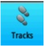
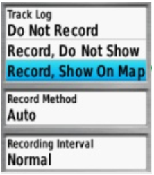
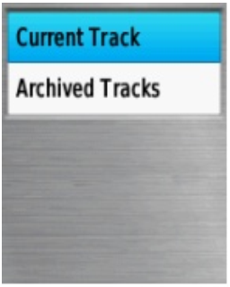
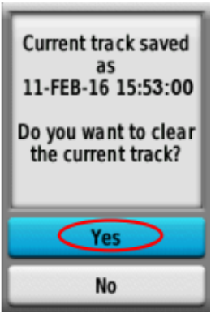
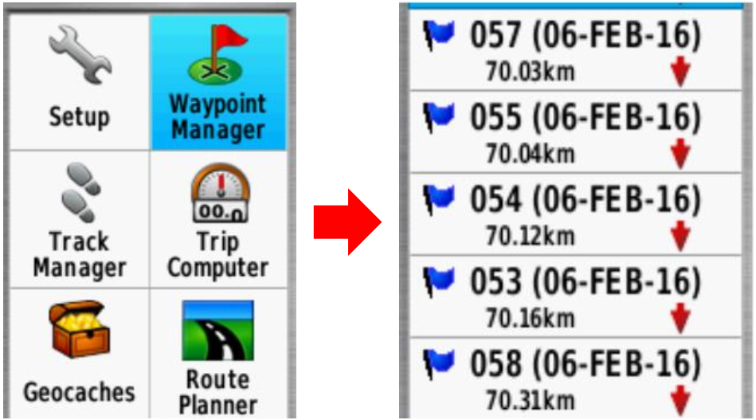
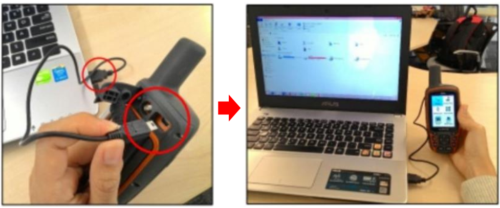

# Menggunakan GPS
**Tujuan Pembelajaran:**
*   Mengetahui bagian-bagian yang ada di GPS
*   Memahami cara menyalakan GPS
*   Memahami cara menggunakan GPS
*   Memahami definisi dari rute perjalanan dan titik objek pada GPS
*   Memahami cara menyalakan perekaman rute perjalanan pada GPS
*   Memahami cara menyimpan titik pada GPS
*   Memahami cara menyalin rute perjalanan dan titik ke laptop

Dalam melakukan survei lapangan, dibutuhkan suatu alat navigasi yang memiliki fungsi sebagai perekam jejak dan titik. Alat yang sering digunakan adalah _Global Positioning System_ atau GPS. Pada bab ini akan dibahas apa itu GPS, bagaimana cara menggunakan GPS, dan bagaimana hasil survei dari GPS ini dapat digunakan untuk membuat peta. Pada modul ini akan dijelaskan bagaimana mengoperasikan Garmin GPSmap 62s/64s, yaitu GPS yang sering digunakan untuk pemetaan. Banyak model GPS lain yang dapat melakukan hal yang sama. Jika Anda menggunakan GPS dengan model yang berbeda, Anda tidak perlu khawatir karena pada prinsipnya akan tetap sama. Jika Anda tidak memiliki GPS, sebagai alternatif dapat menggunakan _OSM Tracker_ yang dapat dipelajari pada modul **Menggunakan Aplikasi OSMTracker**.

### I. Pengertian dan Bagian-bagian GPS
_Global Positioning System_ atau GPS adalah sebuah alat atau sistem berbasis satelit yang dapat digunakan untuk memberikan informasi kepada penggunanya dimana pengguna berada (secara global) di permukaan bumi. Pada dasarnya, cara kerja GPS sama seperti ponsel. Bedanya adalah ponsel menerima sinyal radio dari menara telekomunikasi, sedangkan GPS menerima sinyal dari satelit yang berputar mengelilingi bumi. Dengan menerima sinyal-sinyal dari satelit, sebuah GPS dapat memperhitungkan letak atau lokasi pada permukaan bumi. GPS merekam lokasi ini dalam bentuk koordinat, dimana terdapat dua deret nomor yang panjang. Deret nomor yang pertama menunjukkan posisi Anda dari Timur atau Barat, atau biasa disebut sebagai posisi bujur. Deret nomor yang kedua menunjukkan posisi Anda dari utara atau selatan, atau biasa disebut sebagai posisi lintang. Koordinat bujur dan lintang merupakan koordinat geografis dan setiap tempat di bumi memiliki koordinat geografis yang berbeda-beda.

 

<i>Ilustrasi garis lintang dan garis bujur</i>

Berikut ini adalah bagian-bagian dari GPS Garmin 64s. Jika Anda menggunakan GPS tipe lain tidak perlu khawatir, karena pada dasarnya semua GPS memiliki prinsip yang sama.

 

<i>Bagian depan pada GPS</i>

 

<i>Bagian belakang pada GPS</i>

Berikut ini fungsi dari tombol-tombol yang ada pada GPS:
*   Tombol _power_ terletak di sebelah kanan atas. Tekan tombol agak lama, kemudian GPS akan otomatis nyala. 
*   Tombol (IN) berfungsi untuk memperbesar tampilan peta pada layar GPS. 
*   Tombol (OUT) berfungsi untuk memperkecil tampilan peta pada layar GPS. 
*   Tombol (FIND) berfungsi untuk membuka menu pencarian pada GPS. 
*   Tombol (PAGE) berfungsi untuk mengakses halaman utama dari GPS. 
*   Tombol (MARK) berfungsi untuk menyimpan titik lokasi pada saat survei menggunakan GPS. 
*   Tombol (MENU) berfungsi untuk membuka pilihan menu yang ada di GPS. 
*   Tombol (QUIT) berfungsi untuk membatalkan pilihan atau kembali ke menu sebelumnya.
*   Tombol (ENTER) berfungsi untuk memilih atau ok pada suatu menu yang akan Anda pilih. 
*   Tombol berfungsi untuk menavigasi pada layar peta yang ditampilkan di GPS. Pada bagian belakang GPS sisi atas, terdapat _port USB_ yang berfungsi untuk menyambungkan ke laptop menggunakan kabel USB. Di bagian bawahnya adalah untuk memasang baterai tipe AA.

### II. Menyalakan GPS
_Global Positioning System_ atau GPS adalah sebuah alat yang berbasis satelit sehingga untuk menyalakan GPS, pastikan Anda berada di tempat yang terbuka dimana Anda dapat melihat langit dengan jelas. GPS dapat menentukan lokasi Anda dengan cara menerima sinyal dari satelit sehingga jika Anda berada di dalam ruangan, maka GPS tidak akan dapat bekerja. Berikut ini adalah langkah-langkah untuk menyalakan GPS:

*   Pada bagian atas sisi kanan GPS Anda, tekan dan tahan tombol _Power _selama beberapa detik hingga layar menyala dan memunculkan logo “Garmin”. Proses dengan logo Garmin ini memang agak lama, tapi Anda tidak perlu khawatir karena GPS sedang memproses _waypoints, tracks,_ dan _routes_ yang ada di dalam GPS Anda sehingga memerlukan waktu lebih lama.

 

<i>GPS dalam keadaan baru nyala dengan logo Garmin</i>

*   Setelah GPS nyala, GPS akan otomatis menunjukkan lokasi dimana Anda berada, seperti gambar di bawah ini.

 

<i>GPS menunjukkan lokasi dimana Anda berada</i>

### III. Menggunakan GPS
GPS memiliki banyak fungsi yang bermanfaat bagi kehidupan sehari-hari, seperti untuk menentukan arah perjalanan ataupun untuk mengukur jarak, membuat peta, dan dapat dijadikan sebagai referensi pengukuran suatu wilayah. GPS juga memiliki beberapa pengaturan yang dapat disesuaikan dengan keinginan, salah satunya adalah mengatur tingkat kecerahan dari layar GPS itu sendiri. Untuk mengatur tingkat kecerahan, Anda dapat tekan sekali tombol _power_ di sisi kanan atas GPS, kemudian pada layar GPS akan muncul seperti gambar di bawah ini:

 

<i>Tampilan layar GPS untuk pengaturan tingkat kecerahan layar</i>

Di layar GPS pada bagian atas dapat dilihat keterangan mengenai hari dan jam Anda menggunakan GPS saat ini. Selanjutnya di bagian bawahnya terdapat pengaturan _Backlight_ atau tingkat kecerahan yang dapat anda atur dengan cara menekan tombol _power_ sekali hingga menemukan tingkat kecerahan yang sesuai dengan keinginan Anda, atau dengan menekan tombol navigasi. Di bagian bawah _Backlight_, terdapat status baterai GPS Anda dan juga keterangan sinyal GPS Anda. Anda juga dapat melihat berapa banyak satelit yang telah ditangkap oleh GPS Anda dengan cara tekan tombol **_Page → Satellite_**. Kemudian layar GPS Anda akan seperti gambar di bawah ini:

 

<i>Tampilan layar GPS yang menunjukkan satelit yang sudah ditangkap</i>

Pada layar GPS dapat dilihat bagian _Satellite_, Anda dapat melihat koordinat dimana Anda berada, akurasi dari GPS, titik ketinggian, jumlah satelit yang sudah ditangkap GPS, dan sinyal satelitnya. Gambar diatas menunjukkan bahwa GPS Anda sedang mencari sinyal satelit. Ketika sudah terhubung dengan tiga satelit atau lebih, GPS akan mendapatkan lokasi Anda.

Di GPS Anda juga dapat mengetahui arah mata angin dari titik lokasi Anda pada pilihan _Compass_. Anda dapat mencobanya dengan cara menekan tombol **_Page → Compass_**. Kompas ini bertujuan untuk menunjukkan arah mata angin pada saat survei.

 

<i>Kompas untuk membantu sebagai penunjuk arah pada saat survei</i>

Pada GPS Anda juga dapat mengetahui lokasi dimana Anda berada dan melihat tempat-tempat di sekitar lokasi Anda. Anda dapat mencobanya dengan cara menekan tombol **_Page → Map_**. Pada opsi map ini, Anda juga dapat melihat _track_ dan _waypoint _jika Anda sudah mulai merekam _track _dan _waypoint_. 

 

<i>Tampilan layar GPS pada pilihan menu Map</i>

Tampilan layar GPS Anda mungkin tidak akan seperti gambar di atas karena GPS akan menunjukkan sesuai dengan lokasi Anda saat ini. Jika pada layar GPS Anda lokasinya terlalu besar, maka Anda dapat memperkecil dengan menekan tombol _OUT_ pada GPS beberapa kali hingga tampilan layarnya sesuai dengan yang Anda inginkan. Sebaliknya, jika pada layar GPS Anda lokasinya terlalu kecil, maka anda dapat memperbesarnya dengan menekan tombol _IN_ pada GPS Anda hingga tampilan layarnya sesuai dengan yang Anda inginkan.

Pada GPS Anda terdapat berbagai macam menu utama lainnya pada tombol **MENU**. Jika Anda menekan tombol **MENU**, maka akan keluar tampilan pilihan menu seperti gambar di bawah ini.

 

<i>Pilihan menu utama pada tombol MENU</i>

### IV. _Track_ dan _Waypoint_
GPS Anda merekam dua jenis informasi yang berguna untuk membuat peta atau menyimpan koordinat dari sebuah tempat. Pertama, GPS Anda dapat menyimpan jalur yang Anda lewati yang sering disebut dengan _track_ (trek). Kedua, GPS dapat menyimpan lokasi Anda pada memori GPS yang sering disebut dengan titik objek (_Waypoint_). 

**a. Pengertian _Track_ atau Rute Perjalanan**
 
_Track_ atau rute perjalanan adalah arah atau jalur perjalanan Anda saat mulai direkam dan akan disimpan berupa seri lokasi kemana pun Anda bergerak. Sebagai contoh, _track_ akan merekam lokasi Anda setiap satu detik, atau setiap satu meter, dan hasilnya akan berupa sebuah seri dari titik-titik yang menunjukan jalur lokasi dimana Anda pernah berada. _Track_ sangat berguna untuk memetakan objek yang ditunjukkan oleh garis atau bentuk, seperti sebuah jalan, atau bentuk dari sebuah lapangan.

**b. Pengertian _Waypoint_ atau Titik Objek**

_Waypoint_ atau titik objek adalah titik acuan atau kumpulan koordinat yang digunakan untuk keperluan navigasi atau untuk mengidentifikasi sebuah titik di peta. GPS dapat menyimpan lokasi Anda pada memori GPS. Ketika Anda menyimpan sebuah lokasi, koordinat akan disimpan dengan sebuah nama. Sebagai contoh, titik pertama yang tersimpan oleh Anda akan diberi nama 001, kedua 002, dan seterusnya. Untuk lebih jelasnya, akan dibahas pada sub-bab VI. Menyimpan Titik.

### V. Menyalakan Mode Perekaman _Track_ atau Rute Perjalanan
Berikut ini adalah langkah-langkah dalam mengaktifkan perekaman _track_:

*   Pergi ke **_Main Menu_**, pilih **_Setup_**.

 

<i>Tampilan Main Menu, Setup</i>

*   Pilih **_Tracks_**.

 

<i>Tampilan ikon Tracks</i>

*   Pada **_Track Log_**, ubah menjadi: **_Record, Show on Map_**.

 

<i>Tampilan Track Log</i>

*   Pastikan perekaman rute atau _track_ pada GPS Anda dalam keadaan aktif sebelum Anda melakukan survei.
*   Jika sudah selesai survei dan ingin **menonaktifkan** perekam rute atau _Track_, lakukan cara seperti tadi kemudian pilih **_Do Not Record_**.

_Track_ disimpan setelah survei lapangan selesai dilakukan. Umumnya _track_ disimpan perhari. Cara untuk menyimpan _Track_ yang sudah direkam adalah sebagai berikut:

*   Pergi ke **_Main Menu_**, pilih **_Track Manager_**.

 

<i>Tampilan Main Menu, Track Manager</i>

*   Pilih **_Current Track_**, yaitu perekaman rute yang baru saja dilakukan.  

 

<i>Tampilan Curent Track</i>

*   Pilih **_Save Track_**, untuk menyimpan rute perjalanan atau _track_.  

 

<i>Tampilan Save Track</i>

*   Masukkan nama _track_, umumnya dalam bentuk Tanggal dan waktu survei kemudian pilih **_Done_**.

 

<i>Tampilan Enter Name pada GPS</i>

*   Bersihkan perekam _track_ dari perekaman sebelumnya, pilih **_Yes_**.

 

<i>Tampilan menghapus track sebelumnya</i>

*   Perhatikan akan muncul nama _track_ yang Anda simpan. Ini membuktikan bahwa _track_ survei Anda sudah berhasil tersimpan.  

 

<i>Tampilan track yang telah berhasil disimpan</i>

### VI. Menyimpan Titik
Langkah-langkah untuk menyimpan _waypoint_ (titik lokasi) adalah sebagai berikut:  
*   Tekan tombol **_Mark_** pada GPS dan akan muncul tampilan sebagai berikut:

 

<i>Menyimpan titik pada GPS</i>

*   Pilih **_Done_** untuk menyimpan _Waypoint_.  

Untuk melihat daftar _waypoint_ yang sudah Anda simpan, silakan Anda pergi ke **_Main Menu_** dan pilih **_Waypoint Manager_**. Kemudian akan muncul daftar _waypoint_ yang sudah Anda simpan.

 

<i>Tampilan daftar waypoint yang tersimpan pada GPS</i>

Untuk menghapus satu _Waypoint_ yang sudah Anda simpan, tekan **_Enter_** pada salah satu titik _Waypoint_ yang akan dihapus, kemudian tekan tombol **_Menu_** dan pilih **_Delete_**.

### VII. Menyalin _Track_ dan _Waypoint_ ke Laptop
Selanjutnya data yang sudah dikumpulkan dengan GPS akan di-_copy_ atau salin ke komputer untuk digunakan sebagai acuan pemetaan. Langkah-langkahnya adalah sebagai berikut:

*   Sambungkan GPS ke komputer dengan menggunakan kabel data.
*   Pastikan GPS dalam keadaan menyala.

 

<i>Menyambungkan GPS dengan kabel ke Laptop</i>

*   Pergi ke direktori **Garmin GPSMAP** kemudian pilih folder **_Garmin → GPX_**

 

<i>Tampilan pada komputer setelah disambungkan dengan GPS</i>

*   Pilih data dengan keterangan tanggal Anda survei (_Track & Waypoint_) dan salin data tersebut ke komputer Anda.

 

<i>Tampilan setelah data di GPS dipindahkan ke komputer</i>

**RINGKASAN**
Selamat! Anda sekarang telah mendapatkan pemahaman bagaimana menggunakan GPS. Jika belum, cobalah untuk melatih menyimpan titik dari beberapa lokasi yang menurut Anda penting. Pada modul ini Anda telah mempelajari bagaimana mengumpulkan _waypoint_ dan _track_ dan membukanya di JOSM. Nantinya, Anda akan menggunakan informasi ini untuk menambahkan objek baru ke _OpenStreetMap_.

