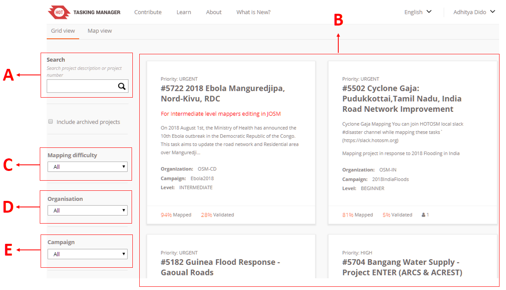
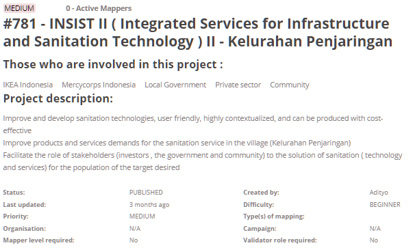
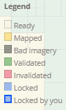
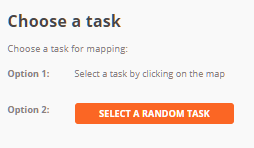
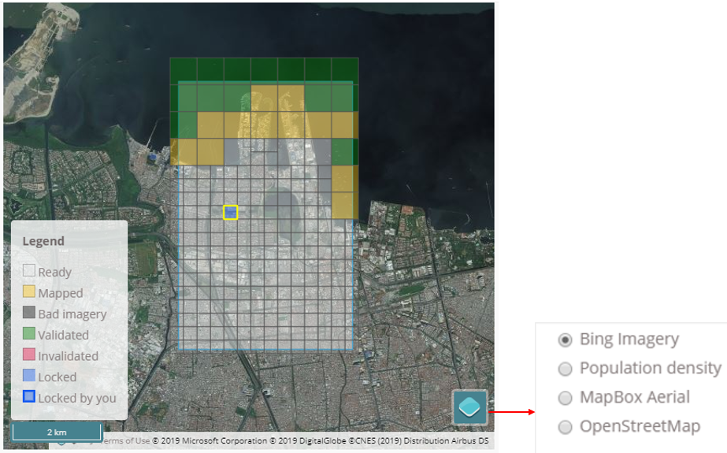
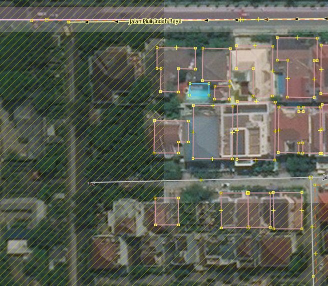

# Penggunaan _Tasking Manager_
**Tujuan Pembelajaran:**

*   Menjalankan fungsi dari _tasking manager_ dalam konteks pemetaan partisipatif
*   Mengoperasikan cara menggunakan _tasking manager_ untuk kegiatan pemetaan

_OpenStreetMap_ sebagai sebuah alternatif untuk melakukan pemetaan secara bebas dan terbuka memungkinkan semua orang tanpa terkecuali untuk dapat melakukan pemetaan dimanapun dan kapanpun. Namun, bagaimana jika Anda ingin melakukan pemetaan secara serentak yang dilakukan oleh banyak orang? Tentunya Anda membutuhkan sebuah alat untuk dapat membagi pekerjaan pemetaan tersebut supaya bisa dikerjakan oleh banyak orang. _Tasking manager_ memungkinkan Anda untuk melakukan hal itu. Dalam modul ini, Anda akan mempelajari lebih lanjut mengenai _Tasking Manager_ dan bagaimana cara memetakan data OSM melalui _Tasking Manager_.  

### I. Apa itu _Tasking Manager_?
1. **Definisi _Tasking Manager_**
    _Tasking manager_ merupakan sebuah alat yang dibuat secara khusus untuk melakukan pemetaan secara kolaboratif dan partisipatif. _Tasking manager_ memungkinkan Anda untuk melakukan pemetaan di suatu wilayah secara bersama-sama dengan pembagian wilayah yang berbeda.  Fungsi _Tasking manager_ adalah untuk membagi pekerjaan pemetaan ke dalam beberapa grid/kotak yang berbeda sehingga setiap orang dapat memilih grid/kotak untuk dikerjakan. Selain itu, _Tasking manager_ juga dapat memudahkan Anda dalam memantau proses pengerjaan pemetaan. Anda dapat mengetahui wilayah mana yang masih butuh dipetakan, sedang dipetakan, dan wilayah mana yang sudah selesai dipetakan.

    Bayangkan Anda ingin melakukan pemetaan pada suatu wilayah tertentu dimana Anda harus memetakan secara bersama-sama dengan 20 orang lainnya. Jika tidak ada pembagian tugas dan wilayah, maka akan ada kemungkinan beberapa orang memetakan di wilayah yang sama. Dengan adanya _Tasking manager_, hal seperti ini dapat dihindari dan pekerjaan pemetaan akan dapat diselesaikan secara lebih cepat dan efisien. 

2. **Contoh Penggunaan _Tasking Manager_**
    _Tasking manager_ pernah digunakan sebagai bentuk respon ketika bencana Topan Haiyan terjadi di Filipina pada 8 November 2013. Pemetaan menggunakan _tasking manager_ dilakukan di Kota Tacloban, salah satu kota yang terdampak sangat parah ketika bencana terjadi. Dalam kurun waktu 24 jam setelah dibuatnya proyek _tasking manager_, sebanyak 10.000 bangunan telah terpetakan atau sekitar 25% dari total jumlah bangunan yang ada di Kota Tacloban. Seluruh pemetaan ini dilakukan oleh 33 orang relawan. 

    

	

    
<i>Kondisi bangunan sebelum dan setelah dipetakan menggunakan Tasking Manager</i>

    
    _Tasking manager_ juga digunakan di Indonesia untuk respon ketika bencana terjadi. Salah satu contohnya adalah ketika bencana gempa dan tsunami terjadi di Selat Sunda pada Desember 2018. Dalam kurun waktu 1 bulan, seluruh daerah terdampak sudah selesai dipetakan oleh sekitar 60 orang relawan. 

    

    
<i>Tasking Manager yang dibuat sebagai respon bencana gempa dan tsunami di Selat Sunda</i>

### II. Memulai _Tasking Manager_

Anda dapat mengakses halaman _tasking manager_ di alamat [https://tasks.hotosm.org/](https://tasks.hotosm.org/). Ketika Anda membuka halaman tersebut, akan muncul tampilan seperti berikut: 

	
<i>Halaman utama Tasking Manager</i>

Pada halaman utama, Anda dapat melihat beberapa menu yang bisa Anda pilih. Untuk mengganti bahasa yang ingin ditampilkan Anda dapat memilih tombol tanda panah di sebelah kiri tombol _**Login**_ pada kanan atas layar. Anda juga bisa mempelajari lebih lanjut mengenai tutorial penggunaan _tasking manager_ pada menu **_Learn_** di bagian atas layar. 

<i>Tombol untuk mengganti bahasa di sebelah kanan dan tombol Learn di sebelah kiri</i>

Sebelum dapat memetakan menggunakan _Tasking Manager_, ada beberapa hal yang perlu Anda perhatikan, seperti:

1. **_Login_/Masuk ke dalam _Tasking Manager_**

    Sebelum Anda dapat melakukan memetakan, Anda harus melakukan _login_ atau masuk dengan menggunakan akun _OpenStreetMap_ yang Anda miliki. Silakan Anda pilih menu **_Login_** yang berada di sebelah kanan atas layar kemudian masukkan akun _OpenStreetMap_ yang telah Anda miliki. Pada pilihan **_Authorize access to  your account_** silakan Anda centang pilihan **_read your user preferences_** kemudian pilih **_Grant Access_**. Untuk lebih jelasnya, silakan Anda lihat gambar berikut:

    

    
<i>Pilihan untuk mengizinkan otorisasi pada akun Anda</i>

    Setelah Anda _login_ maka Anda akan diarahkan kembali pada halaman _Tasking Manager_. Anda dapat melihat nama akun _OpenStreetMap_ di bagian kanan atas halaman yang menandakan bahwa Anda telah berhasil melakukan _login_. Untuk memulai memetakan, silakan pilih tombol **_Start Mapping_** atau tombol **_Contribute_** yang terletak di sebelah kiri atas layar. 

    

    
<i>Tombol Contribute dan Start Mapping pada halaman Tasking Manager</i>

2. **Mencari Proyek _Tasking Manager_ di Kolom Pencarian**
    Setelah Anda menekan tombol **_Start Mapping_** atau **_Contribute_** akan muncul halaman _Contribute_. Di halaman ini Anda dapat memilih tampilan _Grid View_ dan _Map View_. Di dalam tampilan _Grid View_ ada beberapa hal yang perlu Anda perhatikan, seperti: 

    

    
<i>Beberapa pengaturan yang dapat dilakukan pada tampilan Grid View</i>

    1. **_Search_** (Kotak Pencarian)
        Pada bagian ini, Anda dapat melakukan pencarian proyek _tasking manager._ Silakan Anda ketik kata kunci yang diinginkan seperti nama kecamatan, kabupaten, provinsi, atau nama kegiatan yang menjadi judul proyek yang telah dibuat. 

    2. **Proyek** **_Tasking_**
        Di bagian ini, Anda dapat melihat berbagai proyek _tasking manager_ yang telah dibuat sebelumnya oleh para kontributor. 

    3. **_Mapping Difficulty_**
        Pada bagian ini, Anda dapat memilih tingkat kesulitan dari proyek _tasking manager_ yang ingin Anda cari. Tingkat kesulitan yang dapat dipilih dibagi menjadi 3 kategori, _beginner_, _intermediate_, dan _advance_. Jika Anda masih pemula silakan Anda pilih _beginner_, jika Anda sudah mahir memetakan silakan Anda pilih _Intermediate_, dan jika Anda sudah ahli dalam memetakan maka Anda dapat memilih _Advance_. Jika Anda ingin melihat seluruh tasking pilih **_All_**

    4. **_Organization_**
        Anda dapat memilih proyek _tasking manager_ berdasarkan organisasi pembuat proyek tersebut seperti _American Red Cross_, _Missing Maps_, HOTOSM, dan HOT Indonesia. 

    5. **_Campaign_**
        Anda juga dapat memilih proyek _tasking manager_ berdasarkan kegiatan tertentu. Sebagai contoh, Anda dapat memilih proyek _tasking manager_ untuk kegiatan _Malaria Elimination_.

    Anda dapat mengubah tampilan dari _Grid View_ menjadi _Map View_. Pada tampilan _Grid View_, Anda akan melihat daftar proyek _tasking manager_ dalam bentuk grid atau kotak. Jika Anda memilih tampilan _Map_ _View_, tampilan utama yang akan Anda lihat adalah tampilan peta dunia dengan banyak bulatan kecil berwarna biru di atasnya.

    

    
<i>Tombol untuk mengubah tampilan Grid View atau Map View</i>

    Jika Anda telah mengubah tampilan Anda menjadi _Map View_, akan muncul halaman seperti berikut:

    

    
<i>Tampilan Map View pada Tasking Manager</i>

    Berbeda dengan tampilan _Grid View_, tampilan _Map View_ akan  memperlihatkan tampilan peta dunia dengan banyak bulatan biru. Anda dapat menggunakan tombol dengan tanda plus dan minus yang ada di sebelah kiri atas bidang peta untuk memperbesar dan memperkecil tampilan peta. Ketika tampilan peta diperbesar, maka akan muncul berbagai proyek _tasking manager_ yang ada di berbagai tempat ditandai dengan adanya titik-titik berwarna. Masing-masing warna tersebut mewakili tingkat prioritas proyek _tasking_ mulai dari _urgent_ hingga _low_. 

    

    
    Jika Anda ingin mulai melakukan pencarian, maka Anda dapat mengubah tampilan menjadi _Grid View_. Ubah kembali tampilan _Tasking Manager_ Anda menjadi tampilan _Grid View_. Untuk dapat mencari proyek _tasking,_ silakan Anda arahkan kursor Anda pada kotak pencarian. Pada contoh kali ini kita akan mencari proyek _tasking manager_ dengan kata kunci ‘Penjaringan’ kemudian tekan **_Enter_**. Untuk parameter lain seperti _mapping difficulty_, _organization_, dan _campaign_ tidak perlu diubah.

    

    
<i>Hasil pencarian proyek tasking manager dengan kata pencarian ‘penjaringan’</i>

    _Tasking Manager_ akan menampilkan proyek dengan kata kunci ‘Penjaringan’. Silakan Anda pilih proyek _tasking_ yang ada di sebelah kanan dengan judul _‘#781 - INSIST II (Integrated Services for Infrastructure and Sanitation Technology) II - Kelurahan Penjaringan’._

3. **Mengenal Tampilan _Tasking Manager_**
    Ketika Anda telah memilih satu proyek _tasking_, maka akan muncul tampilan sebagai berikut: 

    

    
<i>Tasking manager #781 INSIST - Kelurahan Penjaringan</i>

    Tampilan ini menunjukkan deskripsi proyek _tasking manager_ yang sedang kita buka. Pada bagian deskripsi, Anda dapat membaca latar belakang proyek pemetaan infrastruktur dan sanitasi di Penjaringan. Di bagian bawah kita dapat melihat informasi lebih detail mengenai proyek ini, mulai dari tingkat prioritas, organisasi pembuat, nama pembuat proyek, tingkat kesulitan, hingga objek apa yang harus dipetakan. Jika Anda ingin membuat proyek _tasking manager_ Anda sendiri, Anda dapat membacanya di modul **Membuat dan Mengelola Tasking Manager**.

    

    
<i>Tampilan proyek tasking manager</i>

    
    Di bagian bawah deskripsi Anda dapat melihat tampilan peta di sebelah kanan dan beberapa informasi yang dapat Anda lihat di sebelah kiri. Jika Anda perhatikan pada bidang peta, terdapat beberapa kotak dengan warna yang berbeda. Warna tersebut mewakili informasi: 

    

	
*   **_Ready_ (Siap)**
        Menunjukkan kotak tersebut dapat Anda kerjakan 

*   **_Mapped_ (Dipetakan)**
        Kotak berwarna kuning menunjukkan bahwa kotak tersebut telah selesai dipetakan 

*   **_Bad Imagery_ (Citra Satelit Buruk)**
        Kotak berwarna abu-abu kehitaman ditandai sebagai daerah dengan citra satelit yang buruk

*   **_Validated_ (Tervalidasi)**
        Kotak berwarna hijau menunjukkan bahwa kotak tersebut telah tervalidasi

*   **_Invalidated_ (Tidak Tervalidasi)**
        Kotak berwarna merah menunjukkan bahwa kotak tersebut masih perlu diperiksa ulang sebelum dilakukan validasi kembali

*   **_Locked_ (Terkunci)**
        Kotak berwarna abu-abu menunjukkan bahwa kotak tersebut telah dipilih oleh pengguna lain

*   **_Locked by you_ (Dikunci oleh Anda)**
        Kotak berwarna dengan garis berwarna biru tua menunjukkan kotak yang sedang Anda pilih dan kerjakan

4. **Memulai Berkontribusi di Proyek _Tasking Manager_**

    Anda dapat melakukan dua jenis kontribusi pada proyek _tasking manager_, yaitu melakukan digitasi objek dan melakukan validasi data yang sudah dipetakan. Untuk mulai berkontribusi dan melakukan pemetaan silakan ikuti langkah-langkah berikut:

*   Pilih tombol **_Map_**.
    

*   Selanjutnya, tugas Anda adalah memilih grid/kotak proyek _tasking manager_ mana yang akan Anda kerjakan dengan cara memilih langsung grid/kotak pada proyek _tasking manager_ atau Anda juga dapat memilih kotak secara acak dengan menekan tombol **_Select a Random Task_.**

Anda  juga dapat mengganti _basemap_ atau peta dasar agar  area pemetaan di citra satelit yang terkena awan atau hutan dapat terlihat, sehingga tidak perlu dipilih. 

Jika Anda menemukan grid/kotak yang tertutup awan, silakan Anda pilih tombol **_Mark as Bad Imagery_**. Jika Anda melihat bahwa area pemetaan tersebut hanya terdapat hutan, silakan Anda pilih **_Mark as Completely Mapped_**. 

*   Jika sudah terpilih kotak yang diinginkan, silakan pilih tombol **_Start Mapping_**. 

*   Silakan Anda pilih JOSM sebagai _editor_ yang akan digunakan untuk memetakan, kemudian pilih tombol **_Start Editor_**. Pastikan bahwa _software_ JOSM Anda telah dibuka sebelumnya. 

*   Secara otomatis _tasking manager_ akan mengunduh data ke dalam JOSM. Anda dapat langsung memetakan menggunakan JOSM dan citra satelit yang telah disesuaikan dengan petunjuk yang ada di halaman proyek _tasking_. Jika Anda ingin mengetahui bagaimana cara memetakan dengan menggunakan JOSM, silakan Anda buka kembali modul **Menggunakan JOSM**. Petakan seluruh objek yang ada di grid/kotak tersebut. 

    

    
<i>Data OSM yang telah berhasil di-download melalui tasking manager</i>

*   Setelah selesai, jangan lupa untuk meng-_upload_ hasil pemetaan Anda secara berkala. Hal ini bertujuan untuk mencegah terlalu banyaknya beban data yang akan di-_upload_. Ketika Anda ingin meng-_upload_, jangan lupa untuk menambahkan komentar. Jika Anda perhatikan pada kolom komentar, Anda akan melihat komentar bawaan yang sama dengan penomeran proyek _tasking manager_ tersebut. Silakan Anda tambahkan komentar Anda di belakang komentar _tasking manager_ tersebut. 

    

    
<i>Kolom komentar pada saat upload data dari JOSM</i>

*   Setelah Anda selesai melakukan pemetaan dan telah mengunggah data ke dalam server _OpenStreetMap_, silakan Anda kembali pada halaman _tasking manager_. Anda dapat memberikan komentar mengenai perubahan yang telah dikerjakan. Jika telah selesai memetakan seluruh objek di dalam proyek _tasking manager_, pilih tombol **_Mark as Completely Mapped_**. Namun, jika masih ada beberapa objek yang belum terpetakan, Anda dapat memilih tombol **_Stop Mapping_** untuk berhenti melakukan pemetaan dan dapat melanjutkan pemetaan nanti atau membiarkan kontributor lain untuk melengkapi dan memetakan objek tersebut.
    
    

    
<i>Menambahkan komentar pada grid/kotak tasking manager yang telah dipetakan</i>

5. **Hal-hal yang Harus Diperhatikan saat Sudah Memilih Area di Proyek _Tasking_**
    Ada beberapa hal yang harus Anda perhatikan jika Anda telah memilih proyek dalam _Tasking Manager_. 

*   **Batas waktu pengerjaan maksimal 120 menit**
    Ketika Anda telah memilih satu kotak untuk dikerjakan, kotak tersebut akan menjadi milik Anda dalam jangka waktu 120 menit atau 2 jam. Pastikan Anda tidak terlalu lama mengerjakan dan segera lakukan _upload_ data secara berkala. 

    

    
<i>Pemberitahuan batas waktu pengerjaan tasking manager</i>

*   **Jangan lupa untuk membuka kembali kotak yang telah Anda pilih**
        Jika Anda telah selesai memetakan, jangan lupa gunakan tombol **_Stop Mapping_** jika kotak belum selesai dipetakan. Tombol **_Mark as Completely Mapped_** digunakan jika kotak yang Anda pilih telah betul-betul selesai Anda petakan dan sudah tidak ada objek apapun yang dapat Anda petakan. 

    

        
<i>Tombol Stop Mapping digunakan jika grid/kotak Anda belum selesai dipetakan</i>

*   **Jangan memetakan objek di luar area _tasking_ terpilh**

    

        
<i>Area yang  terarsir tidak boleh Anda petakan</i>

    
    Ketika grid/kotak _tasking manager_ yang Anda pilih telah terbuka di dalam JOSM,  terdapat area yang terarsir dan area tidak terarsir. Maksud dari area tidak terarsir menandakan bahwa area tersebut merupakan area pemetaan Anda, sementara area yang terarsir merupakan area yang tidak boleh Anda petakan. Hal ini dimaksudkan supaya tidak terjadi konflik antara pengguna _tasking manager_. 

*   **Perlakuan khusus untuk objek yang berada di perbatasan antar kotak**
        Seringkali ketika memetakan menggunakan _tasking manager_, Anda menemukan objek-objek yang terletak di perbatasan antar dua grid/kotak _tasking manager_ yang berbeda seperti contoh berikut:

    

        
<i>Objek yang terletak di perbatasan grid/kotak tasking manager</i>

    Jika menemukan contoh objek seperti gambar di atas, silakan Anda petakan objek tersebut sedikit melewati batas grid/kotak _tasking manager_ yang Anda pilih. Hal ini dilakukan terutama pada objek jalan untuk memberi panduan bagi  kontributor lain yang memetakan di proyek _tasking manager_ berbeda dan bersebelahan dengan area Anda.

**RINGKASAN**
Saat ini Anda telah berhasil mempelajari definisi serta fungsi dari _tasking manager_. _Tasking manager_ merupakan sebuah alat yang sangat berguna untuk melakukan pemetaan secara kolaboratif dan partisipatif. Ketika suatu wilayah perlu untuk dipetakan secara masif dan perlu dilakukan secara cepat, _Tasking manager_ menjadi alat yang sangat berguna untuk digunakan. Anda juga telah mempelajari bagaimana cara menggunakan _Tasking Manager_ untuk kegiatan pemetaan. Diharapkan dengan menggunakan _Tasking Manager_ pekerjaan pemetaan yang Anda lakukan dapat diselesaikan dengan lebih cepat dan dapat diorganisir dengan baik. 
