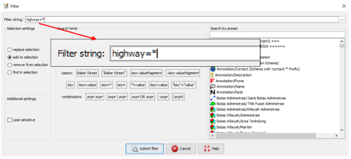
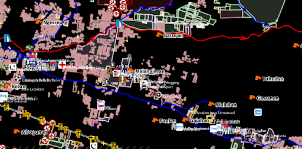
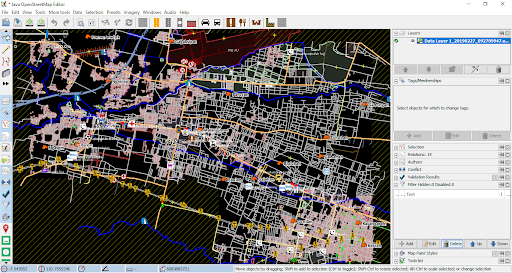

# Menggunakan Alat Filter di JOSM
**Tujuan Pembelajaran:**
*   Melakukan aktivasi mode penyaring data di JOSM
*   Mengoperasikan alat untuk menyaring data di JOSM

JOSM memiliki berbagai macam alat yang dapat memudahkan penggunanya untuk melakukan pemetaan. Salah satu alat yang dapat digunakan adalah filter. Filter merupakan sebuah alat tambahan untuk memilih salah satu objek berdasarkan informasi (tag) objek di _OpenStreetMap_  (_key_ dan _value_), sehingga Anda dapat mengedit dan memeriksa data OSM berdasarkan informasi tertentu dari suatu objek. Filter juga memudahkan Anda untuk menampilkan dan melihat data berdasarkan informasi tertentu yang ingin Anda lihat. Hal ini sangat membantu ketika Anda ingin memeriksa data yang sangat banyak dan kompleks.   

### I. Mengaktifkan Jendela Filter di JOSM

*   Untuk dapat mengaktifkan jendela filter, silakan Anda pilih menu **_Window_** kemudian pilih **_Filter_**

    

    
<i>Mengaktifkan jendela filter pada JOSM</i>

*   Jendela filter akan ditampilkan di sebelah kanan layar Anda. 

    

    
<i>Jendela filter pada JOSM</i>

### II. Menggunakan Alat Filter di JOSM

<i>Contoh data OpenStreetMap di Daerah Cengklik</i>

Bayangkan jika Anda mempunyai data seperti gambar di atas. Seringkali tampilan data seperti gambar di atas tersebut terlihat membingungkan karena banyaknya data yang ditampilkan. Untuk itu Anda dapat menggunakan filter untuk menyederhanakan tampilan data tersebut dengan menampilkan objek-objek yang hanya ingin Anda lihat. Sebagai contoh, kita akan melakukan filter untuk objek jalan. Langkah-langkah yang perlu Anda lakukan adalah sebagai berikut:

*   Pada jendela filter, pilih menu **_Add_**. 

    

    
<i>Tombol Add di jendela filter</i>

*   Pada bagian **_Filter string_**, silakan Anda masukkan informasi _key_ dan _value_ yang ingin Anda filter. Pada kasus ini, silakan Anda tulis _highway=*_ (untuk memilih semua objek jalan yang ada). Kemudian pilih **_Submit filter._**

    

    
<i>Tampilan filter</i>

*   Pada jendela filter Anda akan melihat tiga buah kotak yang dapat anda _checklist_. 

    

    
<i>Hasil filter</i>

1. Jika Anda aktifkan kotak di angka 1, maka objek jalan akan disembunyikan namun terlihat pada _layer_ peta dengan warna hitam pekat
    

    
<i>Hasil filter 1</i>

2. Jika Anda aktifkan kotak di angka 1 dan 2, maka objek jalan akan disembunyikan sepenuhnya dan tidak terlihat sama sekali di _layer_ peta
    

    
<i>Hasil filter 2</i>

3. Jika Anda aktifkan kotak di angka 1, 2 dan 3, maka _layer_ peta hanya akan menampilkan objek jalan di JOSM
    

    
<i>Hasil filter 3</i>

Perlu diingat bahwa ketika Anda menggunakan fungsi filter pada JOSM, hasil filter tersebut akan secara otomatis selalu muncul meskipun Anda sudah menutup _software_ JOSM ataupun berpindah lokasi pada saat melakukan pemetaan. Hal ini dapat menimbulkan masalah karena jika Anda memetakan daerah lain dengan fungsi filter yang sama, objek jalan yang ada di daerah tersebut menjadi tidak terlihat dan bisa saja Anda petakan lagi, padahal jalan tersebut sudah dipetakan sebelumnya. Oleh karena itu, pastikan Anda menonaktifkan hasil filter terlebih dahulu setelah selesai menggunakan fungsi tersebut. Untuk melihat apakah fungsi filter masih aktif pada JOSM, Anda dapat melihat melihatnya pada bagian kanan atas bidang peta di JOSM. Jika tulisan _Filter active_ masih muncul maka hal itu  menandakan bahwa fungsi filter masih aktif. 

<i>Filter active yang menandakan fungsi filter masih aktif pada JOSM</i>

Untuk menghapus filter yang masih aktif, silakan pilih hasil filter yang ingin Anda hapus di jendela filter, setelah itu pilih tombol **_Delete_**.

<i>Pilih tombol Delete untuk menghapus hasil filter</i>

Setelah Anda berhasil menghapus hasil filter tersebut, maka tampilan data _OpenStreetMap_ Anda akan kembali seperti semula.

<i>Tampilan Data OpenStreetMap setelah fungsi filter dihapus</i>

>Catatan :
Saat Anda menggunakan fungsi filter pada JOSM, hasil filter tersebut akan selalu muncul pada saat Anda membuka JOSM. Pastikan Anda selalu menghapus fungsi filter setelah Anda menggunakannya!

**RINGKASAN**
 Jika Anda telah berhasil mengikuti semua langkah-langkah yang ada, pada akhir  modul ini Anda telah berhasil mengetahui apa itu mode filter atau mode penyaringan data di JOSM. Anda juga telah mampu mengoperasikan mode filter di JOSM untuk memilih data mana saja yang ingin Anda lihat. Silakan Anda gunakan filter untuk membantu proses pemetaan Anda supaya menjadi lebih mudah. 

