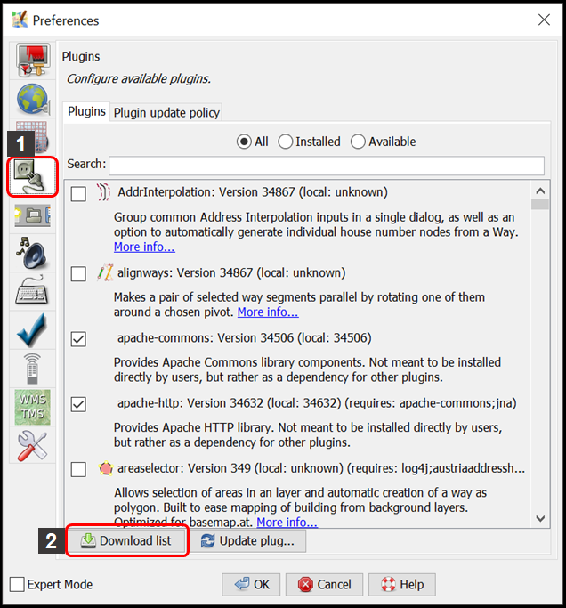
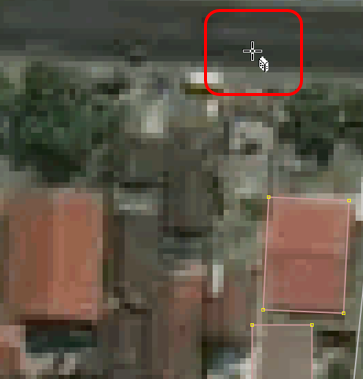

# **Menggunakan _buildings tools_ di JOSM**

**Tujuan Pembelajaran:**

*   Mampu menerapkan cara melakukan instalasi alat tambahan untuk membuat objek bangunan
*   Mampu menerapkan cara mengoperasikan alat tambahan di JOSM untuk membuat objek bangunan

Jika Anda menambahkan data di JOSM tanpa melakukan survei lapangan, data yang ditambahkan akan memiliki informasi yang terbatas karena hanya menggunakan citra satelit sebagai acuan pemetaan. Salah satu objek yang dapat dipetakan menggunakan citra satelit  adalah bangunan. Namun, Anda tidak dapat mengetahui fungsi spesifik bangunan yang dipetakan menggunakan citra satelit kecuali bentuk bangunannya cukup berbeda misalnya sekolah yang berbentuk seperti huruf L atau huruf U.

<i>Bangunan sekolah berbentuk seperti huruf U</i>

Dengan OSM, Anda dapat memetakan bangunan umum walaupun Anda tidak mengetahui fungsi spesifiknya. Objek bangunan tersebut dapat diberikan _preset/tag_ _**building=yes**_ untuk menunjukkan bahwa objek tersebut adalah bangunan. Tetapi jika Anda memetakan banyak bangunan, pasti cukup merepotkan juga jika Anda harus menambahkan _preset/tag_ _**buidling=yes**_ setiap kali Anda menggambarkan satu bangunan. JOSM memiliki _plugin_ (alat tambahan) yang dapat memudahkan Anda  menggambar objek bangunan. Alat ini memungkinkan bangunan yang Anda digitasi/gambar otomatis memiliki _preset_ _**building=yes**_ dan memiliki bentuk bangunan yang relatif lebih rapi. _Plugin_ ini bernama _**buildings tools**_.

### **I. Menginstal _buildings tools_ di _plugin_ JOSM**

Untuk dapat menggunakan _plugin_ **_buildings tools_**, Anda harus menginstalnya terlebih dahulu. Langkah-langkah untuk menginstal _plugin_ **_buildings tools_** adalah sebagai berikut:

*   Buka **JOSM** Anda
*   Klik menu **_Edit → Preferences_**
*   Akan muncul jendela **_Preferences_** dan pilih menu **_Plugins_** (ikon steker) untuk menginstal _plugin_ baru. Jika daftar _plugins_ belum muncul, Anda dapat mengklik **_Download List_** dan pastikan komputer Anda terkoneksi dengan internet untuk dapat men-_download_ _plugins_ tersebut.

<i>Tampilan jendela Preferences untuk menu Plugins</i>

*   Pada  kotak **_Search_**, tuliskan _**buildings_tools**_ untuk mencari _plugin **buildings tools**_. Setelah berhasil menemukan _plugin **buildings tools**_, silakan **centang** kotak kecil di samping _plugin **buildings tools**_. Setelah itu klik **_OK_** dan tunggu hingga proses instalasi selesai.

<i>Tampilan hasil pencarian plugin buildings_tools</i>

>Catatan :
Terkadang JOSM meminta Anda untuk melakukan _Restart_ setelah melakukan instalasi _plugin_ baru untuk mengaplikasikan _plugin_ yang baru saja diinstal. Namun, tidak semua _plugin_ membutuhkan _Restart_ untuk dapat digunakan setelah instalasi.

*   Jika _plugin **buildings_tools**_ sudah berhasil diinstal, akan muncul _tool **Draw buildings**_ di sebelah kiri atas JOSM  Anda. Anda dapat menggunakannya untuk menggambar bangunan.

<i>Ikon Draw buildings sudah muncul menandakan plugin buildings tools sudah berhasil terinstal</i>

### **II. Menggunakan alat _buildings tools_**

Langkah-langkah menggunakan _plugin **buildings tools**_ adalah sebagai berikut:

*   Seperti yang sudah dibahas pada modul **Menambahkan Data OSM Menggunakan JOSM** untuk menambahkan data OSM menggunakan JOSM, Anda harus men-_download_ data OSM yang sudah ada terlebih dahulu di wilayah pemetaan Anda. Untuk men-_download_ data OSM, klik menu **_File_ → _Download Data_**.
*   Gambar kotak pemetaan Anda dengan cara **klik kiri tahan dan geser** hingga membentuk **kotak warna merah muda** yang meliputi seluruh wilayah pemetaan Anda. Setelah itu klik **_Download_**. 
*   Setelah berhasil men-_download_ data OSM, akan muncul _layer_ baru yang juga akan menjadi _layer_ dimana Anda dapat menambahkan data OSM. Pastikan Anda hanya menambahkan data pada **kotak yang tidak diarsir** karena kotak yang diarsir sudah bukan wilayah yang Anda _download_.
*   Tambahkan citra satelit sebagai acuan untuk memetakan dengan cara klik menu **_Imagery_ → pilih citra satelit yang akan digunakan, misalnya _Digital Globe Premium Imagery_**.
*   Sekarang Anda sudah siap untuk menambahkan data OSM. Untuk memetakan bangunan, gunakan _**buildings tools**_ untuk menggambarnya. Klik _plugin **buildings tools**_ (ikon _Draw buildings_) yang terletak di sebelah kiri atas JOSM atau **tekan B** pada _keyboard_ Anda. Jika kursor _mouse_ Anda sudah berubah menjadi tanda plus dengan ikon bangunan, berarti Anda sudah siap menggambar bangunan menggunakan _buildings tools_.

<i>Tampilan kursor saat plugin buildings tools diaktifkan</i>

*   Setelah itu, gambar bangunannya sesuai dengan bentuk yang terlihat pada citra satelit. **Klik kiri satu kali** pada salah satu titik pojok bangunan. **Geser kursor** ke titik pojok bangunan di sebelah titik pojok bangunan yang pertama, kemudian **klik kiri satu kali**. Terakhir, **geser kursor** ke titik pojok bangunan di sebelah titik pojok bangunan kedua lalu **klik kiri satu kali** pada titik tersebut. Untuk lebih jelasnya, lihat gambar di bawah ini:

<i>Proses menggambar bangunan menggunakan plugin buildings tools</i>

*   Jika daerah yang Anda petakan terdapat bangunan-bangunan yang ukurannya dan bentuknya hampir sama seperti di kompleks perumahan, Anda dapat mengatur panjang dan lebar bangunan yang digambar dengan cara klik menu _**Data → Set Building Size**_ lalu isikan lebar bangunan di kolom _**Buildings width/diameter**_ dan isikan panjang bangunan di kolom _**Length step**_ (masing-masing dalam satuan meter). Pada jendela _**Set Building Size**_, Anda juga dapat mengatur bentuk _default_ bangunan yang digambar. Ada dua pilihan yaitu _**Rectangle**_ (persegi empat) atau _**Circle**_ (lingkaran), tetapi karena pada umumnya bangunan berbentuk persegi empat pilih _**Rectangle**_. Lalu klik _**OK**_.

<i>Tampilan jendela Set Building Size</i>

*   Jika ada bangunan berbentuk kompleks atau tidak kotak seperti huruf L atau huruf U, gambar dua atau tiga bangunan tumpang tindih terlebih dahulu hingga membentuk L atau U. Pilih kedua atau ketiga bangunan yang tumpang tindih tersebut, kemudian klik menu **_Tools → Join Overlapping Areas_** atau tekan **_Shift + J_** pada _keyboard_ untuk menggabungkan bagian yang tumpang tindih. Setelah bangunan tergabung, rapikan bangunan dengan cara pilih bangunan tersebut lalu klik menu **_Tools → Orthogonalize Shape_** atau **tekan Q** pada _keyboard_.

<i>Proses menggambar bangunan yang berbentuk seperti huruf L</i>

*   Setelah objek-objek bangunan terpetakan, jangan lupa _upload_ hasil pemetaan Anda dengan cara klik menu **_File → Upload Data_**. Tuliskan hal yang Anda lakukan pada kolom komentar, misalnya menambahkan bangunan serta tuliskan sumber pada kolom sumber misalnya nama citra yang digunakan sebagai acuan dan kemudian klik **_Upload Changes_**.

>Catatan :
Pastikan tidak ada objek yang terpilih saat Anda menggunakan _plugin buildings_tools_ agar kursor dapat digerakkan lebih leluasa saat menggambar bangunan menggunakan _plugin buildings_tools_.

**RINGKASAN**

Jika Anda dapat mengikuti dan memperhatikan seluruh tahapan dalam bab ini, maka Anda telah berhasil menerapkan cara melakukan instalasi _plugin buildings tools_ serta memetakan menggunakan _plugin_ _buildings tools_. Setelah ini, Anda akan mempelajari bagaimana membuat batas-batas administrasi menggunakan JOSM.
