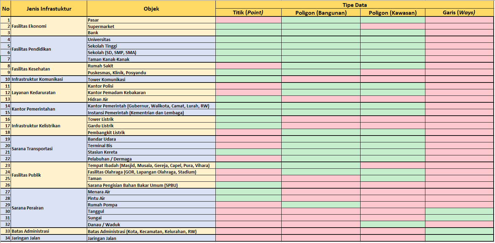

# **Model Data _OpenStreetMap_**

**Tujuan Pembelajaran:**

*   Memahami konsep _tag_, _key,_ dan _value_ di _OpenStreetMap_
*   Mengenal halaman Wikipedia _OpenStreetMap_ untuk melihat _key_ dan _value_
*   Memahami objek yang dapat dipetakan di dalam _OpenStreetMap_
*   Mengetahui dan memahami model data sebagai rencana persiapan pemetaan
*   Mengecek penggunaan _key_ dan _value_ tertentu di Situs _TagInfo_

Dalam modul ini, Anda akan mempelajari tentang konsep _key_ dan _value_ yang ada di _OpenStreetMap_ (OSM) kemudian anda juga akan mengetahui tentang model data yang ada di OSM. Pemahaman terhadap pembuatan model data akan memudahkan Anda dalam melakukan kegiatan pemetaan, mulai dari kegiatan perencanaan, survei lapangan, hingga pengambilan data hasil pemetaan. Anda juga akan mempelajari beberapa situs yang dapat memudahkan Anda dalam menemukan informasi yang Anda butuhkan sesuai dengan _key_ dan _value_ yang ada di _OpenStreetMap_.

### **I. Pengenalan Konsep _Tag_, _Key_, dan _Value_**

Di _OpenStreetMap_ setiap objek digambarkan dalam tipe data dan informasi tertentu. Tipe data di _OpenStreetMap_ ada 3 yaitu: titik (_Nodes),_ garis (_Ways),_ dan area (_Polygon/Relation_). Setiap tipe data OSM terdiri dari beberapa informasi objek yang disebut dengan _Tag_ yang dimana terdiri dari _key_ dan _value_.

Terdapat objek yang merupakan sebuah sekolah oleh karena itu objek tersebut harus diberikan **_Tag_** sebagai sebuah sekolah. Dalam _tag_ tersebut terdapat beberapa informasi lebih rinci yang membuat sekolah itu memiliki informasi khusus yang akan membedakannya dengan sekolah-sekolah yang lain seperti nama, alamat, jumlah tingkat, jenis sekolah, dll. Informasi-informasi tersebut disebut dengan **_Key_** sedangkan untuk nilai masing-masing informasi  disebut dengan **_Value_**. 

Sebagai contoh _Tag_ Sekolah: 

nama=SDN Kebon Manggis 11 Pagi  
alamat= Jalan Slamet Riyadi II. 

Dalam contoh di atas “nama dan alamat” adalah **_Key_** sedangkan “SDN Kebon Manggis 11 Pagi dan Jalan Slamet Riyadi II” merupakan **_Value_.** Untuk penjelasan lebih lanjut silahkan lihat gambar di bawah ini:

<i>Contoh key dan value di data OpenStreetMap</i>

Seperti yang dapat Anda lihat pada gambar di atas, _key_ dan _value_ yang digunakan adalah Bahasa Inggris karena itu merupakan aturan baku yang telah ditetapkan untuk semua data yang ada di _OpenStreetMap_. Anda tidak diharuskan untuk mengingat semua _key_ dan _value_ yang ada. Anda dapat menemukan key dan value yang disesuaikan dengan kebutuhan pemetaan di halaman wikipedia _OpenStreetMap_ yang akan dibahas di sub-bab selanjutnya.

### **II. Wikipedia _OpenStreetMap_ untuk Melihat _Key_ and _Value_**

Sebagai salah satu platform peta partisipatif yang ada di dunia, _OpenStreetMap_ memiliki jutaan pengguna di seluruh dunia.  Oleh karena itu, untuk menghasilkan data serta informasi yang akurat di _OpenStreetMap_, kontributor _OpenStreetMap_ membuat berbagai macam aturan serta standar yang telah disepakati bersama-sama oleh para pengguna _OpenStreetMap_. Aturan dan standar tersebut dituangkan ke dalam _platform_ berupa halaman wikipedia yang merupakan ensiklopedia yang bersifat bebas dan terbuka.

**a. Wikipedia _OpenStreetMap_ Global**

Penjelasan tentang objek serta daftar _key_ dan _value_ yang ada di data OSM telah dibuat di dalam satu halaman khusus pada OSM Wikipedia yang disebut _Map Feature_. Di halaman ini Anda dapat melihat berbagai macam daftar objek yang dapat dipetakan di dalam OSM serta informasi key dan value yang menggambarkan objek di seluruh dunia. Untuk mengaksesnya silahkan buka di [https://wiki.openstreetmap.org/wiki/Map_Features](https://wiki.openstreetmap.org/wiki/Map_Features) 

<i>Tampilan situs wikipedia OpenStreetMap map feature</i>

Setiap _key_ dan _value_ yang ada di halaman _Map Features_ adalah hal yang tidak dapat Anda ubah ataupun edit sesuai keinginan Anda. Jadi, halaman ini merupakan panduan untuk para pengguna OSM di seluruh dunia. Anda dapat menelusuri seluruh halaman _Map Features_ ini untuk mencari segala macam informasi objek yang Anda ingin ketahui.

**b. Wikipedia _OpenStreetMap_ Indonesia**

Jumlah pengguna OSM di Indonesia terus mengalami peningkatan dalam beberapa tahun terakhir. Sebagai salah satu pengguna OSM terbesar di dunia, Indonesia tentu akan membutuhkan informasi _key_ dan _value_ khususnya yang informasinya sesuai dengan kondisi di Indonesia. Akan tetapi, pada kenyataannya dalam pemetaan biasanya mereka mengalami kesulitan untuk memberikan _Tag_ yang sesuai dengan objek yang hanya ada di Indonesia. Informasi yang ditampilkan di _Map Features_ sangat beragam dan banyak jumlahnya sehingga seringkali untuk pengguna OSM di Indonesia sulit untuk melihat serta menemukan informasi terkait objek yang ada di area pemetaan mereka. Selain itu, banyak nama-nama objek yang sifatnya global sehingga tidak dapat dipahami dengan baik oleh para pengguna _OpenStreetMap_ di Indonesia. Oleh karena itu Humanitarian _OpenStreetMap_ Team (HOT) Indonesia membuat halaman wikipedia khusus untuk objek-objek yang ada di Indonesia sebagai panduan untuk para pengguna OSM di Indonesia.

Perbedaan mendasar antara halaman _Map Features_ dan wikipedia Panduan Objek OSM di Indonesia adalah daftar objek-objek yang ditampilkan di halaman wikipedia Panduan Objek OSM semuanya hanya objek-objek yang ada di Indonesia tetapi tidak ada di halaman _Map Features_. Sebagai contoh, informasi terhadap sekolah SD, SMP dan SMA yang merupakan informasi umum dan penting di Indonesia serta fasilitas kesehatan yang beragam mulai dari rumah sakit, puskesmas, posyandu serta klinik. Oleh karena itu, objek-objek serta informasi tersebut dimasukkan ke dalam halaman wikipedia Panduan Objek OSM di Indonesia. Contoh lainnya adalah jika Anda menemukan informasi nama objek yang berbeda misalnya di dalam panduan _Map Features_ "toko kelontong" dinamakan kios maka di Panduan Objek OSM Indonesia akan dinamakan "warung". Hal ini dikarenakan  nama "warung" lebih dikenal dan mudah dipahami untuk orang Indonesia dibandingkan dengan kios. 

Anda dapat melihat daftar objek-objek panduan OSM di Indonesia dengan mengakses tautan sebagai berikut: [https://wiki.openstreetmap.org/wiki/Id:Indonesian_Tagging_Guidelines](https://wiki.openstreetmap.org/wiki/Id:Indonesian_Tagging_Guidelines) 

 dan garis (bawah) di  OSM Indonesia")

<i>Halaman wiki panduan objek titik (atas) dan garis (bawah) di  OSM Indonesia</i>

### **III. Objek-Objek Pemetaan di _OpenStreetMap_**

**a. Tipe Data di _OpenStreetMap_**

Pada modul ini telah dijelaskan sebelumnya mengenai tipe data _OpenStreetMap_, yang terdiri dari titik (_Nodes),_ garis (_Ways)_ dan area (_Polygon/Relation_). Berikut akan diberikan penjelasan lebih rinci mengenai tipe data tersebut.
*   **Titik (_Nodes_)**

Titik biasanya digunakan untuk menggambarkan posisi atau lokasi dari suatu objek tertentu. Sebagai contoh objek yang dapat digambarkan berbentuk titik di _OpenStreetMap_ yaitu lampu merah, Saluran Pengisian Bahan Bakar Umum (SPBU), ataupun rumah makan yang berada di dalam suatu _mall_ atau pusat perbelanjaan.

  

<i>Contoh objek titik (nodes) di OSM</i>

*   **Garis (_Ways_)**

Garis adalah bentuk yang terdiri dari beberapa titik (_nodes_) yang saling terhubung satu sama lain. Beberapa contoh objek garis di _OpenStreetMap_ yaitu jalan, sungai, rel kereta, dan batas administrasi.

  

<i>Contoh objek garis (ways) di OSM</i>

*   **Area (_Polygon_)**

Area merupakan bentuk dari beberapa garis (_ways_) yang saling terhubung dan tertutup. Beberapa contoh objek area di _OpenStreetMap_ yaitu bangunan, taman, penggunaan lahan dan danau/waduk.

  

<i>Contoh objek area (polygon) di OSM</i>

**b. Objek Pemetaan di Kegiatan Pemetaan HOT-PDC InAWARE**

Dalam pemetaan di _OpenStreetMap_ Anda dapat memetakan segala macam objek yang ada di permukaan bumi yang bersifat nyata (_real_) dan tetap / permanen. Objek yang bersifat nyata artinya objek tersebut memiliki wujud dan dapat dilihat bentuknya oleh mata manusia seperti bangunan atau jalan sedangkan objek yang tidak nyata adalah objek yang tidak memiliki bentuk fisik dan tidak dapat dilihat oleh mata manusia seperti ketinggian ataupun kepadatan penduduk.  Kemudian objek bersifat permanen artinya objek yang dipetakan tidak berpindah-pindah tempat dan memiliki lokasi yang tetap sedangkan objek tidak permanen merupakan objek yang hanya ada sementara atau pada waktu tertentu seperti warung kaki lima di pinggir jalan.

Memilih objek yang akan dipetakan di dalam _OpenStreetMap_ tergantung dari tujuan pemetaan itu sendiri. Tujuan pemetaan di dalam kegiatan HOT-PDC InAWARE adalah untuk melengkapi infrastruktur publik yang memiliki peran penting dalam kegiatan manajemen kebencanaan. Berikut adalah objek-objek yang dipetakan ke dalam _OpenStreetMap_ dalam pemetaan HOT-PDC InAWARE:

**1.Fasilitas Ekonomi**
*   Pasar
*   Supermarket
*   Bank

**2. Fasilitas Pendidikan**
*   Universitas
*   Sekolah Tinggi
*   Sekolah (SD, SMP, SMA)
*   Taman Kanak-Kanak

**3. Fasilitas Kesehatan**
*   Rumah Sakit
*   Klinik

**4. Infrastruktur Komunikasi**
*   Tower Komunikasi

**5. Layanan Kedaruratan**
*   Kantor Polisi
*   Kantor Pemadam Kebakaran
*   Tempat Evakuasi
*   Hidran Air

**6. Kantor Pemerintahan**
*   Kantor Pemerintah (Kantor Gubernur, Kantor Walikota, Kantor Kantor Kecamatan, Kantor Kelurahan, dan Kantor RW)
*   Kedutaan Besar
*   Instansi Pemerintah (Kementrian dan Lembaga)

**7. Infrastruktur Kelistrikan**
*   Tower Listrik
*   Gardu Listrik
*   Pembangkit Listrik

**8. Sarana Transportasi**
*   Bandar Udara
*   Terminal Bis
*   Stasiun Kereta
*   Pelabuhan/Dermaga

**9. Fasilitas Publik**
*   Tempat Ibadah (Masjid, Musala, Gereja, Capel, Pura, Vihara)
*   Fasilitas Olahraga (GOR, Stadium, Lapangan Olahraga, Ruang Terbuka Hijau)
*   Ruang Publik Terpadu Ramah Anak (RPTRA)

**10. Sarana Perairan**
*   Menara Air
*   Pintu Air
*   Rumah Pompa
*   Tanggul
*   Sungai
*   Waduk / Danau

**11. Stasiun Pengisian Bahan Bakar Umum (SPBU)**

**12. Batas Wilayah Administrasi**
*   Batas Kota
*   Batas Kecamatan
*   Batas Kelurahan
*   Batas RW

**13. Jaringan Jalan**

### **IV. Model Data Pemetaan di _OpenStreetMap_**

Model data adalah beberapa informasi yang terdapat dalam sebuah objek dimana merupakan gabungan dari beberapa _key _dan _value _yang telah disepakati sebelum kegiatan pemetaan dilakukan. Sebuah model data tidak memiliki bentuk baku karena informasi yang ingin diambil akan disesuaikan sesuai dengan kebutuhan kegiatan pemetaan. Sebagai contoh dalam melakukan pemetaan sekolah, jika Anda ingin mengumpulkan informasi **nama sekolah**, **alamat sekolah**, **jenis sekolah**, **pengelola sekolah**, **jumlah tingkat sekolah** maka model data yang akan Anda buat adalah seperti berikut:

Tabel _Tag_ Informasi Sekolah

|  key |  (possible) values |
|---|---|
| amenity  |  school |
|building   | school  |
|  school:type_idn | sd [SD/MI (Elementary School)], smp [SMP/MTs (Junior High School)], sma [SMA/SMK/MA (Senior High School)]  |
|  name |  (nama bangunan) |
|addr:full   |  (alamat) |
| operator:type  | government (Pemerintah), private (Swasta), community (Komunitas/Masyarakat)  |
|  building:levels | (jumlah lantai)  |

amenity=school  merupakan informasi yang wajib ada untuk informasi sekolah. _Key_ dan _value_ ini merupakan informasi utama yang menandakan bahwa objek tersebut merupakan sebuah sekolah.

building=school merupakan informasi yang menunjukkan bahwa sekolah tersebut merupakan sebuah bangunan yang berdiri sendiri dan tidak menumpang di bangunan yang lain. Jika sekolah tersebut menumpang di bangunan lain yang fungsinya bukan sekolah maka _key_ dan _value_ ini tidak perlu dimasukkan.

**a. Model Data di Kegiatan Pemetaan HOT-PDC InAWARE**

Pemetaan HOT-PDC InAWARE memiliki tujuan untuk mengumpulkan beberapa informasi terhadap masing-masing objek yang akan dipetakan. Oleh karena itu, Anda membutuhkan model data yang dapat membantu tim surveyor untuk melakukan pemetaan di lapangan dan input data ke dalam _OpenStreetMap_. Berikut adalah contoh model data untuk masing-masing objek dalam kegiatan Pemetaan HOT-PDC InAWARE:

**Keterangan Warna:**
*   Warna biru artinya _key_ dan _value_ tersebut wajib dimiliki oleh objek tersebut.
*   Warna merah artinya _key_ dan _value_ merupakan informasi khusus untuk bangunan. Jika objek tersebut memiliki bangunan sendiri maka informasi tersebut perlu dimasukkan, jika objek  menumpang di bangunan lain dengan fungsi yang berbeda maka informasi tersebut tidak perlu dimasukkan.
*   Warna putih artinya _key_ dan _value_ tersebut perlu dimasukkan ke dalam objek pemetaan baik objek tersebut  memiliki bangunan sendiri ataupun menumpang di bangunan yang lain.

**1.Fasilitas Ekonomi**
* Tabel Model Data Pasar

| key  |  possible values |
|---|---|
|  amenity | marketplace  |
|  building |  marketplace |
|  name | (nama pasar)  |
|  addr:full |(alamat)   |
|  addr:city |  (kota pemetaan) |
|  capacity:persons | <50, 50-100, 100-250, 250-500, >500  |
|  building:levels |  (jumlah lantai) |
|building:structure   |   confined_masonry (Rangka beton bertulang), steel_frame (Rangka baja), wood_frame (Rangka kayu), bamboo_frame (Rangka bambu)|
| building:material  |  brick (Bata), concrete (Beton), wood (Papan kayu), bamboo (Bambu), glass (Kaca) |
| building:floor  | ground (Tanah), wood (Papan kayu), cement (Plester / Semen), tekhel (Tegel), ceramics (Keramik)  |
| building:roof  |  tile (Genteng), tin (Seng), asbestos (Asbes), concrete (Beton) |
|  access:roof | yes (Ada), no (Tidak ada)  |
|  building: condition |  poor (Buruk), good (Baik) |
|  ground_floor:height |  tinggi bangunan dari jalan dalam satuan meter |
| backup_generator  | yes (Ada), no (Tidak ada)  |
|  source |  HOT_InAWARESurvey_2018 |

*  Tabel Model Data Supermarket

| key  |  possible values |
|---|---|
|  amenity | supermarket  |
|  building |  supermarket |
|  name | (nama supermarket)  |
|  addr:full |(alamat)   |
|  addr:city |  (kota pemetaan) |
|  capacity:persons | <50, 50-100, 100-250, 250-500, >500  |
|  building:levels |  (jumlah lantai) |
|building:structure   |   confined_masonry (Rangka beton bertulang), steel_frame (Rangka baja), wood_frame (Rangka kayu), bamboo_frame (Rangka bambu)|
| building:material  |  brick (Bata), concrete (Beton), wood (Papan kayu), bamboo (Bambu), glass (Kaca) |
| building:floor  | ground (Tanah), wood (Papan kayu), cement (Plester / Semen), tekhel (Tegel), ceramics (Keramik)  |
| building:roof  |  tile (Genteng), tin (Seng), asbestos (Asbes), concrete (Beton) |
|  access:roof | yes (Ada), no (Tidak ada)  |
|  building: condition |  poor (Buruk), good (Baik) |
|  ground_floor:height |  tinggi bangunan dari jalan dalam satuan meter |
| backup_generator  | yes (Ada), no (Tidak ada)  |
|  source |  HOT_InAWARESurvey_2018 |

*   Tabel Model Data Bank

| key  |  possible values |
|---|---|
|  amenity | bank  |
|  building |  bank |
|  name | (nama bank)  |
|  addr:full |(alamat)   |
|  addr:city |  (kota pemetaan) |
|  capacity:persons | <50, 50-100, 100-250, 250-500, >500  |
|  building:levels |  (jumlah lantai) |
|building:structure   |   confined_masonry (Rangka beton bertulang), steel_frame (Rangka baja), wood_frame (Rangka kayu), bamboo_frame (Rangka bambu)|
| building:material  |  brick (Bata), concrete (Beton), wood (Papan kayu), bamboo (Bambu), glass (Kaca) |
| building:floor  | ground (Tanah), wood (Papan kayu), cement (Plester / Semen), tekhel (Tegel), ceramics (Keramik)  |
| building:roof  |  tile (Genteng), tin (Seng), asbestos (Asbes), concrete (Beton) |
|  access:roof | yes (Ada), no (Tidak ada)  |
|  building: condition |  poor (Buruk), good (Baik) |
|  ground_floor:height |  tinggi bangunan dari jalan dalam satuan meter |
| backup_generator  | yes (Ada), no (Tidak ada)  |
|  source |  HOT_InAWARESurvey_2018 |

**2. Fasilitas Pendidikan**

*  Tabel Model Data Universitas

| key  |  possible values |
|---|---|
|  amenity | university  |
|  building |  university |
|  name | (nama universitas) |
|  addr:full |(alamat)   |
|  addr:city |  (kota pemetaan) |
|  operator:type |  government (Pemerintah), private (Swasta), community (Komunitas/Masyarakat) |
|  capacity:persons | <50, 50-100, 100-250, 250-500, >500  |
|  building:levels |  (jumlah lantai) |
|building:structure   |   confined_masonry (Rangka beton bertulang), steel_frame (Rangka baja), wood_frame (Rangka kayu), bamboo_frame (Rangka bambu)|
| building:material  |  brick (Bata), concrete (Beton), wood (Papan kayu), bamboo (Bambu), glass (Kaca) |
| building:floor  | ground (Tanah), wood (Papan kayu), cement (Plester / Semen), tekhel (Tegel), ceramics (Keramik)  |
| building:roof  |  tile (Genteng), tin (Seng), asbestos (Asbes), concrete (Beton) |
|  access:roof | yes (Ada), no (Tidak ada)  |
|  building: condition |  poor (Buruk), good (Baik) |
|  ground_floor:height |  tinggi bangunan dari jalan dalam satuan meter |
| backup_generator  | yes (Ada), no (Tidak ada)  |
|  source |  HOT_InAWARESurvey_2018 |
|  evacuation_center |  yes (Ya), no (Bukan) |
|  shelter_type |  tent (Tenda), building (Bangunan) |
| water_source  |  water_works (PDAM), manual_pump (Pompa Tangan), powered_pump (Mesin Pompa)|
|kitchen:facilities   |  yes (Ada), no (Tidak ada) |
| toilet:facilities |  yes (Ada), no (Tidak ada) |
| toilets:number  |  (jumlah toilet) |

*   Tabel Model Data Sekolah Tinggi

| key  |  possible values |
|---|---|
|  amenity | college  |
|  building |  college |
|  name | (nama sekolah tinggi)  |
|  addr:full |(alamat)   |
|  addr:city |  (kota pemetaan) |
|  operator:type |  government (Pemerintah), private (Swasta), community (Komunitas/Masyarakat) |
|  capacity:persons | <50, 50-100, 100-250, 250-500, >500  |
|  building:levels |  (jumlah lantai) |
|building:structure   |   confined_masonry (Rangka beton bertulang), steel_frame (Rangka baja), wood_frame (Rangka kayu), bamboo_frame (Rangka bambu)|
| building:material  |  brick (Bata), concrete (Beton), wood (Papan kayu), bamboo (Bambu), glass (Kaca) |
| building:floor  | ground (Tanah), wood (Papan kayu), cement (Plester / Semen), tekhel (Tegel), ceramics (Keramik)  |
| building:roof  |  tile (Genteng), tin (Seng), asbestos (Asbes), concrete (Beton) |
|  access:roof | yes (Ada), no (Tidak ada)  |
|  building: condition |  poor (Buruk), good (Baik) |
|  ground_floor:height |  tinggi bangunan dari jalan dalam satuan meter |
| backup_generator  | yes (Ada), no (Tidak ada)  |
|  source |  HOT_InAWARESurvey_2018 |
|  evacuation_center |  yes (Ya), no (Bukan) |
|  shelter_type |  tent (Tenda), building (Bangunan) |
| water_source  |  water_works (PDAM), manual_pump (Pompa Tangan), powered_pump (Mesin Pompa)|
|kitchen:facilities   |  yes (Ada), no (Tidak ada) |
| toilet:facilities |  yes (Ada), no (Tidak ada) |
| toilets:number  |  (jumlah toilet) |

*   Tabel Model Data Sekolah (SD, SMP, SMA)

| key  |  possible values |
|---|---|
|  school:type_idn | sd [SD/MI (Elementary School)], smp [SMP/MTs (Junior High School)], sma [SMA/SMK/MA (Senior High School)]  |
|  amenity | school  |
|  building |  school |
|  name | (nama sekolah)  |
|  addr:full |(alamat)   |
|  addr:city |  (kota pemetaan) |
|  operator:type |  government (Pemerintah), private (Swasta), community (Komunitas/Masyarakat) |
|  capacity:persons | <50, 50-100, 100-250, 250-500, >500  |
|  building:levels |  (jumlah lantai) |
|building:structure   |   confined_masonry (Rangka beton bertulang), steel_frame (Rangka baja), wood_frame (Rangka kayu), bamboo_frame (Rangka bambu)|
| building:material  |  brick (Bata), concrete (Beton), wood (Papan kayu), bamboo (Bambu), glass (Kaca) |
| building:floor  | ground (Tanah), wood (Papan kayu), cement (Plester / Semen), tekhel (Tegel), ceramics (Keramik)  |
| building:roof  |  tile (Genteng), tin (Seng), asbestos (Asbes), concrete (Beton) |
|  access:roof | yes (Ada), no (Tidak ada)  |
|  building: condition |  poor (Buruk), good (Baik) |
|  ground_floor:height |  tinggi bangunan dari jalan dalam satuan meter |
| backup_generator  | yes (Ada), no (Tidak ada)  |
|  source |  HOT_InAWARESurvey_2018 |
|  evacuation_center |  yes (Ya), no (Bukan) |
|  shelter_type |  tent (Tenda), building (Bangunan) |
| water_source  |  water_works (PDAM), manual_pump (Pompa Tangan), powered_pump (Mesin Pompa)|
|kitchen:facilities   |  yes (Ada), no (Tidak ada) |
| toilet:facilities |  yes (Ada), no (Tidak ada) |
| toilets:number  |  (jumlah toilet) |

*   Tabel Model Data Taman Kanak-Kanak

| key  |  possible values |
|---|---|
|  amenity | kindergarten [PAUD/ Play Group / TK (Early education / Play group / Kindergarten)]  |
|  building |  kindergarten |
|  name | (nama taman kanak-kanak)  |
|  addr:full |(alamat)   |
|  addr:city |  (kota pemetaan) |
|  operator:type |  government (Pemerintah), private (Swasta), community (Komunitas/Masyarakat) |
|  capacity:persons | <50, 50-100, 100-250, 250-500, >500  |
|  building:levels |  (jumlah lantai) |
|building:structure   |   confined_masonry (Rangka beton bertulang), steel_frame (Rangka baja), wood_frame (Rangka kayu), bamboo_frame (Rangka bambu)|
| building:material  |  brick (Bata), concrete (Beton), wood (Papan kayu), bamboo (Bambu), glass (Kaca) |
| building:floor  | ground (Tanah), wood (Papan kayu), cement (Plester / Semen), tekhel (Tegel), ceramics (Keramik)  |
| building:roof  |  tile (Genteng), tin (Seng), asbestos (Asbes), concrete (Beton) |
|  access:roof | yes (Ada), no (Tidak ada)  |
|  building: condition |  poor (Buruk), good (Baik) |
|  ground_floor:height |  tinggi bangunan dari jalan dalam satuan meter |
| backup_generator  | yes (Ada), no (Tidak ada)  |
|  source |  HOT_InAWARESurvey_2018 |

**3. Fasilitas Kesehatan**
* Tabel Model Data Rumah Sakit

| key  |  possible values |
|---|---|
|  amenity | hospital  |
|  name | (nama rumah sakit)  |
|  addr:full |(alamat)   |
|  addr:city |  (kota pemetaan) |
|  operator:type |  government (Pemerintah), private (Swasta), community (Komunitas/Masyarakat) |
|  building |  hospital |
|  capacity:persons | <50, 50-100, 100-250, 250-500, >500  |
|  building:levels |  (jumlah lantai) |
|building:structure   |   confined_masonry (Rangka beton bertulang), steel_frame (Rangka baja), wood_frame (Rangka kayu), bamboo_frame (Rangka bambu)|
| building:material  |  brick (Bata), concrete (Beton), wood (Papan kayu), bamboo (Bambu), glass (Kaca) |
| building:floor  | ground (Tanah), wood (Papan kayu), cement (Plester / Semen), tekhel (Tegel), ceramics (Keramik)  |
| building:roof  |  tile (Genteng), tin (Seng), asbestos (Asbes), concrete (Beton) |
|  access:roof | yes (Ada), no (Tidak ada)  |
|  building: condition |  poor (Buruk), good (Baik) |
|  ground_floor:height |  tinggi bangunan dari jalan dalam satuan meter |
| backup_generator  | yes (Ada), no (Tidak ada)  |
|  source |  HOT_InAWARESurvey_2018 |
|  evacuation_center |  yes (Ya), no (Bukan) |
|  shelter_type |  tent (Tenda), building (Bangunan) |
| water_source  |  water_works (PDAM), manual_pump (Pompa Tangan), powered_pump (Mesin Pompa)|
|kitchen:facilities   |  yes (Ada), no (Tidak ada) |
| toilet:facilities |  yes (Ada), no (Tidak ada) |
| toilets:number  |  (jumlah toilet) |

* Tabel Model Data Klinik, Puskesmas, Posyandu

| key  |  possible values |
|---|---|
|  amenity | clinic (Klinik / Puskemas / Posyandu) |
|  name | (nama klinik)  |
|  addr:full |(alamat)   |
|  addr:city |  (kota pemetaan) |
|  operator:type |  government (Pemerintah), private (Swasta), community (Komunitas/Masyarakat) |
|  building |  clinic |
|  capacity:persons | <50, 50-100, 100-250, 250-500, >500  |
|  building:levels |  (jumlah lantai) |
|building:structure   |   confined_masonry (Rangka beton bertulang), steel_frame (Rangka baja), wood_frame (Rangka kayu), bamboo_frame (Rangka bambu)|
| building:material  |  brick (Bata), concrete (Beton), wood (Papan kayu), bamboo (Bambu), glass (Kaca) |
| building:floor  | ground (Tanah), wood (Papan kayu), cement (Plester / Semen), tekhel (Tegel), ceramics (Keramik)  |
| building:roof  |  tile (Genteng), tin (Seng), asbestos (Asbes), concrete (Beton) |
|  access:roof | yes (Ada), no (Tidak ada)  |
|  building: condition |  poor (Buruk), good (Baik) |
|  ground_floor:height |  tinggi bangunan dari jalan dalam satuan meter |
| backup_generator  | yes (Ada), no (Tidak ada)  |
|  source |  HOT_InAWARESurvey_2018 |
|  evacuation_center |  yes (Ya), no (Bukan) |
|  shelter_type |  tent (Tenda), building (Bangunan) |
| water_source  |  water_works (PDAM), manual_pump (Pompa Tangan), powered_pump (Mesin Pompa)|
|kitchen:facilities   |  yes (Ada), no (Tidak ada) |
| toilet:facilities |  yes (Ada), no (Tidak ada) |
| toilets:number  |  (jumlah toilet) |

**4. Infrastruktur Komunikasi**
* Tabel Model Data Tower Komunikasi

|key   | possible values  |
|---|---|
| man_made  | tower  |
| tower:type | communication  |
| name  | (nama tower)  |
| height | (tinggi tower dalam meter)  |
| operator   | Telkomsel, Indosat, XL, Tri, Smartfren  |
| communication:mobile  | yes (Ada), no (Tidak ada)  |
| communication:radio  | yes (Ada), no (Tidak ada)  |
| addr:city  | (kota pemetaan)  |
| source  | HOT_InAWARESurvey_2018  |

**5. Layanan Kedaruratan**
* Tabel Model Data Kantor Polisi

| key  |  possible values |
|---|---|
|  amenity | police  |
|  building |  police |
|  name | (nama kantor polisi)  |
|  addr:full |(alamat)   |
|  addr:city |  (kota pemetaan) |
|  capacity:persons | <50, 50-100, 100-250, 250-500, >500  |
|  building:levels |  (jumlah lantai) |
|building:structure   |   confined_masonry (Rangka beton bertulang), steel_frame (Rangka baja), wood_frame (Rangka kayu), bamboo_frame (Rangka bambu)|
| building:material  |  brick (Bata), concrete (Beton), wood (Papan kayu), bamboo (Bambu), glass (Kaca) |
| building:floor  | ground (Tanah), wood (Papan kayu), cement (Plester / Semen), tekhel (Tegel), ceramics (Keramik)  |
| building:roof  |  tile (Genteng), tin (Seng), asbestos (Asbes), concrete (Beton) |
|  access:roof | yes (Ada), no (Tidak ada)  |
|  building: condition |  poor (Buruk), good (Baik) |
|  ground_floor:height |  tinggi bangunan dari jalan dalam satuan meter |
| backup_generator  | yes (Ada), no (Tidak ada)  |
|  source |  HOT_InAWARESurvey_2018 |

* Tabel Model Data Kantor Pemadam Kebakaran

| key  |  possible values |
|---|---|
|  amenity | fire_station  |
|  building |  fire_station |
|  name | (nama kantor pemadam kebakaran)  |
|  addr:full |(alamat)   |
|  addr:city |  (kota pemetaan) |
|  capacity:persons | <50, 50-100, 100-250, 250-500, >500  |
|  building:levels |  (jumlah lantai) |
|building:structure   |   confined_masonry (Rangka beton bertulang), steel_frame (Rangka baja), wood_frame (Rangka kayu), bamboo_frame (Rangka bambu)|
| building:material  |  brick (Bata), concrete (Beton), wood (Papan kayu), bamboo (Bambu), glass (Kaca) |
| building:floor  | ground (Tanah), wood (Papan kayu), cement (Plester / Semen), tekhel (Tegel), ceramics (Keramik)  |
| building:roof  |  tile (Genteng), tin (Seng), asbestos (Asbes), concrete (Beton) |
|  access:roof | yes (Ada), no (Tidak ada)  |
|  building: condition |  poor (Buruk), good (Baik) |
|  ground_floor:height |  tinggi bangunan dari jalan dalam satuan meter |
| backup_generator  | yes (Ada), no (Tidak ada)  |
|  source |  HOT_InAWARESurvey_2018 |

* Tabel Model Data Hidran Air

|  key  | possible values  |
|---|---|
| emergency  | fire_hydrant  |
| fire_hydrant:type | underground (bawah tanah), pillar (pilar), wall (dinding), pond (kolam)  |
| name  |  (nama hidran) |
| operator  | (nama operator)  |
| addr:city  | (kota pemetaan)  |
| source  | HOT_InAWARESurvey_2018  |

**6. Kantor Pemerintahan**
* Tabel Model Data Kantor Pemerintah (Kantor Gubernur, Kantor Walikota, Kantor Camat, Kantor Lurah, Kantor RW)

| key  |  possible values |
|---|---|
|  office | government  |
|  building |  governor_office (Kantor Gubernur), townhall (Kantor Bupati / Walikota), subdistrict_office (Kantor Camat), village_office (Kantor Desa / Lurah), community_group_office (Balai Warga / Kantor RW)  |
|  admin_level |  4 (Kantor Gubernur), 5 (Kantor Bupati / Walikota), 6 (Kantor Kecamatan), 7 (Kantor Desa / Keluruhan), 9 (Kantor RW)  |
|  name | (nama kantor pemerintahan)  |
|  addr:full |(alamat)   |
|  addr:city |  (kota pemetaan) |
|  capacity:persons | <50, 50-100, 100-250, 250-500, >500  |
|  building:levels |  (jumlah lantai) |
|building:structure   |   confined_masonry (Rangka beton bertulang), steel_frame (Rangka baja), wood_frame (Rangka kayu), bamboo_frame (Rangka bambu)|
| building:material  |  brick (Bata), concrete (Beton), wood (Papan kayu), bamboo (Bambu), glass (Kaca) |
| building:floor  | ground (Tanah), wood (Papan kayu), cement (Plester / Semen), tekhel (Tegel), ceramics (Keramik)  |
| building:roof  |  tile (Genteng), tin (Seng), asbestos (Asbes), concrete (Beton) |
|  access:roof | yes (Ada), no (Tidak ada)  |
|  building: condition |  poor (Buruk), good (Baik) |
|  ground_floor:height |  tinggi bangunan dari jalan dalam satuan meter |
| backup_generator  | yes (Ada), no (Tidak ada)  |
|  source |  HOT_InAWARESurvey_2018 |
|  evacuation_center |  yes (Ya), no (Bukan) |
|  shelter_type |  tent (Tenda), building (Bangunan) |
| water_source  |  water_works (PDAM), manual_pump (Pompa Tangan), powered_pump (Mesin Pompa)|
|kitchen:facilities   |  yes (Ada), no (Tidak ada) |
| toilet:facilities |  yes (Ada), no (Tidak ada) |
| toilets:number  |  (jumlah toilet) |

* Tabel Model Data Instansi Pemerintah (Kementrian dan Lembaga)

| key  |  possible values |
|---|---|
|  office | government  |
|  building |  government_office  |
|  name | (nama instansi pemerintahan)  |
|  addr:full |(alamat)   |
|  addr:city |  (kota pemetaan) |
|  admin_level |  4 (Provinsi), 5 (Kabupaten/Kota), 6 (Kecamatan), 7 ( Desa / Keluruhan)  |
|  capacity:persons | <50, 50-100, 100-250, 250-500, >500  |
|  building:levels |  (jumlah lantai) |
|building:structure   |   confined_masonry (Rangka beton bertulang), steel_frame (Rangka baja), wood_frame (Rangka kayu), bamboo_frame (Rangka bambu)|
| building:material  |  brick (Bata), concrete (Beton), wood (Papan kayu), bamboo (Bambu), glass (Kaca) |
| building:floor  | ground (Tanah), wood (Papan kayu), cement (Plester / Semen), tekhel (Tegel), ceramics (Keramik)  |
| building:roof  |  tile (Genteng), tin (Seng), asbestos (Asbes), concrete (Beton) |
|  access:roof | yes (Ada), no (Tidak ada)  |
|  building: condition |  poor (Buruk), good (Baik) |
| backup_generator  | yes (Ada), no (Tidak ada)  |
|  source |  HOT_InAWARESurvey_2018 |

**7. Infrastruktur Kelistrikan**
* Tabel Model Data Tower Listrik

|  key | possible values  |
|---|---|
|  power | tower  |
| name  |  (nama tower) |
| addr:city  | (kota pemetaan)  |
| operator  |  PT Perusahaan Listrik Negara |
|  source | HOT_InAWARESurvey_2018  |

* Tabel Model Data Gardu Listrik

|  key | possible values  |
|---|---|
|  power | substation  |
|  substation | transmission (Gardu Induk), distribution (Gardu Distribusi)  |
|  building | power_substation  |
| name  |  (nama gardu listrik) |
| addr:city  | (kota pemetaan)  |
| rating  | (ditentukan pengguna)  |
| operator  |  PT Perusahaan Listrik Negara |
|  source | HOT_InAWARESurvey_2018  |

* Tabel Model Data Pembangkit Listrik

|  key | possible values  |
|---|---|
|  power | plant  |
|  building | power_plant  |
| name  |  (nama pembangkit listrik) |
| operator  |  (nama operator) |
| addr:city  | (kota pemetaan)  |
| addr:full  | (alamat)  |
|  source | HOT_InAWARESurvey_2018  |

**8. Sarana Transportasi**
* Tabel Model Data Bandar Udara

| key  |  possible values |
|---|---|
|  amenity | aerodrome  |
|  building |  aerodrome |
|  name | (nama bandar udara)  |
|  addr:full |(alamat)   |
|  addr:city |  (kota pemetaan) |
|  capacity:persons | <50, 50-100, 100-250, 250-500, >500  |
|  building:levels |  (jumlah lantai) |
|building:structure   |   confined_masonry (Rangka beton bertulang), steel_frame (Rangka baja), wood_frame (Rangka kayu), bamboo_frame (Rangka bambu)|
| building:material  |  brick (Bata), concrete (Beton), wood (Papan kayu), bamboo (Bambu), glass (Kaca) |
| building:floor  | ground (Tanah), wood (Papan kayu), cement (Plester / Semen), tekhel (Tegel), ceramics (Keramik)  |
| building:roof  |  tile (Genteng), tin (Seng), asbestos (Asbes), concrete (Beton) |
|  access:roof | yes (Ada), no (Tidak ada)  |
|  building: condition |  poor (Buruk), good (Baik) |
| backup_generator  | yes (Ada), no (Tidak ada)  |
|  source |  HOT_InAWARESurvey_2018 |

* Tabel Model Data Terminal Bis

| key  |  possible values |
|---|---|
|  amenity | bus_station  |
|  name | (nama terminal bis)  |
|  addr:full |(alamat)   |
|  addr:city |  (kota pemetaan) |
|  source |  HOT_InAWARESurvey_2018 |

* Tabel Model Data Stasiun Kereta

| key  |  possible values |
|---|---|
|  amenity | station  |
|  name | (nama stasiun kereta)  |
|  ele | (ketinggian di atas permukaan laut)  |
|  operator | PT Kereta Api Indonesia  |
|  addr:full |(alamat)   |
|  addr:city |  (kota pemetaan) |
|  source |  HOT_InAWARESurvey_2018 |

* Tabel Model Data Pelabuhan/Dermaga

| key  |  possible values |
|---|---|
|  amenity | ferry_terminal  |
|  building |  ferry_terminal |
|  name | (nama dermaga)  |
|  addr:full |(alamat)   |
|  addr:city |  (kota pemetaan) |
|  capacity:persons | <50, 50-100, 100-250, 250-500, >500  |
|  building:levels |  (jumlah lantai) |
|building:structure   |   confined_masonry (Rangka beton bertulang), steel_frame (Rangka baja), wood_frame (Rangka kayu), bamboo_frame (Rangka bambu)|
| building:material  |  brick (Bata), concrete (Beton), wood (Papan kayu), bamboo (Bambu), glass (Kaca) |
| building:floor  | ground (Tanah), wood (Papan kayu), cement (Plester / Semen), tekhel (Tegel), ceramics (Keramik)  |
| building:roof  |  tile (Genteng), tin (Seng), asbestos (Asbes), concrete (Beton) |
|  access:roof | yes (Ada), no (Tidak ada)  |
|  building: condition |  poor (Buruk), good (Baik) |
| backup_generator  | yes (Ada), no (Tidak ada)  |
|  source |  HOT_InAWARESurvey_2018 |

**9. Fasilitas Publik**
* Tabel Model Data Tempat Ibadah (Masjid, Musala, Gereja, Capel, Pura, Vihara)

| key  |  possible values |
|---|---|
|  amenity | place_of_worship  |
|  religion |  muslim, christian, hindu, buddhist, confucian  |
|  name | (nama kantor pemerintahan)  |
|  addr:full |(alamat)   |
|  addr:city |  (kota pemetaan) |
|  building |  mosque (Masjid), church (Gereja), temple (Pura), tempe (Vihara), temple (Klenteng)  |
|  capacity:persons | <50, 50-100, 100-250, 250-500, >500  |
|  building:levels |  (jumlah lantai) |
|building:structure   |   confined_masonry (Rangka beton bertulang), steel_frame (Rangka baja), wood_frame (Rangka kayu), bamboo_frame (Rangka bambu)|
| building:material  |  brick (Bata), concrete (Beton), wood (Papan kayu), bamboo (Bambu), glass (Kaca) |
| building:floor  | ground (Tanah), wood (Papan kayu), cement (Plester / Semen), tekhel (Tegel), ceramics (Keramik)  |
| building:roof  |  tile (Genteng), tin (Seng), asbestos (Asbes), concrete (Beton) |
|  access:roof | yes (Ada), no (Tidak ada)  |
|  building: condition |  poor (Buruk), good (Baik) |
|  ground_floor:height |  tinggi bangunan dari jalan dalam satuan meter |
| backup_generator  | yes (Ada), no (Tidak ada)  |
|  source |  HOT_InAWARESurvey_2018 |
|  evacuation_center |  yes (Ya), no (Bukan) |
|  shelter_type |  tent (Tenda), building (Bangunan) |
| water_source  |  water_works (PDAM), manual_pump (Pompa Tangan), powered_pump (Mesin Pompa)|
|kitchen:facilities   |  yes (Ada), no (Tidak ada) |
| toilet:facilities |  yes (Ada), no (Tidak ada) |
| toilets:number  |  (jumlah toilet) |

* Tabel Model Data Fasilitas Olahraga (GOR,Lapangan Olahraga, Stadium)

| key  |  possible values |
|---|---|
|  leisure | stadium (Stadion), sports_centre (Pusat Kegiatan Olahraga / GOR), pitch (Lapangan Olahraga)  |
|  building |  stadium, sports_centre, yes (futsal field)  |
|  name | (nama fasilitas olahraga)  |
|  addr:full | (alamat)   |
|  addr:city |  (kota pemetaan) |
|  sport |  soccer,futsal,basketball,badminton,tennis,volleyball,swimming,athletics, baseball,cycling, multi |
|  capacity:persons | <50, 50-100, 100-250, 250-500, >500  |
|  building:levels |  (jumlah lantai) |
|building:structure   |   confined_masonry (Rangka beton bertulang), steel_frame (Rangka baja), wood_frame (Rangka kayu), bamboo_frame (Rangka bambu)|
| building:material  |  brick (Bata), concrete (Beton), wood (Papan kayu), bamboo (Bambu), glass (Kaca) |
| building:floor  | ground (Tanah), wood (Papan kayu), cement (Plester / Semen), tekhel (Tegel), ceramics (Keramik)  |
| building:roof  |  tile (Genteng), tin (Seng), asbestos (Asbes), concrete (Beton) |
|  access:roof | yes (Ada), no (Tidak ada)  |
|  building: condition |  poor (Buruk), good (Baik) |
|  ground_floor:height |  tinggi bangunan dari jalan dalam satuan meter |
| backup_generator  | yes (Ada), no (Tidak ada)  |
|  source |  HOT_InAWARESurvey_2018 |
|  evacuation_center |  yes (Ya), no (Bukan) |
|  shelter_type |  tent (Tenda), building (Bangunan) |
| water_source  |  water_works (PDAM), manual_pump (Pompa Tangan), powered_pump (Mesin Pompa)|
|kitchen:facilities   |  yes (Ada), no (Tidak ada) |
| toilet:facilities |  yes (Ada), no (Tidak ada) |
| toilets:number  |  (jumlah toilet) |

* Tabel Model Data Taman

| key  |  possible values |
|---|---|
|  leisure | park  |
|  name | (nama taman)  |
|  addr:full | (alamat)   |
|  addr:city |  (kota pemetaan) |
|  source |  HOT_InAWARESurvey_2018 |
|  evacuation_center |  yes (Ya), no (Bukan) |
|  shelter_type |  tent (Tenda), building (Bangunan) |
| water_source  |  water_works (PDAM), manual_pump (Pompa Tangan), powered_pump (Mesin Pompa)|
|kitchen:facilities   |  yes (Ada), no (Tidak ada) |
| toilet:facilities |  yes (Ada), no (Tidak ada) |
| toilets:number  |  (jumlah toilet) |

**10. Sarana Perairan**
* Tabel Model Data Menara Air

| key  |  possible values |
|---|---|
|  man_made | water_tower  |
|  name | (nama tower)  |
|  operator | (nama operator)   |
|  addr:city |  (kota pemetaan) |
|  source |  HOT_InAWARESurvey_2018 |

* Tabel Model Data Pintu Air

| key  |  possible values |
|---|---|
|  waterway | floodgate  |
|  name | (nama pintu air)  |
|  operator | (nama operator)   |
|  floodgate:unit | (jumlah pintu air)   |
|  elevation | (ketinggian di atas permukaan laut)   |
|  condition | good (baik), poor (buruk)   |
|  addr:city |  (kota pemetaan) |
|  source |  HOT_InAWARESurvey_2018 |

* Tabel Model Data Rumah Pompa

| key  |  possible values |
|---|---|
|  man_made | pumping_station  |
|  building |  pumping_station |
|  name | (nama rumah pompa)  |
|  addr:full |(alamat)   |
|  addr:city |  (kota pemetaan) |
|  operator | (nama operator)   |
|  pump:unit | (jumlah pompa)   |
|  elevation | (ketinggian di atas permukaan laut)   |
|  capacity:persons | (kapasitas pompa (l/s))  |
|  building:levels |  (jumlah lantai) |
|building:structure   |   confined_masonry (Rangka beton bertulang), steel_frame (Rangka baja), wood_frame (Rangka kayu), bamboo_frame (Rangka bambu)|
| building:material  |  brick (Bata), concrete (Beton), wood (Papan kayu), bamboo (Bambu), glass (Kaca) |
| building:floor  | ground (Tanah), wood (Papan kayu), cement (Plester / Semen), tekhel (Tegel), ceramics (Keramik)  |
| building:roof  |  tile (Genteng), tin (Seng), asbestos (Asbes), concrete (Beton) |
|  access:roof | yes (Ada), no (Tidak ada)  |
|  building: condition |  poor (Buruk), good (Baik) |
|  ground_floor:height |  tinggi bangunan dari jalan dalam satuan meter |
| backup_generator  | yes (Ada), no (Tidak ada)  |
|  source |  HOT_InAWARESurvey_2018 |

* Tabel Model Data Tanggul

| key  |  possible values |
|---|---|
|  man_made | embankment  |
|  name | (nama tanggul)  |
|  material | concrete (Benton), stone (Batu), soil (Tanah), sand (Pasir)   |
|  source |  HOT_InAWARESurvey_2018 |

* Tabel Model Data Sungai

| key  |  possible values |
|---|---|
|  waterway | river (Sungai), riverbank (Badan sungai), canal (Kanal)  |
|  name | (nama sungai)  |
|  width | (lebar sungai)   |
|  source |  HOT_InAWARESurvey_2018 |

* Tabel Model Data Waduk / Danau

| key  |  possible values |
|---|---|
|  landuse | reservoir  |
|  name | (nama waduk/danau)  |
|  operator | (nama operator)   |
|  addr:city |  (kota pemetaan) |
|  source |  HOT_InAWARESurvey_2018 |

**11. Stasiun Pengisian Bahan Bakar Umum (SPBU)**
* Tabel Model Data SPBU

| key  |  possible values |
|---|---|
|  amenity | fuel  |
|  name | (nama SPBU)  |
|  addr:full |  (alamat) |
|  addr:city |  (kota pemetaan) |
|  operator | (PT Pertamina, Shell, etc)   |
|  source |  HOT_InAWARESurvey_2018 |

**12. Batas Wilayah Administrasi**

| key  |  possible values |
|---|---|
|  type | boundary  |
|  boundary |  administrative |
|  name | (nama rumah pompa)  |
|  admin_level |4 (Provinsi), 5 (Kota / Kotamadya / Kabupaten), 6 (Kecamatan), 7 (Kelurahan / Desa), 8 (Dusun), 9 (RW), 10 (RT)   |
|  is_in:province |  (nama provinsi) |
|  is_in:city (Kota) / is_in:town (Kabupaten)| (nama kota/kabupaten)   |
|  is_in:municipality | (nama kecamatan)   |
|  is_in:village | (nama kelurahan)   |
|  is_in:RW | (nama rw)  |
|  flood_prone *khusus untuk relasi RW |  yes (Iya), no (Tidak) |
|  landslide_prone *khusus untuk relasi RW   |  yes (Iya), no (Tidak) |
|  source |  HOT_InAWARESurvey_2018 |

**13. Jaringan Jalan**

| key  |  possible values |
|---|---|
|  highway | motorway (Jalan Tol), trunk (Jalan Arteri Primer), primary (Jalan Arteri Sekunder), secondary (Jalan Kolektor Primer), , tertiary (Jalan Lokal), service (Jalan Layanan), residential (Jalan Permukiman), pedestrian (Jalan Khusus Pejalan Kaki), path (Jalan Setapak), living_street (Gang), track (Jalan Pematang).  |
|  name | (nama jalan)  |
|  layer | 5,4,3,2,1,-1,-2,-3,-4,-5  |
|  width |  (lebar jalan) |
|  lanes | (jumlah lajur)   |
|  surface | asphalt (Aspal), concrete (Beton), metal (Besi/Baja), wood (Kayu), grass (Rumput), ground (Tanah), gravel (Batu Kerikil), mud (Lumpur), sand (Pasir), paving_stones (Paving blok)  |
|  smoothness | good (Baik), intermediate (Cukup Baik), bad (Buruk), impassable (Tidak dapat dilewati)  |
|  motorcycle | yes (Iya), no (Tidak)  |
|  oneway |  yes (Iya), no (Tidak) |
| ref  |  (referensi) |
|  source |  HOT_InAWARESurvey_2018 |

**b. Tipe Data _OpenStreetMap_ Berdasarkan Objek**

Setelah Anda mengetahui model data berdasarkan _tag_ yang diperlukan untuk masing-masing objek khususnya dalam kegiatan pemetaan kebencanaan, Anda juga perlu mengetahui pemetaan objek berdasarkan tipe data di _OpenStreetMap_. Berikut adalah tabel pembagian jenis-jenis objek berdasarkan tipe data yang dapat dipetakan:

**Keterangan Warna:**
*   Warna hijau artinya objek bisa dipetakan dalam tipe data tersebut.
*   Warna merah artinya objek tidak bisa dan tidak boleh dipetakan dalam tipe data tersebut

Tabel Jenis Infrastruktur dan Tipe Data di _OpenStreetMap_

### V. Mengecek _key_ dan _value_ di _Tag Info_

Pada bab sebelumnya sudah dijelaskan mengenai panduan untuk melihat _key_ dan _value_ pada objek di _OpenStreetMap_ dengan menggunakan halaman wikipedia _Map Features_ dan Referensi objek OSM Indonesia. Namun, ada beberapa _key_ dan _value_ yang tidak dijelaskan pada halaman tersebut khususnya informasi yang lebih rinci dan spesifik misalnya untuk **kapasitas orang pada sebuah bangunan** atau **jenis lantai bangunan**. Untuk melihat informasi (_tag_) tersebut Anda dapat melihat di halaman berikut: [https://taginfo.openstreetmap.org/](https://taginfo.openstreetmap.org/) 

<i>Tampilan halaman utama Tag Info</i>

Pada gambar di atas, menunjukkan kolom _KEYS_ dimana menunjukkan beberapa _key_ yang sering dicari oleh pengguna _OpenStreetMap_ seperti _building, highway, name, source_, dan lain-lain. Selain itu Anda juga dapat memilih kombinasi _key_ dan _value_ (_tag_) yang populer seperti _building=yes_ dan _highway=residential_ di kolom _TAGS_ dan Anda juga dapat mencari secara manual di kotak pencarian pada pojok kanan atas pada halaman utama _Tag Info_. 

Sebagai contoh, jika Anda ingin melihat informasi khusus terkait **sumber kegiatan pemetaan** dan **jumlah tingkat dari sebuah bangunan** maka silakan klik _building_ di bagian _Keys_. Anda kemudian akan melihat halaman berikut:

<i>Contoh kombinasi tag and value di Tag Info</i>

Pilih menu _tab_ _Combinations_ kemudian Anda akan melihat beberapa kombinasi _key building_ khusus yang sering digunakan oleh pengguna _OpenStreetMap_. Misalnya, jika Anda ingin mencari sumber pemetaan bangunan dan tinggi bangunan maka Anda bisa menggunakan **_source_** untuk sumber pemetaan bangunan dan **_building:levels_** untuk tinggi bangunan. Selain itu, Anda dapat melihat _key_ yang terkait informasi bangunan yang lain. Anda dapat memilih _key_ dengan jumlah terbanyak yang terdapat pada kolom _Count._ Hal ini menunjukkan seberapa sering _key_ tersebut digunakan untuk objek bangunan oleh pengguna OSM di seluruh dunia. 

> Catatan :
 1. Penulisan key dan value di OpenStreetMap harus menggunakan Bahasa Inggris
 2. Penulisan key dan value di OpenStreetMap harus menggunakan huruf kecil
 3. Tampilan Informasi untuk objek bisa diatur dalam tampilan sebagai Bahasa Indonesia di JOSM dengan mengedit / membuat presets khusus.
 4. Materi pembuatan presets akan dibahas di modul yang berbeda dengan judul  Membuat Presets OpenStreetMap

**RINGKASAN**

Selamat Anda telah mempelajari tentang model data yang ada di _OpenStreetMap_. Materi yang ada di modul ini perlu dan penting untuk Anda pahami agar dalam melaksanakan kegiatan pemetaan Anda sudah mengetahui acuan standar yang harus digunakan.  Selain itu, Anda juga telah mengetahui situs-situs yang dapat membantu Anda dalam mencari standar _tag_ terhadap informasi yang Anda butuh kumpulkan di lapangan seperti halaman OSM wiki _Map Feature_ dan Referensi Objek OSM Indonesia serta _Tag Info_.
