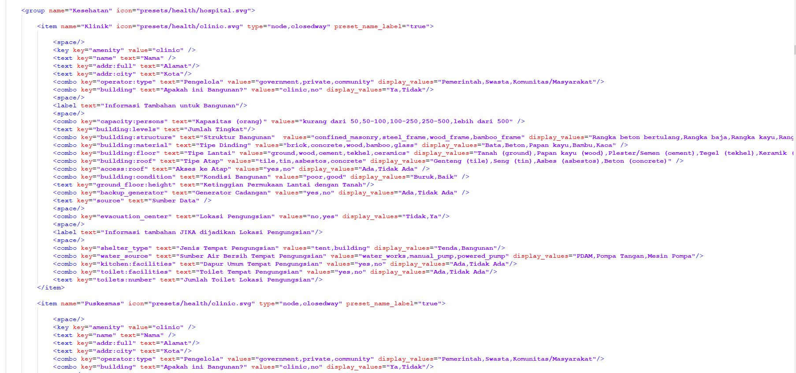
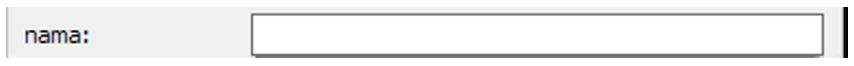


# Membuat Presets

**Tujuan Pembelajaran:**

*   Memahami pengertian dan konsep Presets di _OpenStreetMap_
*   Mengerti dan memahami Bahasa XML di Presets _OpenStreetMap_
*   Mengerti Membuat Presets Khusus di _OpenStreetMap_
*   Memahami dan mengerti elemen-elemen penyusun _presets_

Seperti yang telah dipahami bahwa  _OpenStreetMap_ merupakan peta partisipatif yang bersifat terbuka untuk seluruh dunia. Hal ini menjelaskan bahwa pemanfaatan _OpenStreetMap_ untuk pemetaan akan beragam pula. Semakin banyak pemetaan dengan tujuan yang berbeda-beda maka akan menimbulkan banyaknya variasi informasi yang dihasilkan. Kebutuhan akan informasi yang berbeda-beda inilah yang membuat pengguna _OpenStreetMap_ membuat kesepakatan akan standar informasi yang ada di _OpenStreetMap_ yang disebut dengan _Tag_. Untuk penjelasan lebih lanjut soal _Tag_ silakan dilihat pada Modul **Model Data _OpenStreetMap_**.

Berangkat dari kebutuhan informasi dan disepakatinya standar internasional oleh para pengguna _OpenStreetMap_ dibuatlah beberapa platform yang membantu pengguna untuk menemukan informasi yang mereka cari seperti halaman wiki _Map Features,_ Referensi Objek OSM Indonesia, dan _Tag Info_. Untuk memudahkan dalam memasukkan informasi-informasi objek yang ingin dipetakan ke dalam _OpenStreetMap_ maka komunitas _OpenStreetMap_ membuat sebuah isian informasi umum yang disebut dengan _presets_ di dalam perangkat lunak editor _Java OpenStreetMap_ (JOSM) untuk memudahkan pengguna _OpenStreetMap_ mengisi informasi yang mereka inginkan. 

### **I. Konsep Presets di _OpenStreetMap_**

**a.  Pengertian Umum Presets**

_Presets_ merupakan sebuah informasi yang diwakilkan oleh sebuah _Tag_, kombinasi antara _key_ dan _value_ tertentu, dimana memudahkan para pengguna untuk melakukan edit atau memetakan di _OpenStreetMap_ menggunakan JOSM maupun iD Editor. 


<p align="center"><i>Tampilan presets di JOSM</i></p>

Gambar di atas adalah contoh pemberian _presets_ untuk objek sekolah. Jika kemudian Anda ingin mengisi informasi-informasi terkait sekolah tersebut, maka tampilan di JOSM akan berganti seperti berikut:


<p align="center"><i>Pengisian presets di JOSM</i></p>

**b. Presets Khusus di JOSM**

Seperti yang sudah dijelaskan di sub-bab sebelumnya, komunitas _OpenStreetMap_ telah membuat _presets_ umum yang otomatis ada ketika Anda menggunakan JOSM. Akan tetapi, _presets_ yang disediakan di JOSM memiliki beberapa kekurangan khususnya untuk pengguna _OpenStreetMap_ di Indonesia, antara lain:

*   Kolom Informasi untuk suatu objek tidak lengkap dan tidak sesuai kebutuhan pemetaan
*   Kolom Informasi yang disediakan seringkali tidak dibutuhkan di Indonesia
*   Pilihan jawaban dari masing-masing informasi seringkali tidak tepat sesuai dengan kebutuhan pemetaan di Indonesia
*   Tampilan isian informasi dalam Bahasa Inggris sehingga menyulitkan pengisian informasi
*   Daftar objek-objek yang disediakan seringkali tidak tersedia atau tidak terdapat di Indonesia

Oleh karena itu solusi untuk mengatasi masalah-masalah tersebut adalah dengan membuat Presets Khusus sesuai dengan kebutuhan pemetaan Anda sendiri. Dengan membuat _presets_ sendiri Anda juga dapat menyesuaikan informasi-informasi apa saja yang ingin Anda kumpulkan dalam kegiatan pemetaan Anda dan juga label serta bahasa apa yang ingin Anda tampilkan untuk _presets_ Anda di JOSM. 

 dan tampilan presets buatan / khusus (kanan)")
<p align="center"><i>Tampilan presets bawaan JOSM (kiri) dan tampilan presets buatan / khusus (kanan)</i></p>

### **II. Penggunaan Bahasa XML untuk Presets di OpenStreetMap**

Sebelum memulai membuat _presets_ ada baiknya Anda memahami terlebih dahulu bahasa yang digunakan untuk membuat _presets_ itu sendiri. _Presets_ yang dimasukkan ke dalam JOSM menggunakan bahasa yang disebut _Extensible Markup Language_ atau disingkat XML. Bahasa XML merupakan bahasa yang berfungsi untuk membawa data-data yang nantinya dapat ditampilkan di JOSM dan _OpenStreetMap_. Bahasa XML menggunakan elemen-elemen penyusun yang memiliki hierarki dimana elemen tersebut akan mempunyai sub-elemen dan sub-elemen akan memiliki sub-sub-elemen. 


<p align="center"><i>Contoh tampilan XML di Notepad ++</i></p>

Berikut adalah hierarki dan terminologi dalam bahasa XML yang digunakan untuk membuat _presets _di _OpenStreetMap_:

**XML:  Root Element   -->  Element dan Sub-Element  -->   Tag  -->   Attribute**

*   **_Root element_**:  elemen terluar dari suatu _file_ XML; _root element_ mendeskripsikan informasi apa saja yang termuat di dalam _file_ XML. _Root element_ ini ditulis seperti  berikut **<presets>**...**element.. </presets>**

*   **_Element_**:  satu daftar objek dalam XML, objek ini nanti akan memiliki beberapa informasi (_tag_) yang berada diantara _tag_ pembuka & penutup, contoh **<item>..tag ..</item>,<group>..tag..</group>**

*   **_Tag_**:  suatu informasi yang termuat di dalam elemen dan sub-elemen. Informasi tersebut diisi oleh _attribute_. _Tag_ ditandai oleh tanda kurung <> dan diakhiri oleh </>, contoh **< item >..attribute </item>**

*   **_Attribute:_**  Merupakan informasi spesifik yang termuat di dalam sebuah _tag_, contohnya **landuse=“orchard”**

Berikut contoh hierarki tentang terminologi XML untuk _preset OpenStreetMap_


<p align="center"><i>Hierarki file XML pada sebuah presets di OpenStreetMap</i></p>

### III. Membuat Presets Khusus 

Untuk bisa membuat _presets_ Anda sendiri, ada beberapa hal yang perlu Anda persiapkan dan ketahui terlebih dahulu. Untuk bisa membuat _presets_ Anda perlu menginstal perangkat lunak tambahan untuk membuat _presets_ yaitu **_Notepad ++_** yang bisa Anda unduh di [https://notepad-plus-plus.org/download/v7.6.3.html](https://notepad-plus-plus.org/download/v7.6.3.html) kemudian instal di laptop/komputer Anda. Terdapat beberapa aturan yang perlu Anda ketahui ketika ingin membuat _presets_ sehingga nantinya _presets_ Anda sesuai dengan ketentuan dari _OpenStreetMap_ seperti:

*   Ketahui bentuk data dari objek yang ingin Anda petakan. Seperti yang telah dijelaskan pada Modul **Model Data _OpenStreetMap_** bahwa ada 3 bentuk data di _OpenStreetMap_ yaitu **titik (_nodes_), garis (_ways_), **dan** area (_closedway_)**. Sebagai contoh, jika objek tersebut merupakan jalan maka bentuk data yang akan Anda tuliskan di _presets_ Anda adalah _ways_ bukan yang lain.
*   Anda harus menggunakan _key_ dan _value_ sesuai dengan ketentuan _OpenStreetMap._ Untuk melihatnya Anda dapat merujuk di Halaman Wikipedia _Map Features_ dan Referensi Objek OSM Indonesia dan Tag Info. Untuk lebih jelasnya silahkan lihat di Modul **Model Data _OpenStreetMap_**.
*   Penulisan _key_ dan _value_ harus menggunakan Bahasa Inggris, untuk penulisan label Indonesia nanti dapat diatur dalam _presets_ itu sendiri.

**a. Elemen-Elemen di Presets**
Jika sudah mengetahui dan memahami aturan dalam pembuatan_ presets_ maka Anda juga perlu untuk mengetahui tentang elemen-elemen penyusun yang dapat menampilkan informasi di _presets_ Anda dengan bentuk yang beragam. Beberapa elemen-elemen _presets _tersebut adalah:

Elemen <p style="color:red;">key key</p> 

```
                                   Struktur dasar  : <key key="......" value="......" /> 
```
Ini merupakan _key_ wajib yang mendefinisikan informasi utama dari suatu objek walaupun informasi yang lain dikosongkan. Sebagai contoh jika dalam _presets_ Anda ingin menekankan bahwa itu informasi _tag_ ini adalah sekolah maka Anda dapat menuliskannya seperti:

<key key=”amenity” value=”school”/>

*   Elemen **text** key

```
                                   Struktur dasar   : <text key="......" text="......" />
```
Ini merupakan elemen yang mendefinisikan informasi objek dalam bentuk isian. Elemen ini biasanya digunakan untuk informasi nama dan alamat objek. Sebagai contoh jika Anda ingin memberikan informasi nama objek maka Anda dapat menuliskannya seperti: 
**<text key=”name” text=”nama”/>**

Penambahan kata “text” pada contoh di atas adalah sebagai label informasi yang akan tampil di JOSM. Pada bagian “text” ini Anda dapat mengisinya dengan Bahasa Indonesia ataupun bahasa lain yang Anda inginkan. Contoh tampilan dari elemen ini di JOSM seperti berikut:


<p align="center"><i>Tampilan elemen text key di JOSM</i></p>


*   Elemen **combo** key

```
Struktur dasar : <combo key="......" text="......" values="...,...,..." display_values="...,...,..."/>
```
Ini merupakan elemen yang menampilkan informasi dalam bentuk pilihan. Elemen ini biasanya digunakan untuk informasi seperti tipe atap ataupun jenis dinding. Jika ingin mengumpulkan seperti itu Anda dapat menuliskannya di _presets_ seperti berikut:

**<combo key="building:materials" text="Tipe Dinding" values="bamboo, brick,concrete,glass,wood" display_values="Bambu,Bata,Beton,Kaca, Papan Kayu" />**

Elemen yang terlihat pada contoh di atas tersebut berfungsi untuk menentukan informasi jenis dinding sehingga _key_ yang digunakan adalah “_building:walls”_ dan kata “_text”_ untuk menampilkan label _key_ dalam Bahasa Indonesia.

Anda juga dapat melihat _value_ yang ada ditambahkan (s) dibelakangnya karena pilihan informasi yang disediakan lebih dari 1 dan kata “_display_values_” adalah label _value_ yang bisa dituliskan dalam Bahasa Indonesia. Berikut adalah contoh tampilan di JOSM dari elemen di atas:

<p align="center">
  
</p>
<p align="center"><i>Tampilan elemen combo key di JOSM</i></p>


*   **Elemen multiselect** key

```
Struktur dasar : <multiselect key="......" text="......" values="...;...;...;..." display_valuest="..;..;..;.." />
```

Elemen ini dapat menampilkan informasi dalam bentuk pilihan. Elemen ini mirip dengan _combo key_ dimana Anda dapat memasukkan pilihan informasi yang akan dipilih, akan tetapi perbedaannya adalah dengan elemen ini Anda dapat memilih lebih dari satu pilihan. Elemen ini biasanya digunakan untuk informasi seperti sumber air di suatu bangunan dimana kadang bisa memiliki lebih dari 1 sumber air. Berikut penulisan elemen ini dalam _presets_:

**<multiselect key="water_source" text="Sumber Air" values="water_works;manual_pump;powered_pump" display_values="PDAM;Pompa Tangan;Mesin Pompa"/>**

Penulisan elemen ini mirip dengan _combo key_ dimana perbedaannya adalah kata _multiselect_ menggantikan kata _combo_ dan pemisah antara _value_ menggunakan titik koma (;) sedangkan label _key_ dan _value_ yang dapat ditulis dalam Bahasa Indonesia sama-sama menggunakan kata _text_ dan _display_values_. Ini merupakan contoh tampilan elemen _multiselect key_ di JOSM:

<p align="center">
  
</p>
<p align="center"><i>Tampilan elemen multiselect key di JOSM</i></p>

*   **Elemen check key**

```
          Struktur Dasar : <check key="......" text="......" value_on="yes" value_off="no" default="......" />
```
Elemen ini biasanya digunakan untuk menampilkan isian informasi yang berupa tanda centang. Biasanya elemen ini digunakan untuk pertanyaan yang jawabannya iya atau tidak seperti akses ke atap dan jalan satu arah. Anda dapat menuliskan elemen ini di _preset_ seperti berikut:
**<check key="access:roof" text="Ada akses ke atap" value_on="yes" value_off="no" default="off" />**

Penulisan elemen menggunakan _value_on_ dan _value_off_ dimana masing-masing dapat sesuai dengan nilai dimana _value_on_ artinya jika informasi itu dicentang dan _value_off_ jika tidak dicentang. Adapun _default_ atau pengaturan awal dari elemen ini adalah perintah bahwa jika tidak dicentang maka informasi ini akan tetap muncul di jendela _membership_ di JOSM. Berikut adalah contoh tampilan elemen ini di JOSM:

<p align="center">
  
</p>
<p align="center"><i>Tampilan elemen check key di JOSM</i></p>

**b. Memasukkan Ikon di Presets**

Hal lain yang dapat Anda lakukan dalam membuat _presets_ adalah memasukkan ikon di _presets_ Anda. Ikon berfungsi sebagai gambar yang mewakili objek yang akan diisi informasinya dan selain itu akan memperindah tampilan dari _presets_ Anda. Untuk memasukkan ikon di _presets_ maka Anda harus memasukkan keterangan ikon dan tipe data di elemen pada _presets_ seperti contoh di bawah ini:


<p align="center"><i>susunan elemen presets</i></p>

Jika Anda ingin menggunakan ikon yang sudah ada di JOSM maka Anda dapat melihatnya di **[https://josm.openstreetmap.de/browser/josm/trunk/images/presets ](https://josm.openstreetmap.de/browser/josm/trunk/images/presets)**. Akan tetapi, jika Anda ingin menggunakan ikon yang berbeda Anda dapat membuat ikon tersebut ataupun mengambilnya dari tempat lain dan menempatkannya secara _offline_ di laptop/komputer Anda. Akan tetapi jika Anda membagikan _presets_ Anda ke teman Anda maka ikon tersebut tidak akan muncul di JOSM yang ada di laptop/komputer mereka. Berikut adalah contoh sumber untuk menaruh ikon secara _offline_ di laptop/komputer Anda. \
 **C:\Users\(nama komputer/laptop Anda)\Desktop\icon presets\building.png** \
Silahkan _download_ contoh presets HOT-PDC InAWARE sebagai acuan Anda dalam mempelajari materi _presets_ di https://bit.ly/presetshotpdcid

<p align="center">
  
</p>
<p align="center"><i>Contoh tampilan ikon di Presets JOSM</i></p>

**RINGKASAN**

Anda sudah mempelajari tentang cara pembuatan _presets_ di _OpenStreetMap._ Materi ini dapat membantu Anda dalam mengumpulkan informasi khusus yang Anda butuhkan saat melakukan pengumpulan data di lapangan. Pemanfaatan _presets_ akan sangat bermanfaat jika Anda mengetahui pembuatan _presets_ untuk pemetaan spesifik dengan menggunakan _OpenStreetMap_. Selain itu Anda dapat membantu pengguna _OpenStreetMap_ yang lain dengan menambahkan informasi yang lebih banyak dan tersedia di JOSM.
