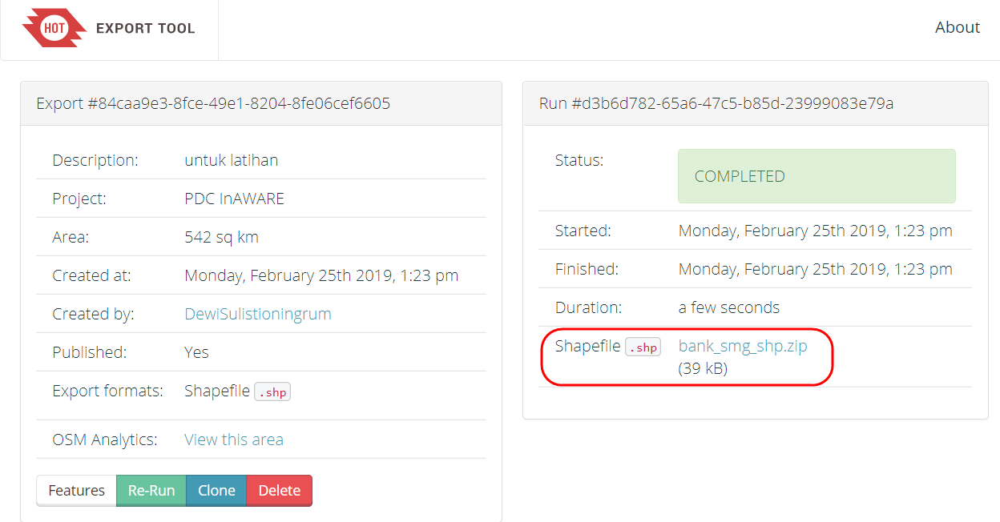

# **Penggunaan YAML pada _Export Tool_**

**Tujuan Pembelajaran:**

*   Mampu memahami konsep YAML
*   Mampu membuat YAML untuk struktur data OSM 
*   Mampu mengoperasikan YAML untuk men-_download_ data OSM pada _Export Tool_

Pada bab sebelumnya, Anda telah mempelajari bagaimana mengenal _tag_ informasi objek di dalam _OpenStreetMap_. Anda juga telah menentukan objek-objek yang akan dikumpulkan pada saat survei lapang. Pada saat proses pengambilan data OSM yang telah di _upload_ ke server menggunakan _Export Tool_, Anda menemukan kendala karena beberapa data atribut yang berasal dari _tag_ info tidak dapat di _download_ melalui _tag_ yang disediakan  _Export Tool_. Oleh karena itu, Anda dapat menggunakan YAML untuk men-_download_ data dengan atribut yang sama seperti atribut yang dimasukkan saat pemetaan.

### **I. Pengertian YAML**

YAML (_YAML Ain't Markup Language)_ adalah sebuah struktur data sederhana yang dapat digunakan pada semua bahasa pemrograman. YAML dapat digunakan untuk membuat struktur data yang disesuaikan dengan _tag_ (_key _dan_ value_) data OSM, yang nantinya dapat berfungsi untuk menyaring data OSM berdasarkan _presets_ yang digunakan saat proses memasukkan data OSM.  

### **II. Pembuatan YAML untuk Filter Data di _Export Tool_**

Cara membuat YAML untuk struktur data OSM dapat dibagi menjadi empat bagian, yaitu :

*   Judul _file_ = menunjukkan nama _file_
*   _Types_	    = menunjukkan tipe data pemetaan, terdiri dari _points, lines_, dan _polygons_
*   _Select_	    = menunjukkan _key_ yang berasal dari objek OSM 
*   _Where_ = menunjukkan letak objek pada data OSM, terdiri dari _key_ dan _value_ dari objek tersebut

  

<i>Struktur format YAML untuk data OSM</i>

Dalam pembuatan YAML, Anda membutuhkan suatu editor tambahan untuk mempermudah dalam penulisan struktur data YAML. Editor tersebut adalah Notepad++, silakan donwload  [https://notepad-plus-plus.org/download/v7.6.4.html](https://notepad-plus-plus.org/download/v7.6.4.html) lalu instal. Anda dapat membuka modul **Pembuatan Model Data OSM** untuk melihat daftar model data objek OSM yang akan dipetakan. Kemudian dari daftar tabel-tabel tersebut akan dibuat ke dalam struktur data YAML.  Langkah-langkah untuk membuat YAML, yaitu:

*   Buka **Notepad++**
*   Buat daftar objek yang dipetakan yang sudah dibuat sebelumnya pada model data OSM

Tabel Model Data OSM untuk Objek Bank

<table>
  <tr>
   <td><strong>key</strong>
   </td>
   <td><strong>possible values</strong>
   </td>
  </tr>
  <tr>
   <td>amenity
   </td>
   <td>bank
   </td>
  </tr>
  <tr>
   <td>building
   </td>
   <td>bank
   </td>
  </tr>
  <tr>
   <td>name
   </td>
   <td><building name>
   </td>
  </tr>
  <tr>
   <td>addr:full
   </td>
   <td><address>
   </td>
  </tr>
  <tr>
   <td>capacity
   </td>
   <td><50, 50-100, 100-250, 250-500, >500
   </td>
  </tr>
  <tr>
   <td>building:levels
   </td>
   <td>1, 2, 3, 4-7, >7
   </td>
  </tr>
  <tr>
   <td>building:structure
   </td>
   <td>confined_masonry (Rangka beton bertulang), steel_frame (Rangka baja), wood_frame (Rangka kayu), bamboo_frame (Rangka bambu)
   </td>
  </tr>
  <tr>
   <td>building:walls
   </td>
   <td>brick (Bata), concrete (Beton), wood (Papan kayu), bamboo (Bambu), glass (Kaca)
   </td>
  </tr>
  <tr>
   <td>buildings:floor
   </td>
   <td>ground (Tanah), wood (Papan kayu), cement (Plester / Semen), tekhel (Tegel), ceramics (Keramik)
   </td>
  </tr>
  <tr>
   <td>building:roof
   </td>
   <td>tile (Genteng), tin (Seng), asbestos (Asbes), concrete (Beton)
   </td>
  </tr>
  <tr>
   <td>access:roof
   </td>
   <td>yes (Ada), no (Tidak ada)
   </td>
  </tr>
  <tr>
   <td>building: condition
   </td>
   <td>poor (Buruk), good (Baik)
   </td>
  </tr>
  <tr>
   <td>backup_generator
   </td>
   <td>yes (Ada), no (Tidak ada)
   </td>
  </tr>
</table>

*   Pada baris pertama ketikkan **nama _file_ yang akan dijadikan judul _file_**, misalnya bank

		  bank:

*   Pada baris kedua **tekan enter + tab** dan ketikkan **types:**, kemudian **tekan enter + tab**  dan isi tipe data tersebut berdasarkan model data OSM dengan mengetikkan ke bawah baris 

		 types:
            - points
            - polygons

*   Tekan enter dan sesuaikan dengan baris types:, kemudian ketikkan **select: → tekan enter + tab** ketikkan daftar **key** yang terdapat pada objek “bank”.

		select:
            - amenity
            - name
            - addr:full
            - addr:city
            - capacity:persons
            - building
            - building:levels
            - building:structure
            - building:walls
            - building:floor
            - building:roof
            - access:roof
            - building:condition
            - backup_generator
            - source

*   Tahap terakhir, tekan enter dan sesuaikan dengan posisi types dan select **→ ketikkan where: key dan value**.         

             where: amenity='bank'

*   Anda dapat meneruskan pembuatan YAML sampai seluruh objek pemetaan dimasukkan, yang disamakan dengan format seperti sebelumnya. 
*   Simpan struktur YAML tersebut dalam format _.txt_ di dalam direktori komputer/laptop Anda.

		   bank:
            types:
                - points
                - polygons
            select:
                - amenity
                - name
                - addr:full
                - addr:city
                - capacity:persons
                - building
                - building:levels
                - building:structure
                - building:walls
                - building:floor
                - building:roof
                - access:roof
                - building:condition
                - backup_generator
                - source
                                                                                                                                                                                                                                                             
### **III. Penggunaan YAML pada _Export Tool_**

*   Buka halaman situs Anda, dan ketikkan link berikut ini https://export.hotosm.org

  

<i>Halaman muka situs Export Tool</i>

*   Anda harus masuk menggunakan akun OSM dengan klik **_Login_** di sudut kanan atas. Apabila muncul _‘Authorize access to your account’_ klik **_Grant Access_**. Periksa alamat email Anda untuk mengkonfirmasi pembuatan akun pada email yang masih aktif. Klik tautan pada email tersebut untuk konfirmasi pembuatan akun.

  

<i>Izin akses akun OSM</i>

*   Sekarang Anda sudah masuk dengan menggunakan akun OSM, kemudian klik **_Start Exporting_** untuk memulai proses _download _data OSM
*   Pada **_Menu Describe_** akan muncul formulir isian dan gambar peta seperti gambar di bawah ini, formulir isian yang wajib diisi dan Anda dapat memilih area yang diinginkan pada gambar peta di sebelah kanan. 

  

<i>Lembar kerja Export Tool</i>

*   Ada beberapa cara untuk menggambarkan area yang akan dipilih
1. **_Box_** = Menggambar area dengan menggunakan kotak. Jika Anda ingin mengulang untuk pembuatan kotak klik tanda X pada kolom _Box_. 

  

<i>Penentuan area dengan bentuk kotak</i>

2. **_Draw_** = Menggambar area yang dipilih secara manual, Anda dapat klik pada area yang ingin digambar dan diakhiri dengan klik dua kali.

  

<i>Penentuan area dengan bentuk manual</i>

3. **_Import _**= Menggunakan poligon dalam format _.geojson_ untuk memilih area yang akan di _download_. Syarat format data _.geojson_ yang dapat ditambahkan ke dalam _Export Tool_ adalah harus satu fitur (satu baris) pada data atribut. Anda dapat membuka modul **Menggunakan GeoJSON** untuk mengetahui cara mendapatkan data _.geojson._

  

<i>Penentuan area dengan berdasarkan batas administrasi</i>

 
*   Jika sudah menyelesaikan formulir isian dan menentukan area yang akan di _download_, pilih menu **_Format_**. Pilih data spasial yang Anda inginkan, misalnya _.shapefile_

  

<i>Format data spasial</i>

*   Selanjutnya klik Menu **Data → YAML**. Salin struktur data YAML yang telah dibuat, tempelkan/_paste_ ke kotak YAML

  

<i>Menu YAML</i>

*   Klik Menu **_Summary_**, Anda harus memilih apakah _file_ ekspor ini akan dipublikasikan kepada umum atau hanya ada pada akun Anda. Kemudian klik **_Create Export_** untuk memulai proses ekspor data OSM.

  

<i>Menu summary</i>

*   Tunggu beberapa saat sampai proses selesai. Jika _file export_ Anda sudah selesai, _Export Tool_ akan memberikan pemberitahuan melalui _email_, atau Anda dapat melihat hasilnya di Menu **_Export._** Jika Anda ingin melihat hasil _export_ yang dilakukan oleh pengguna lainnya, maka beri tanda centang **_Show all Export_**. 

  

<i>Menu Export</i>

*   Jika proses sudah selesai akan muncul kotak dialog seperti di bawah ini, klik tulisan berwarna biru seperti **nama file.shp.zip** untuk menyimpan hasil ekspor data OSM.

  

<i>Proses export tool telah selesai</i>

**Latihan!**

Buatlah 2 (dua) proyek baru di _Export Tool_ dan _download_ data OSM dengan menggunakan tautan YAML berikut [https://tinyurl.com/group-stats](https://tinyurl.com/group-stats). Data OSM tersebut akan digunakan pada bab selanjutnya mengenai perhitungan jumlah objek menggunakan _plugin Group Stats_. Jika Anda telah berhasil, maka akan ada 2 (dua) _shapefile_ yaitu fasum dan jalan.

**RINGKASAN**

Anda telah menyelesaikan proses men-_download_ data spasial dengan menggunakan _Export Tool_. Dengan menggunakan YAML, data yang dihasilkan akan sesuai dengan data yang dimasukkan pada proyek pemetaan. Sehingga _file_ tersebut sudah tertata rapi dan teratur, Anda dapat membuka _file_ tersebut, untuk melihat data-data yang sudah dihasilkan dari pemetaan. _File_ yang sudah di-_download_ dapat dibuka di _software_ pemetaan seperti QGIS.
