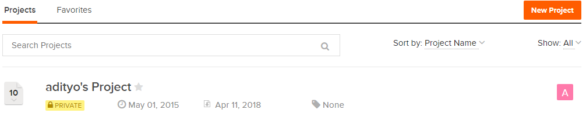
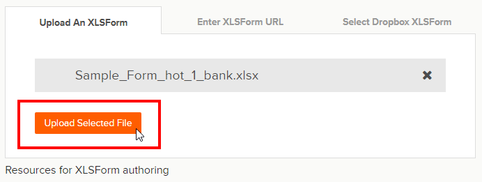
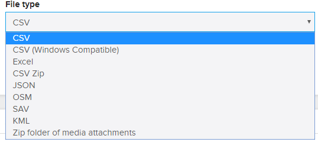

# Meletakkan Formulir Survei ke *Ona.io*

**Tujuan Pembelajaran:**

*   Mampu menjelaskan manfaat penggunaan *Ona.io*
*   Menjelaskan cara mengunggah formulir survei ke server *Ona.io*

Setelah kita berhasil membuat formulir survei yang telah dipelajari pada modul **Membuat Form Survey untuk Aplikasi ODK Collect & OpenMapKit**, Anda akan mempelajari platform yang digunakan untuk mengunggah formulir survei ke salah satu platform. Platform yang digunakan pada materi ini adalah _Ona.io_.  _Ona.io_ merupakan salah satu platform yang dapat digunakan untuk meletakkan formulir survei yang akan digunakan untuk kegiatan survei lapangan menggunakan _ODK Collect_ atau _OpenMapKit_. Disini Anda akan mempelajari apa saja yang bisa dilakukan menggunakan _Ona.io_ dan bagaimana cara mengunggah formulir survei kedalam _Ona.io_.

## I. Pengenalan _Ona.io_

### a. Apa itu _Ona.io_
_Ona.io_ adalah suatu perusahaan sosial yang membangun data infrastruktur untuk keperluan pengumpulan data di lapangan. Mereka menyediakan beberapa platform yang dapat digunakan untuk membantu pengumpulan data, salah satunya adalah platform penyimpanan data lapangan. Anda dapat mengunggah formulir survei Anda ke server yang disediakan oleh _Ona.io_ dan kemudian Anda gunakan untuk kegiatan lapangan Anda. Platform _Ona.io_ menyediakan beberapa kemampuan yang akan membantu kegiatan pengumpulan data. Salah satunya adalah:

*   Statistik jumlah data yang masuk dalam bentuk grafik maupun tabel
*   Peta lokasi sebaran data hasil pengumpulan di lapangan
*   Tampilan foto yang berhasil dikumpulkan selama pengumpulan data
*   Kemampuan mengunduh data dalam beberapa jenis _file_ seperti _csv, xls, kml, osm_ atau _json_

### b. Batasan dalam _Ona.io_

Apabila Anda ingin menggunakan platform _Ona.io_ Anda dapat membuat akun secara gratis dan kemudian menggunakan platform tersebut untuk mengunggah formulir survei. Namun terdapat beberapa batasan dalam menggunakan akun gratis di _Ona.io_:
*   Hanya dapat membuat satu proyek pribadi
*   Untuk proyek pribadi hanya dapat menampung 500 data masuk
*   Dalam satu proyek pribadi dapat menampung sebanyak 10 jenis formulir survei

## II. Manajemen Formulir Survei pada _Ona.io_
Setelah Anda mengetahui apa itu platform _Ona.io_ dan batasannya, pada modul ini sekarang Anda akan mencoba untuk memasukkan formulir survei yang sudah Anda buat sebelumnya pada modul **Membuat Formulir Survei untuk Aplikasi _ODK Collect_ dan _OpenMapKit_**. Apabila Anda belum membuat formulir survei, Anda bisa mengunduh contoh formulir survey dengan mengakses link: [http://bit.ly/sample_form_survey](http://bit.ly/sample_form_survey). 

### a. Membuat akun di _Ona.io_
Sebelum Anda meng-_upload_ formulir survei Anda, Anda harus memiliki akun di _Ona.io_ terlebih dahulu. Untuk membuat akun di _Ona.io_ klik pada tombol **Get Free Account** dan kemudian masukkan nama Anda (huruf kecil) yang akan menjadi _url_ tempat Anda menyimpan formulir dan nantinya akan digunakan di dalam aplikasi _ODK Collect._

  

<i>Tampilan membuat akun di Ona.io</i>

###  b. Meng-_upload_ Formulir Survei

Saat pertama kali Anda berhasil membuat akun pada _Ona.io_, Anda akan secara otomatis membuat proyek pribadi dengan nama Anda sendiri. 

  

<i>Proyek pribadi dengan nama akun Anda sendiri</i>

Untuk meng-_upload_ formulir Anda, klik pada nama proyek Anda sendiri. Setelah berhasil masuk ke dalam proyek Anda. Klik pada bagian **_Add a form_** dan sebuah jendela baru akan muncul. Disini Anda diminta untuk memasukkan _file XLSForm_. Pilih _file_ formulir survei Anda. Setelah Anda berhasil memilih _file_ formulir survei Anda, klik pada bagian **_Upload Selected File_**. Sistem akan mengecek apakah formulir Anda terdapat kesalahan dalam pembuatan ataupun tidak. 

  

<i>Tampilan jendela saat meng-upload formulir survei</i>

Jika sudah berhasil mengunggah formulir survei, akan muncul keterangan **Form Verified!** Dan klik pada tombol **Save form** untuk langsung menyimpan formulir surveinya.

  

<i>Pilih Save Form untuk menyimpan formulir yang sudah terverifikasi</i>

### c. Mengganti formulir survei
Apabila Anda melakukan perubahan di dalam formulir survei yang telah berhasil diunggah ke dalam proyek Anda, Anda bisa memperbarui formulir survei tersebut. Namun yang perlu diingat adalah **ketika Anda memperbarui formulir survei Anda, apabila formulir tersebut sudah diisi oleh beberapa data, maka ada potensi data yang sudah dimasukkan akan terhapus**. Oleh karena itu, sebelum Anda mengganti formulir survei, disarankan untuk mengunduh data Anda terlebih dahulu untuk berjaga-jaga apabila terjadi kesalahan.

Untuk mengganti formulir survei Anda, klik pada tanda panah kebawah yang terletak di bagian paling kanan dari formulir survei Anda. Kemudian pilih **_Replace Form_**. 

  

<i>Klik pada bagian kanan formulir survei Anda untuk memunculkan menu Replace Form</i>

Apabila formulir survei Anda telah berisikan beberapa isian. Akan muncul peringatan dari _Ona.io_. Peringatan tersebut muncul agar pengguna paham bahwa ketika mengganti formulir survei, terutama mengganti variabel, _Ona.io_ akan menggunakan variabel yang terdapat pada formulir survei yang baru.

  

<i>Peringatan Ketika akan Mengganti Formulir Survei</i>

Setelah Anda mengklik tombol **_I Understand_**, Anda akan diarahkan ke jendela untuk mengunggah formulir survei. Pilih formulir survei baru Anda dan klik **_Upload Selected file_**. Setelah formulir berhasil tervalidasi, klik pada bagian tombol **Save form**.

### d. Menghapus/Menonaktifkan Formulir Survei

Apabila Anda memiliki formulir survei yang ingin Anda hapus/dinon-aktifkan. Anda bisa melakukannya dengan cara memilih tanda panah ↓ yang terletak pada bagian sebelah kanan formulir survei Anda dan kemudian pilih **_Delete Form_** untuk menghapus atau **_Make inactive_** untuk menonaktifkan formulir Anda.

  

<i>Tampilan untuk menghapus atau menonaktifkan formulir survei</i>

>Catatan:
>Apabila Anda memilih untuk Delete Form. Anda akan diminta untuk menulis ulang kembali nama formulir survei Anda sebelum Anda bisa menghapus formulir survei Anda.
>Dengan memilih Make inactive, maka formulir survei Anda tidak akan nampak pada aplikasi ODK Collect pada saat tahapan mengambil formulir survei kosong.

### e. Men-_download_ XLSForm
Anda bisa men-_download_ format XLSForm dari formulir survei yang telah Anda buat dengan mengklik tanda panah ↓ pada bagian kanan dari formulir survei Anda dan kemudian pilih **_Download XLSForm_**. 

### f. Men-_download_ Data Hasil Survei
Untuk men-_download_ data hasil survei. Anda terlebih dahulu harus memilih formulir survei Anda. Setelah Anda berhasil memilih formulir survei, Anda akan diarahkan pada halaman manajemen formulir survei.

  

<i>Tampilan untuk mengunduh data hasil survei</i>

Klik pada bagian tombol **_Prepare Data Export_** untuk memulai mengunduh data formulir survei Anda. Setelah itu Anda akan diarahkan untuk memilih tipe _file_ yang akan Anda unduh. 

  

<i>Pilihan jenis file yang dapat Anda unduh</i>
 

Apabila formulir survei Anda tidak menggunakan foto, Anda bisa memilih langsung tipe _file_ CSV. Namun jika formulir survei Anda menggunakan foto, Anda bisa memilih **_Zip folder of media attachment._** Lama tidaknya proses _download_ data survei tergantung dari berapa banyak data yang Anda hasilkan pada kegiatan pengumpulan data.

Data hasil survei dari _Ona.io_ ini nantinya dapat Anda gunakan untuk berbagai macam keperluan pemetaan seperti misalnya data dengan format **_KML_** dapat Anda buka dengan aplikasi **_Google Earth_**, data dengan format **_OSM_** dapat Anda buka dengan aplikasi **_JOSM_**, dan data dalam format **_CSV_** dapat Anda buka dengan aplikasi **_Spreadsheet_** atau **_QGIS_**.

**RINGKASAN**

Selamat! Saat ini Anda telah memahami bagaimana mengunggah _file_ formulir survei ke dalam salah satu platform yang bisa digunakan untuk menyimpan formulir survei secara online. Ada beberapa pilihan yang dapat Anda gunakan selain Ona.io untuk meng-_upload_ formulir survei. Ona.io dapat menjadi salah satu pilihan karena penggunaannya yang sangat mudah dan gratis berdasarkan syarat yang telah dijelaskan sebelumnya.

