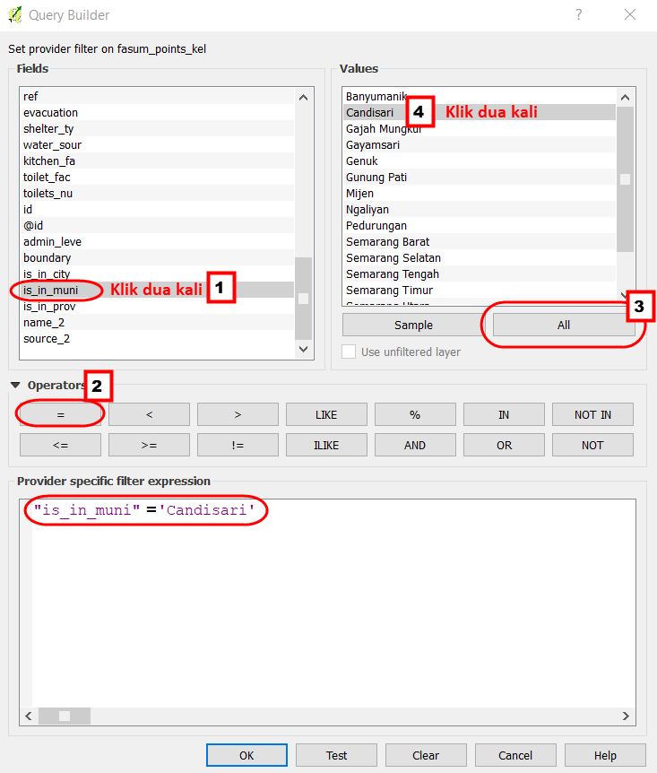
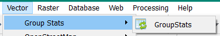
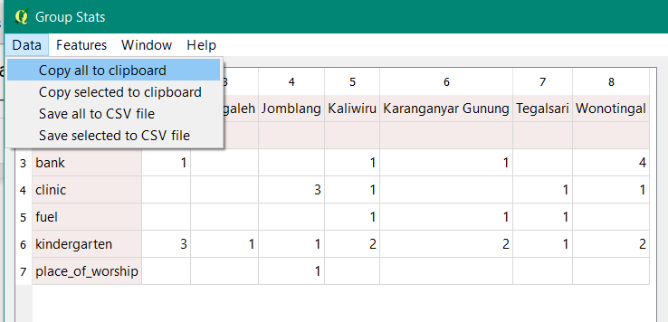
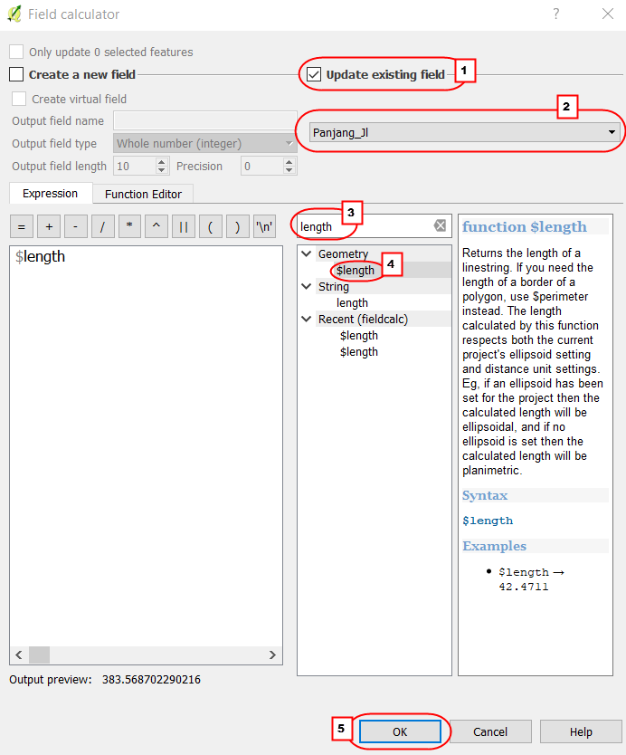

# **Perhitungan Kuantitas Data Menggunakan _Plugin Group Stats_**

**Tujuan Pembelajaran:**

*   Memahami cara melakukan instalasi tambahan (_plugin_) untuk menghitung jumlah objek menggunakan QGIS
*   Memahami cara mengoperasikan _group stats_ untuk menghitung jumlah objek di QGIS

Kuantitas adalah kualitas sesuatu hal yang terbentuk dari proses perhitungan dan pengukuran _(Thompson:1990)_. Perhitungan kuantitas data dapat menjadi indikator dalam pencapaian proyek pemetaan yang dapat dituangkan ke dalam sebuah laporan pemetaan. Proses perhitungan kuantitas data OSM dapat dilakukan dengan menginstal _plugin_ _group stats_ di QGIS secara gratis, _plugin_ ini dapat digunakan untuk menghitung jumlah objek berdasarkan kategori tertentu.  

### **I. Instalasi _Group Stats_**

*   Jika Anda belum memiliki QGIS, Anda dapat download di situs tautan berikut : [http://download.osgeo.org/qgis/win64/QGIS-OSGeo4W-2.14.22-1-Setup-x86.exe](http://download.osgeo.org/qgis/win64/QGIS-OSGeo4W-2.14.22-1-Setup-x86.exe) untuk Windows 32 bit dan [http://download.osgeo.org/qgis/win64/QGIS-OSGeo4W-2.14.22-1-Setup-x86_64.exe](http://download.osgeo.org/qgis/win64/QGIS-OSGeo4W-2.14.22-1-Setup-x86_64.exe) untuk Windows 64 bit.  

* Setelah selesai di _download_, kemudian klik Instal dan Buka QGIS

*   Klik menu **_Plugins → Manage and Install Plugins_** 

  

<i>Tampilan Menu Plugins</i>

 
*   Anda memerlukan koneksi internet untuk menginstal _plugin_, pada kotak **_Search_** ketikkan **_Group Stats_**. **Berikan tanda centang pada _group stats_ _→ Install Plugin_**. Tunggu beberapa saat hingga proses instalasi _plugin_ selesai.

  

<i>Plugin Group Stats</i>

*   Jika sudah berhasil, _plugin_ akan muncul pada **_Menu Vector → GroupStats_**

  

<i>Tampilan Plugin GroupStats</i>

### **II. Cara Menghitung Jumlah Objek dengan _Plugin Group Stats_**

Kalkulasi kuantitas data dapat dihitung berdasarkan batas administrasi agar memudahkan dalam membuat laporan bulanan dan memantau _timeline_ pemetaan. Dalam perhitungan jumlah objek membutuhkan dua jenis data yaitu: _file .shapefile_ objek OSM dan _file .shapefile_ batas administrasi. Sebelum melakukan perhitungan, Anda harus mempunyai kedua _file .shapefile_ tersebut. 

Data batas administrasi yang akan digunakan pada bab ini dapat di _download_ pada tautan http://tinyurl.com/admin-smg dan data objek OSM dapat di _download_ dengan menggunakan _Export Tool _yang terdapat pada modul_ **Penggunaan YAML pada Export Tool**_. Anda dapat melakukan perhitungan jumlah objek sebelum dan sesudah pemetaan, agar terlihat kalkulasi data yang dihasilkan dari proyek pemetaan. Hasil _download _data OSM pada pada modul_ **Penggunaan YAML pada Export Tool**_ akan digunakan untuk perhitungan jumlah objek. Ada 2 (dua) kategori ._shapefile_ yang dihasilkan, yaitu:

*   **Fasum :**
1. Semua objek yang masuk ke dalam _amenity_=*
2. Instalasi Kelistrikan (_power_=*)
3. Rekreasi dan RTH (_leisure_=*)
4. Kantor pemerintahan (_office_=*)
5. Supermarket (_shop=supermarket_)

*   **Jalan :** _highway_=*

Jika Anda telah memiliki data ._shapefile_ seperti di atas, maka dapat melanjutkan langkah di bawah ini mengenai bagaimana menghitung kuantitas data OSM. Langkah - langkah dalam menghitung kuantitas data OSM, yaitu:

**a. Persiapan _Data Layer_**
*   Persiapkan data objek OSM hasil _download_ dari _Export Tool_ yang sudah dilakukan **_Extract_**.  Kemudian gunakan **QGIS desktop** untuk membuka data tersebut dengan klik **_Add Vector Layer → Browse_** yang berada di sisi sebelah kiri QGIS atau klik **_Menu Layer → Add Layer → Add Vector Layer → Browse_**.

  

<i>Tampilan Add Vector Layer</i>

*   Arahkan ke direktori tempat penyimpanan _file_ → ***Pilih semua → Open → Open***

  

<i>Daftar File .shp hasil download data OSM</i>

*   _Layer-layer_ tersebut akan tampil pada _map canvas (kanvas peta)_ dan daftar _layer_ akan tampil pada **_Layers Panel_**.

<i>Tampilan peta pada QGIS</i>

*   Tambahkan data vektor batas kelurahan ke QGIS dengan klik **_Add Vector Layer_**

<i>Tampilan batas administrasi kelurahan</i>

**b. Penggabungan Layer Objek dan Batas Administrasi**

*   Gabungkan _layer_ batas administrasi dengan _layer_ objek OSM agar data objek memiliki atribut nama kelurahan. Klik **_Menu Vector → Geoprocessing Tool → Intersect_** untuk memulai penggabungan _layer_. Pada bagian  **_ input vector layer_** (_layer_ objek OSM) pilih satu per satu objek untuk digabungkan dengan **_Intersect layer_** (_layer_ kelurahan). Pilih ***Browse*** untuk menentukan lokasi penyimpanan **_output shapefile_** di direktori Anda, lalu klik **OK**. 

  

<i>Intersect penggabungan layer</i>

  
*   Setelah berhasil akan ada _layer_ baru sebagai hasil gabungan keduanya. Untuk melihat hasilnya, Anda dapat membuka atribut tabel, dengan **klik kanan pada _layer_ fasum** dan pilih **_Open Attribute Table_**. Pada tabel atribut akan terlihat nama kelurahan pada kolom **name_2** di setiap objek OSM pada _layer_ “**fasum_point_admin”**. 

<i>Tabel atribut fasum point</i>

*   Lakukan kembali proses **_intersect_** kepada _layer_ **“jalan”** dan _layer_ **“fasum polygon”**, sehingga Anda memiliki 3 (tiga) _layer_ baru dari hasil penggabungan batas administrasi dan objek.
*   Buka atribut tabel di setiap _layer_ dan periksa kolom yang dapat dijadikan acuan untuk perhitungan data OSM. Apakah di dalam tabel atribut tersebut sudah ada nama kolom seperti di bawah ini: 
1. Fasum _point_ = _amenity, power, office_ dan _supermarket_
2. Fasum _polygon_ = _amenity, power, office, supermarket,_ dan _leisure_
3. Jalan = _highway_

**c. Perhitungan Data Objek OSM**

Data OSM yang dihasilkan dari proyek pemetaan terdiri dari _points, lines,_ dan _polygons_. Anda akan melakukan perhitungan dengan dua formula yang berbeda pada saat menggunakan _plugin Group Stats_. Data OSM dalam bentuk **_points_ dan _polygons_** akan dihitung dengan menggunakan formula **“count”**, formula tersebut akan menghitung atribut objek  berdasarkan banyaknya atribut yang terdapat di kolom atribut. Sedangkan data OSM dalam bentuk **_lines_** akan dihitung menggunakan formula **“sum”**,  dimana formula tersebut atribut akan menjumlahkan segmen panjang jalan.

**1. Perhitungan Data OSM dalam bentuk _Points dan Polygon_** 
*   Jika Anda melakukan pemetaan dalam ruang lingkup kota, maka akan lebih mudah melakukan perhitungan kuantitas data per kecamatan. Lakukan _filter_ pada _layer_ “**fasum_point_admin”**, agar data yang ditampilkan  hanya untuk kecamatan tertentu, dengan **klik kanan pada layer fasum_point_admin** → ***Filter***. Kemudian, lakukan langkah seperti gambar di bawah ini.

  

<i>Langkah-Langkah Filter Data</i>

   
*   Ketika Anda klik **OK** akan tampil objek OSM yang hanya ada di Kecamatan Candisari

<i>Tabel atribut hasil filter</i>

*   Sekarang Anda akan memulai proses perhitungan dengan _plugin_ **_Group Stats_**. Buka **_Menu Vector → Group Stats → GroupStats_** 

  

<i>Group Stats</i>

*   Lakukan seperti langkah di bawah ini:
1. **_Layers_**= menunjukkan _layer_ yang akan dihitung jumlah objeknya. **_Fields_** = secara otomatis menunjukkan kolom yang ada pada tabel atribut _layers_ yang dipilih  
2. **_Columns_**= akan menjadi kategori kolom pada saat proses perhitungan, isi dengan kolom yang ada pada _Fields_, dengan cara pilih dan pindahkan ke kotak _Columns_. 
3. **_Rows_**= akan menjadi kategori baris pada saat proses perhitungan, isi dengan kolom yang akan dijadikan baris, dengan cara pilih dan pindahkan ke kotak _Rows._
4. **_Value_**= sebagai acuan dasar perhitungan, pilih formula + kolom _Layers_
5. Klik **_Calculate_** untuk memulai proses perhitungan 

  

<i>Langkah-langkah Group Stats</i>

*   Tabel yang muncul pada **_Group Stats_**, akan di _copy_ dan di _paste_ ke tempat yang lebih mudah untuk dimodifikasi misalnya menjadi bentuk grafik. Anda dapat memindahkan tabel tersebut ke **Excel** atau **Google Sheets**. 

    Caranya : Klik **_Data → Copy all to clipboard._**

  

<i>Copy dan paste tabel atribut</i>

*   Buka _Microsoft_ _Excel_ atau _Google Sheet_ untuk memindahkan isi dari tabel hasil perhitungan **_Group Stats_** tersebut. 
*   Lakukan langkah yang sama untuk perhitungan objek-objek lainnya. Anda dapat melihat contoh tabel hasil perhitungan objek di Kota Semarang pada [http://tinyurl.com/kuantitas-data](http://tinyurl.com/kuantitas-data)

**2. Perhitungan Objek Garis dengan Perhitungan Panjang Jalan**

Perhitungan objek jalan berbeda dengan perhitungan objek dalam bentuk _point_ dan _polygon_. Jika Anda ingin menghitung panjang jalan, maka data _shapefile_ jalan Anda harus  diatur ataupun diubah ke dalam koordinat UTM. Langkah-langkah untuk menghitung panjang jalan adalah sebagai berikut :

**Mengubah Sistem Koordinat**

*   **Klik kanan pada _layer_ jalan → _Save as_ → pilih Format ESRI Shapefile → _Save as_ dalam direktori → CRS** pilih sistem koordinat UTM sesuai dengan wilayah Anda **→** OK. 

  

<i>Simpan file dengan CRS berbeda</i>

*   Jika Anda memberikan tanda centang pada **_Add saved file to map_**, maka _layer_ jalan yang baru akan langsung muncul di **_Layers Panel_** dan kanvas peta.

  **Membuat Kolom Baru untuk Perhitungan Panjang Jalan**

*   Klik kanan pada _Layers_ **“Jalan_Admin_UTM”** → **_Open Attribute Table_**. Aktifkan _toolbar_ yang terletak di atas dengan klik **_Toggle editing mode_** untuk mengaktifkan semua _toolbar_.   

  

<i>Toolbar Toggle editing mode</i>

 
*   Untuk menambahkan kolom baru, klik **_New Field_** yang terletak pada _toolbar_.

  

<i>Toolbar New Field</i>

*   Tampilan kotak dialog **_Add field_** akan nampak seperti gambar di bawah ini, ada beberapa pengaturan isian, yaitu :
1. **_Name_** 	= menampilkan judul kolom
2. **_Type_**	= menunjukkan tipe data yang dapat dipilih sesuai dengan jenis data isi kolom. Tipe _decimal number (real)_ akan menunjukkan bilangan desimal.
3. **_Provider type double_** = _Length_ menunjukkan jumlah angka di setiap baris dan _precision_ menunjukkan jumlah desimal di belakang koma.
4. Klik OK = untuk menyelesaikan pengaturan   

  

<i>Pengaturan Add field</i>

**Perhitungan Panjang Jalan (meter) dengan _Field Calculator_**

*   Anda dapat memeriksa kolom yang sudah dibuat yang terletak di baris paling akhir pada tabel atribut. Untuk melakukan pengisian kolom perhitungan panjang jalan, Anda dapat mengaktifkan **_Open field calculator_**.
*   Ada beberapa pengaturan untuk pengisian _field calculator_, yaitu :
1. Berikan tanda centang pada bagian **_Update existing field_** untuk memperbarui isian kolom
2. Pilih kolom yang akan diperbaharui datanya
3. Anda dapat mengetikkan **_“length”_** untuk menghitung panjang jalan secara otomatis.
4. Klik dua kali pada bagian **_Geometry → length_** sebagai formula untuk menghitung panjang jalan, kata **_$length_** akan muncul pada kotak **_Expression._**
5. Klik OK untuk menyelesaikan pengaturan _field calculator_

  

<i>Pengaturan Field Calculator untuk panjang jalan</i>

  
*   Periksa kolom paling akhir di tabel atribut untuk mengetahui panjang jalan  untuk setiap segmen jalan. 

<i>Panjang jalan untuk segmen jalan</i>

 
*   Simpan hasil perhitungan jalan tersebut dengan cara klik _toolbar **Save Edits**_. Untuk mengakhiri mode pengeditan klik **_Toggle Editing_**.

  

<i>Simpan perubahan</i>

**Menghitung Jumlah Panjang Jalan Berdasarkan Jenis Jalan dengan _Group Stats_**

*   Untuk memudahkan proses perhitungan kuantitas data untuk panjang jalan, Anda akan melakukan filter perhitungan berdasarkan administrasi kecamatan, langkah yang diperlukan yaitu klik kanan pada **_layer_ “jalan_admin_utm” → Filter → (ikuti  langkah-langkah seperti gambar di bawah) → OK**.

  

<i>Filter berdasarkan Kecamatan</i>

*   Buka _plugin **Group Stats**_ dengan klik **_Menu Vector → Group Stats → Group Stats_**. 
*   Pada bagian **_Value_**, Anda dapat menggunakan formula **“sum”** untuk menghitung panjang jalan yang terdapat di kolom **Panjang_Jl** yang telah dihitung sebelumnya.

  

<i>Pengaturan Group Stats untuk panjang jalan</i>

*   Sama seperti sebelumnya, tabel yang muncul pada _Group Stats_ akan disalin dan  _paste_ ke tempat yang lebih mudah untuk dimodifikasi misalnya menjadi bentuk grafik. Anda dapat memindahkan tabel tersebut ke _Microsoft_ _Excel_ atau _Google Sheets_. 

    Caranya : Klik **_Data → Copy all to clipboard._**

  

<i>Copy dan paste tabel atribut</i>

*   Siapkan _Microsoft Excel_ atau _Google Sheet_ untuk memindahkan tabel tersebut

Tabel Data Statistik Jaringan Jalan (meter)
<table>
  <tr>
   <td><strong>Kategori Jalan</strong>
   </td>
   <td><strong>Candi</strong>
   </td>
   <td><strong>Jatingaleh</strong>
   </td>
   <td><strong>Jomblang</strong>
   </td>
   <td><strong>Kaliwiru</strong>
   </td>
   <td><strong>Karanganyar Gunung</strong>
   </td>
   <td><strong>Tegalsari</strong>
   </td>
   <td><strong>Wonotingal</strong>
   </td>
  </tr>
  <tr>
   <td>Motorway
   </td>
   <td>
   </td>
   <td>1313.88
   </td>
   <td>163.85
   </td>
   <td>
   </td>
   <td>
   </td>
   <td>
   </td>
   <td>
   </td>
  </tr>
  <tr>
   <td>Trunk
   </td>
   <td>
   </td>
   <td>1571.20
   </td>
   <td>
   </td>
   <td>1602.19
   </td>
   <td>
   </td>
   <td>
   </td>
   <td>228.14
   </td>
  </tr>
  <tr>
   <td>Primary
   </td>
   <td>1389.34
   </td>
   <td>1264.54
   </td>
   <td>
   </td>
   <td>206.96
   </td>
   <td>
   </td>
   <td>1130.27
   </td>
   <td>
   </td>
  </tr>
  <tr>
   <td>Secondary
   </td>
   <td>1065.13
   </td>
   <td>
   </td>
   <td>24.17
   </td>
   <td>2353.86
   </td>
   <td>
   </td>
   <td>888.05
   </td>
   <td>1809.81
   </td>
  </tr>
  <tr>
   <td>Tertiary
   </td>
   <td>271.49
   </td>
   <td>3920.71
   </td>
   <td>1612.78
   </td>
   <td>
   </td>
   <td>836.18
   </td>
   <td>2.01
   </td>
   <td>925.43
   </td>
  </tr>
  <tr>
   <td>Service
   </td>
   <td>500.24
   </td>
   <td>2567.00
   </td>
   <td>226.11
   </td>
   <td>116.68
   </td>
   <td>150.03
   </td>
   <td>301.93
   </td>
   <td>851.94
   </td>
  </tr>
  <tr>
   <td>Residential
   </td>
   <td>8486.45
   </td>
   <td>14300.66
   </td>
   <td>20972.41
   </td>
   <td>5424.36
   </td>
   <td>13322.03
   </td>
   <td>15234.38
   </td>
   <td>11635.03
   </td>
  </tr>
  <tr>
   <td>Pedestrian
   </td>
   <td>
   </td>
   <td>
   </td>
   <td>
   </td>
   <td>
   </td>
   <td>
   </td>
   <td>141.93
   </td>
   <td>344.38
   </td>
  </tr>
  <tr>
   <td>Path
   </td>
   <td>
   </td>
   <td>14.68
   </td>
   <td>
   </td>
   <td>
   </td>
   <td>
   </td>
   <td>601.85
   </td>
   <td>26.40
   </td>
  </tr>
  <tr>
   <td>Living Street
   </td>
   <td>5913.74
   </td>
   <td>2841.22
   </td>
   <td>6588.17
   </td>
   <td>451.66
   </td>
   <td>4401.59
   </td>
   <td>3509.38
   </td>
   <td>2576.71
   </td>
  </tr>
</table>

*   Lakukan langkah-langkah yang sama untuk melakukan perhitungan objek-objek lainnya. Contoh tabel perhitungan objek OSM yang ada di Kota Semarang [http://tinyurl.com/kuantitas-data](http://tinyurl.com/kuantitas-data)

**RINGKASAN**

Anda telah menyelesaikan perhitungan data OSM dengan menggunakan _plugin Group Stats_ pada QGIS untuk mendapatkan kuantitas data objek yang dihasilkan dari proyek pemetaan. Data statistik tersebut dapat dikembangkan dalam bentuk laporan untuk mengetahui progres dan memantau kinerja pemetaan yang sedang Anda lakukan.
