# Membuat Formulir Survei untuk Aplikasi ODK Collect & OpenMapKit

**Tujuan pembelajaran:**

*   Menjelaskan konsep XLSForm
*   Mengoperasikan pembuatan XLSForm untuk _ODK Collect_
*   Mengoperasikan pembuatan XLSForm untuk _OpenMapKit_

Dalam kegiatan survei lapangan terkadang Anda membutuhkan sebuah formulir survei. Bayangkan apabila Anda membutuhkan formulir survei dengan puluhan pertanyaan untuk setiap responden, Anda tentunya akan mengalami kesulitan pada saat pengisian data dan juga pada saat memasukkan data ke dalam laptop. Pada materi ini Anda akan belajar bagaimana cara membuat sebuah formulir survei dalam format digital yang nantinya akan dimasukkan ke dalam perangkat telepon genggam Anda.

## I. Pengertian konsep _XLSForm_

_XLSForm_ merupakan sebuah formulir standar yang dibuat untuk membantu mempercepat proses pembuatan formulir survei di **Excel.** Pembuatan formulir survei ini dilakukan dalam format yang mudah dibaca dan menggunakan alat yang familiar - **Excel/Google Spreadsheet**. _XLSForm_ menghasilkan standar baku untuk berbagi dan bekerja sama dalam pembuatan formulir survei. _XLSForm_ sangat mudah untuk digunakan tetapi bisa juga menjadi sangat rumit apabila Anda sudah familiar dalam membuatnya. 

  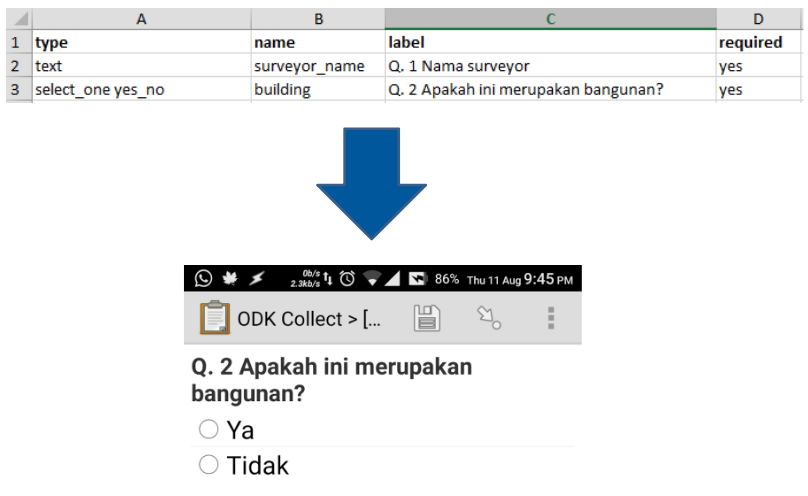

<i>Contoh format XLSForm</i>

_XLSForm_ ini kemudian akan diubah menjadi bentuk _XForm_, sebuah format standar yang bersifat terbuka, dimana format tersebut memungkinkan Anda untuk membuat sebuah formulir dengan fungsi yang sangat kompleks, seperti pertanyaan bertingkat, ke dalam format yang sudah dikenali oleh perangkat pengumpulan data baik itu dalam bentuk situs di internet, maupun dalam perangkat telepon genggam.

  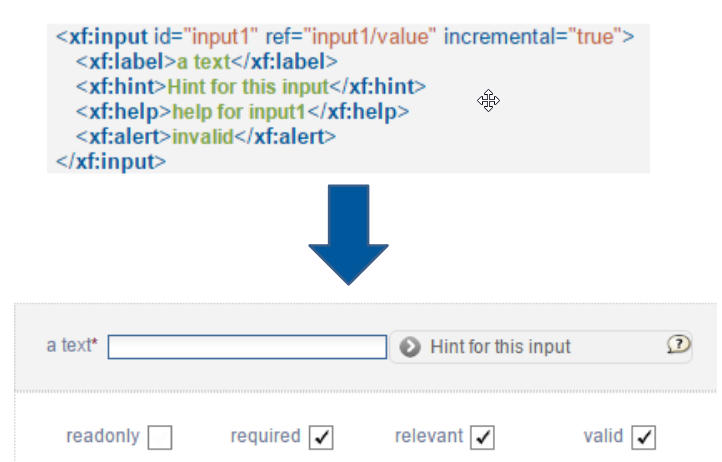

<i>Contoh format XForm</i>

Syarat utama dalam membuat _XLSForm_ adalah berkas akhir formulir survei Anda harus dalam jenis **Microsoft Excel** (format _.xls_ atau _.xls_). Apabila Anda membuat formulir survei menggunakan aplikasi lain seperti **Google Spreadsheet** atau **Libre Office**, Anda harus memastikan bahwa hasil akhir berkas tersebut disimpan dalam format _.xls_ atau _.xlsx_.

## **II. Pembuatan XLSForm untuk aplikasi ODK Collect** 

Anda tentunya sudah memahami cara penggunaan aplikasi _ODK Collect_ yang dijelaskan pada modul **Menggunakan aplikasi ODK Collect.** Semua pertanyaan yang muncul pada aplikasi _ODK Collect_ dibuat dalam format _XLSForm_. Saat ini kita akan mempelajari bagaimana cara membuat formulir survei sehingga bisa ditampilkan ke dalam aplikasi _ODK Collect_.

1. Format Standar

    Dalam pembuatan formulir survei ada beberapa ketentuan yang harus Anda ikuti agar formulir survei yang kita buat bisa diubah kedalam format _XForm_. Beberapa aturan yang harus diikuti untuk membuat formulir survei yang sesuai adalah:

    *   **Tiga lembar kerja/_sheet_ utama.**

    Pada dokumen _spreadsheet_ yang kita buat, harus terdiri dari 3 lembar kerja utama, yaitu lembar kerja yang bernama _**survey, choices, settings.**_ Penamaan lembar kerja ini harus sesuai dan tidak boleh salah karena nanti akan gagal pada saat meng-_upload_ formulir survei Anda.
    

      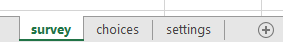
    

    
<i>Tiga Lembar Kerja Utama di setiap XLSForm</i>

    Lembar kerja pertama yaitu **_survey_.** Pada lembar kerja ini semua pertanyaan yang akan kita buat harus kita letakkan pada lembar kerja ini. Semua pertanyaan yang kita buat tidak perlu disertakan dengan daftar jawaban. Semua daftar jawaban yang kita butuhkan akan mengacu ke lembar kerja berikutnya.

    Lembar kerja kedua yaitu **_choices_**. Pada lembar kerja ini kita memasukkan semua daftar jawaban kita dari setiap pertanyaan yang membutuhkan pilihan jawaban. 

    Lembar kerja ketiga yaitu **_settings_.** Pada lembar kerja ini kita hanya dapat memasukkan nama formulir kita apabila nama formulir kita berbeda dengan nama berkas kita. Sebagai contoh, apabila nama berkas kita adalah _formulir_survei_air_bersih.xls_ maka pada lembar kerja ini kita bisa memberikan nama formulir kita dengan nama yang kita inginkan, misalnya _Formulir Kondisi Air Bersih_.

    *   **Tiga nama kolom utama.** 
    Pada setiap lembar kerja harus terdapat dua-tiga nama kolom yang berbeda di setiap lembar kerja. Nama kolom untuk masing-masing lembar kerja ini pun berbeda-beda.

        *   **Lembar kerja survey**

        Pada lembar kerja **survey** kita harus memasukkan tiga nama kolom yaitu **type, name, **&** label**. Kolom dengan nama **type** menunjukkan jenis pertanyaan yang akan muncul nantinya, apakah pertanyaan berbentuk pilihan, isian bebas ataupun mengambil lokasi. 

        Kolom dengan nama **name** menunjukkan variabel unik untuk setiap daftar pertanyaan. Variabel ini tidak boleh sama, tidak menggunakan spasi, dan hanya berupa angka, huruf atau garis bawah.

        Kolom dengan nama **label** menunjukkan tulisan pertanyaan yang akan muncul pada perangkat ponsel pengguna. Tidak ada format baku untuk kolom ini, Anda bebas menggunakan huruf, angka, dan karakter spesial pada kolom ini.
        

          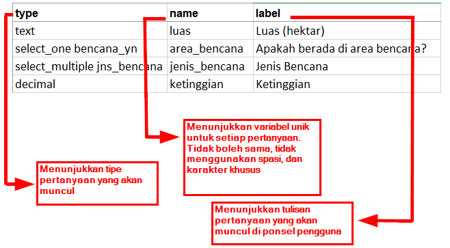
        

        
<i>Contoh kolom untuk lembar kerja survey</i>

        * **Lembar kerja choices**

        Pada lembar kerja **choices** kita harus memasukkan tiga nama kolom yaitu **list_name, name**, & **label.** Pada kolom **list_name** ini anda membuat sebuah grup yang berisikan sebuah set pilihan jawaban. Misalnya seperti sebuah set pilihan jawaban yang akan muncul dibawah pertanyaan pilihan ganda. Untuk penamaan pada variabel **list_name** ini harus mengikuti penamaan yang ada pada lembar kerja **survey**. Misalnya pada lembar kerja **survey** kita memasukkan tipe pilihan ganda dengan nama **select_one jns_bencana**. Maka pada lembar kerja **choices** kita harus mengisi **_list_name_** kita dengan nama **jns_bencana**. Ini akan dijelaskan lebih lanjut pada pembahasan berikutnya.

        Kolom dengan nama **name** memiliki aturan yang sama dengan kolom **name** pada lembar kerja **survey**. Semua harus dalam variabel unik yang tidak sama dengan yang lainnya baik pada lembar kerja **survey** maupun lembar kerja **choices**; tidak menggunakan spasi melainkan diganti dengan menggunakan garis bawah/_underscore_; dan tidak boleh menggunakan karakter spesial seperti tanda tanya, tanda seru, dsb.

        Kolom dengan nama **_label_** memiliki aturan yang sama dengan kolom **label** pada lembar kerja **survey**. Pada kolom ini berisikan teks jawaban yang akan muncul pada ponsel pengguna. Anda bisa bebas menggunakan spasi, karakter khusus maupun huruf pada bagian kolom ini.
        

          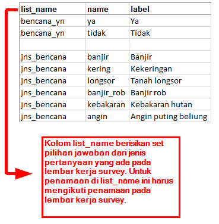
        

        
<i>Contoh penamaan kolom pada lembar kerja **choices**</i>

        *   **Lembar kerja settings**

        Lembar kerja **_settings_** digunakan apabila Anda ingin membuat pengaturan tambahan seperti memberikan nama formulir survei Anda, memberikan id formulir secara spesifik, dan versi formulir survei Anda. Agar dapat menggunakan fitur ini, Anda harus memberikan tiga nama kolom ini: **form_title, form_id,** & **version**. 
        Pada kolom **form_title,** Anda bisa memberikan penamaan yang bebas untuk formulir Anda. Penamaan ini yang nantinya akan muncul pada ponsel pengguna. 
        Sementara untuk kolom **form_id**, Anda bisa memberikan id formulir Anda. Syarat penamaan pada kolom ini adalah Anda tidak boleh memiliki id yang sama seperti formulir lainnya, tidak menggunakan spasi, dan tidak menggunakan karakter spesial.
        Untuk kolom **version**, Anda bisa memberikan versi formulir Anda. Penambahan kolom **version** ini tidak wajib. Apabila Anda sering menambah/mengubah formulir survei Anda, dengan memberikan kolom **version** ini, akan memudahkan Anda dalam mengunggah formulirnya pada server.
        

          
        

        
<i>Contoh penamaan kolom pada lembar kerja choices</i>

        *   **Semua isian harus dengan format standar dan dimulai dari kotak paling pertama.**

        Salah satu syarat yang paling utama adalah ketika kita membuat formulir survei, semua harus dimulai pada _field_/kuadran _**A-1.**_
        

          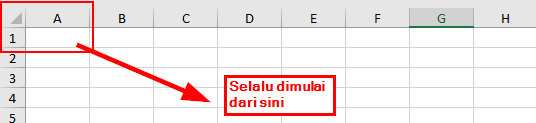
        

        
<i>Posisi awal membuat formulir survei</i>

        Semua isian formulir harus dimulai pada kuadran/_field_ tersebut karena nantinya sistem akan mengkonversi berkas _spreadsheet_ ini menjadi dalam bentuk _XForm_, sehingga apabila Anda tidak memulai dari posisi tersebut, akan terjadi _error_ pada sistem.
        
        Selain itu, syarat utama lainnya adalah tidak boleh menggunakan format tabel seperti contohnya _merge, center, hide row/coloum, wrap text,_ dsb. Semuanya harus dalam keadaan format standar. Pengaturan yang bisa kita gunakan adalah menambahkan huruf cetak tebal/**bold**, memberikan warna pada kolom atau baris, dan mengubah bentuk dan ukuran huruf.

2. Tipe-tipe Pertanyaan Standar

    Dalam formulir survei kertas, biasanya kita menemukan beberapa pertanyaan seperti jawaban singkat, jawaban panjang, memasukkan tanggal lahir, dan pilihan berganda. Beberapa pertanyaan tersebut, apabila kita buat dalam _spreadsheet_, memiliki tipe pertanyaan yang berbeda-beda, seperti: 
    *   Tipe pertanyaan **text**

        Tipe pertanyaan jenis ini akan menghasilkan format pertanyaan dengan jawaban bebas. Pengguna bisa dengan bebas memasukkan angka, huruf, dan karakter spesial apabila kita menggunakan tipe pertanyaan ini.
        

          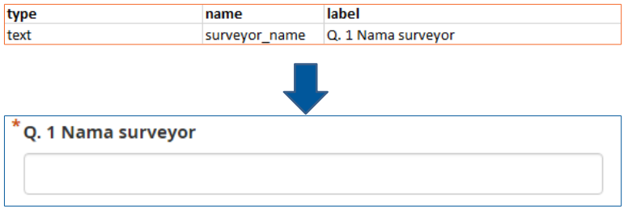
        

        
<i>Contoh tipe pertanyaan text</i>

    *   Tipe pertanyaan **integer/decimal**

        Tipe pertanyaan jenis ini akan menghasilkan format pertanyaan dengan jawaban berupa angka bilangan bulat (khusus untuk tipe **integer**) atau angka bilangan desimal (khusus untuk tipe **decimal**). Pengguna hanya bisa memasukkan angka saja dengan tipe pertanyaan ini, gabungan dari angka dan huruf tidak akan bisa dimasukkan apabila kita menggunakan tipe pertanyaan ini.
        

          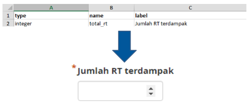
        

        
<i>Contoh tipe pertanyaan integer</i>

    *   Tipe pertanyaan **select_one**

        Tipe pertanyaan jenis ini akan memberikan pengguna sebuah pilihan jawaban dimana pengguna hanya boleh memilih satu jawaban saja. Dalam membuat tipe pertanyaan ini, Anda harus menggunakan format seperti **select_one [opsi]**. Dimana **[opsi]** merupakan variabel grup yang akan dimasukkan ke dalam lembar kerja **choices** di dalam kolom **list_name**.
        

          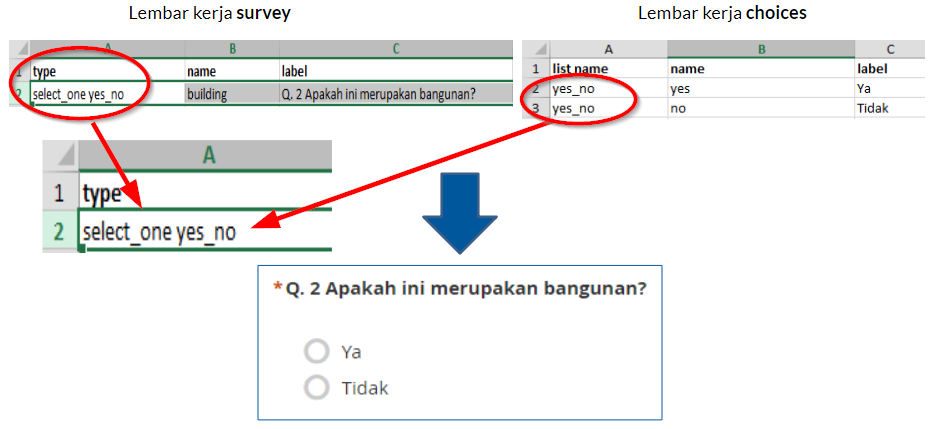
        

        
<i>Contoh tipe pertanyaan select_one [opsi]. Perhatikan bahwa pada  list_name sesuai dengan apa yang ada pada  [opsi] di lembar kerja survey.</i>

    *   Tipe pertanyaan **select_multiple**

        Tipe pertanyaan jenis ini sama seperti tipe pertanyaan sebelumnya. Jawaban yang disajikan ke pengguna merupakan beberapa pilihan dan pengguna boleh memilih lebih dari satu jawaban. Aturan dalam pembuatan tipe pertanyaan ini juga sama seperti **select_one**. Anda harus menggunakan format seperti **select_multiple [opsi],** dimana **[opsi]** merupakan variabel grup yang akan dimasukkan ke dalam lembar kerja **choices** dalam kolom **list_name**.
        

          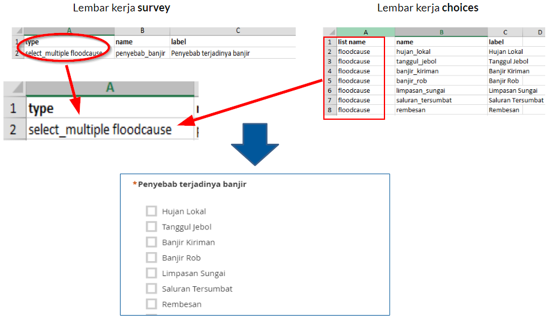
        

        
<i>Contoh tipe pertanyaan select_multiple [opsi]. Opsi pada gambar diatas adalah floodcause yang juga muncul didalam lembar kerja choices</i>

        
    *   Tipe pertanyaan **geopoint**

        Tipe pertanyaan ini akan meminta pengguna untuk merekam koordinat posisi mereka dan akan menghasilkan data berbentuk koordinat lintang dan bujur.
        

          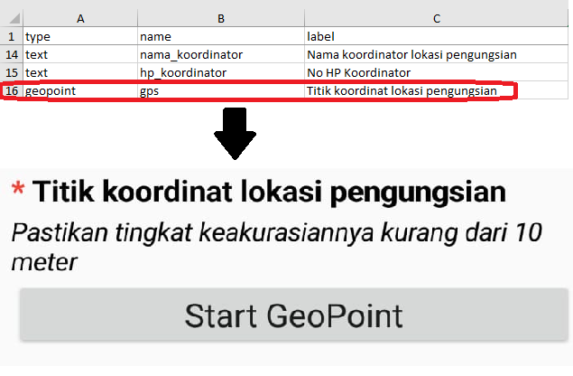
        

        
<i>Contoh penggunaan tipe pertanyaan geopoint</i>

    *   Tipe **note**

        Tipe ini digunakan untuk menambahkan halaman catatan atau pemberitahuan. Pengguna akan disajikan satu halaman yang berisikan tampilan tulisan saja tanpa harus mengisi informasi apapun. Untuk format penulisan masih mengikuti kaidah penulisan pada kolom **label**, dimana kita bebas memberikan format tulisan apapun.
    

      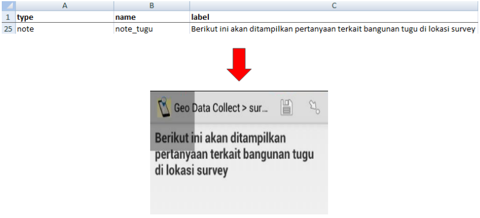
    

    
<i>Contoh penggunaan tipe note</i>

    
    *   Tipe **image, video** atau **audio**
        Tipe pertanyaan ini akan meminta pengguna untuk mengambil gambar, suara atau video. 
    

      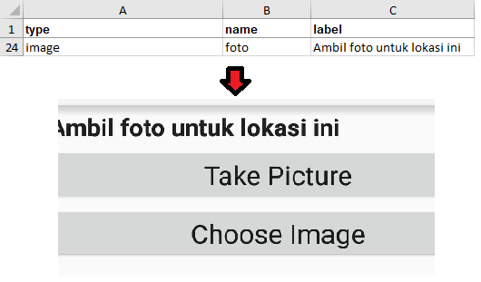
    

    
<i>Contoh penggunaan tipe image</i>

    

3. Format Tambahan

    Anda bisa langsung menggunakan formulir survei Anda hanya dengan memasukan beberapa tipe pertanyaan standar yang sudah dijelaskan sebelumnya. Semakin Anda mahir membuat _XLSForm_, Anda mungkin akan bertanya apakah ada tipe pertanyaan lain yang bisa membuat formulir survei Anda semakin mudah digunakan dan mengambil data sesuai kemauan Anda. Untuk melihat semua tipe pertanyaan yang bisa digunakan dalam membuat _XLSForm_, Anda bisa menuju situs [http://xlsform.org](http://xlsform.org). Pada materi ini, kita hanya akan membahas beberapa tipe pertanyaan tambahan yang bisa Anda gunakan apabila Anda ingin membuat formulir survei Anda menjadi lebih informatif dan mudah digunakan.

    *   **Hint**

        Hint merupakan salah satu fitur tambahan yang bisa kita tambahkan pada formulir survei digital kita. Dengan menggunakan fitur ini, kita bisa memberikan informasi tambahan atau petunjuk tentang bagaimana cara mengisi sebuah pertanyaan yang kita buat. Untuk membuat fitur ini, kita harus menambahkan kolom baru pada lembar kerja **survey** yang bernama **hint**. Dengan menambahkan kolom ini, setiap tipe pertanyaan yang kita buat, bisa kita tambahkan dengan petunjuk informasi pengisian dengan mengisi pada kolom **hint** ini.
        

          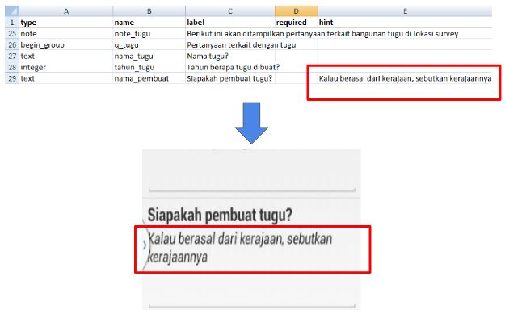
        

        
<i>Contoh penggunaan kolom hint</i>

    *   **Required**

        Fitur ini dibutuhkan apabila pada formulir survei Anda, terdapat pertanyaan yang wajib untuk dijawab. Dengan menggunakan fitur ini, pengguna tidak akan bisa mengisi pertanyaan selanjutnya apabila mereka belum menjawab pertanyaan tersebut. Tipe pertanyaan yang menggunakan fitur ini juga akan memiliki tanda bintang berwarna merah ( * ) apabila dilihat pada ponsel Anda. Untuk menggunakan fitur ini, Anda cukup membuat sebuah kolom baru yang bernama **required** yang terletak pada lembar kerja **survey**. Setiap tipe pertanyaan yang Anda akan atur menjadi wajib, harus anda tambahkan nilai **yes** pada kolom required ini.
        

          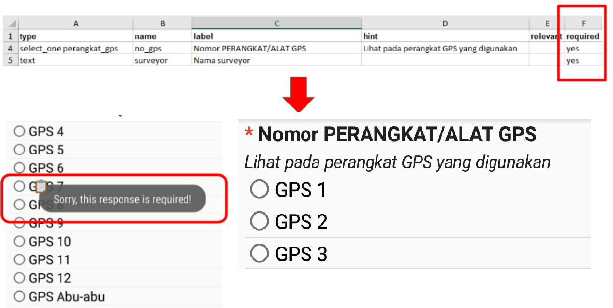
        

        
<i>Contoh penggunaan fitur required. Setiap pertanyaan yang mengaktifkan fitur ini tidak dapat dilewati oleh pengguna apabila belum diisi</i>

    *   **Field-list**

        Fungsi dari fitur ini adalah pengguna akan disajikan beberapa pertanyaan pada **satu halaman saja** pada layar aplikasi. Secara pengaturan awal, setiap halaman hanya akan disajikan satu pertanyaan saja. Apabila kita ingin agar semua pertanyaan muncul pada satu halaman, maka kita harus menggunakan fitur ini.
        Untuk mengaktifkan fitur ini, Anda harus melakukan beberapa pengaturan:
        1.  Anda harus menyelipkan format **begin_group** pada bagian awal pertanyaan yang ingin Anda tampilkan ke dalam satu halaman dan **end_group** pada bagian akhir pertanyaan yang ingin Anda tampilkan dalam satu halaman. Format **begin_group** dan **end_group** ini harus berada di dalam kolom **type**. Dengan menyelipkan format ini, sistem akan membaca bahwa semua pertanyaan yang berada setelah format **begin_group** dan sebelum format **end_group** merupakan satu grup pertanyaan.
        2. Setelah anda membuat grup pertanyaan tersebut, Anda harus menambahkan kolom **appearance** dan disikan dengan format **field-list**. Dengan menambahkan kolom tersebut, Anda memberitahukan kepada sistem bahwa semua grup pertanyaan yang telah Anda buat, akan dimasukkan ke dalam daftar satu halaman saja.
        

          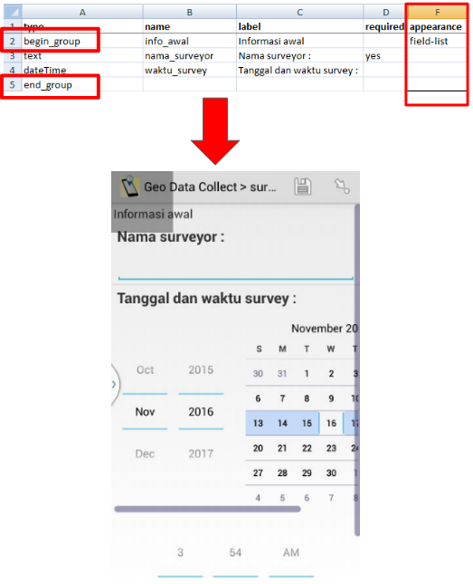
        

        
<i>Contoh penggunaan fitur field-list pada beberapa kelompok pertanyaan</i>

    *   **Relevant**

        Fitur ini memungkinkan kita untuk  membuat daftar pertanyaan yang mengikuti jawaban dari pertanyaan sebelumnya. Misalkan kita diberikan pertanyaan mengenai “Apa makanan yang kamu suka?” dengan pilihan jawaban “A. Nasi Goreng B. Pizza C. Mi Goreng”. Apabila kita menjawab “B. Pizza”, maka pertanyaan berikutnya hanya akan berkaitan dengan pizza, misalnya seperti “Topping pizza apa yang kamu suka?” atau “Jenis pizza apa yang kamu suka?”. Pertanyaan tersebut tidak akan muncul apabila kita menjawab dengan jawaban lain selain pizza. Cara memasukkan fitur **relevant** terdiri dari beberapa tahapan:
        1. Membuat tipe pertanyaan awal
        
            Sebelum menggunakan fitur **relevant**, Anda terlebih dahulu harus membuat pertanyaan Awal yang akan Anda masukkan kedalam format fitur **relevant**. Misalnya dengan menggunakan tipe pertanyaan **select_one**:
        

          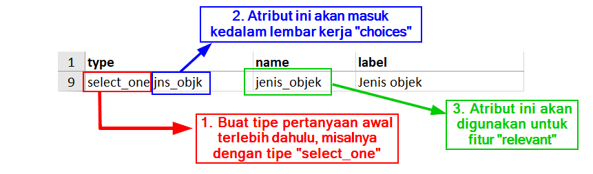
        

        
<i>Contoh pertanyaan pada lembar kerja survey</i>

        2. Membuat pilihan jawaban pada lembar kerja **choices**
        
            Setelah Anda membuat pertanyaan awal, langkah selanjutnya adalah Anda harus membuat pilihan jawaban pada lembar kerja **choices**.
        

          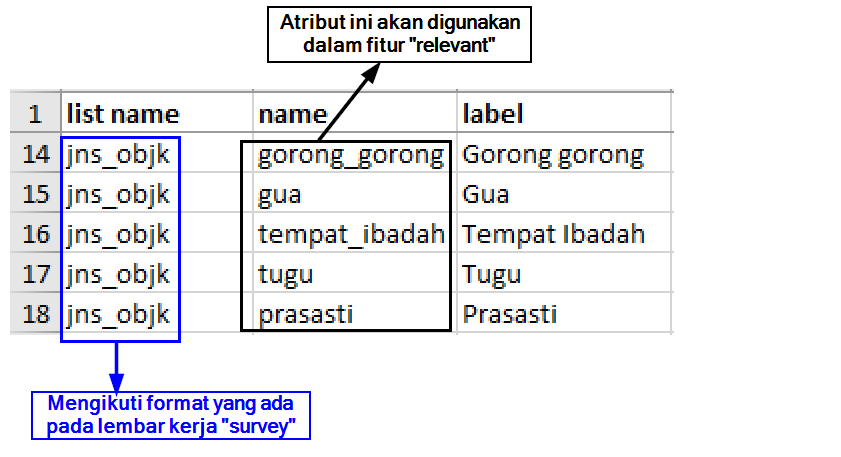
        

        
<i>Contoh pilihan jawaban pada lembar kerja choices</i>

        3. Memasukkan fitur **relevant** pada pertanyaan selanjutnya
        
            Setelah Anda membuat pertanyaan awal dan pilihan jawaban, langkah selanjutnya adalah Anda akan membuat pertanyaan yang akan muncul sesuai dengan pilihan jawaban yang dipilih pada pertanyaan sebelumnya. Misalnya, pada pertanyaan sebelumnya, Anda memilih **prasasti** untuk jenis objek yang dimaksud, maka pada pertanyaan berikutnya akan spesifik mengenai **prasasti** saja. Untuk mengaktifkan fitur ini, Anda harus memasukkan kolom tambahan yang bernama **relevant** pada lembar kerja **survey**. Setelah memasukkan kolom tambahan Anda bisa mengisi baris pertanyaan yang membutuhkan fungsi **relevant** dengan format:

            |Format                    | Deskripsi                           |
            |--------------------------|-------------------------------------|
            |${field_name} = ‘choice’  | Untuk tipe select_one saja          |
            |selected(${field_name}, ‘choice’) | Untuk tipe select_multiple & select_one|

            Untuk **field_name** mengacu kepada variabel yang Anda tentukan sebelumnya di kolom **name** pada lembar kerja **survey.** Sementara itu untuk **choice** mengacu kepada variabel pilihan jawaban yang tersedia pada lembar kerja **choices**.
            

              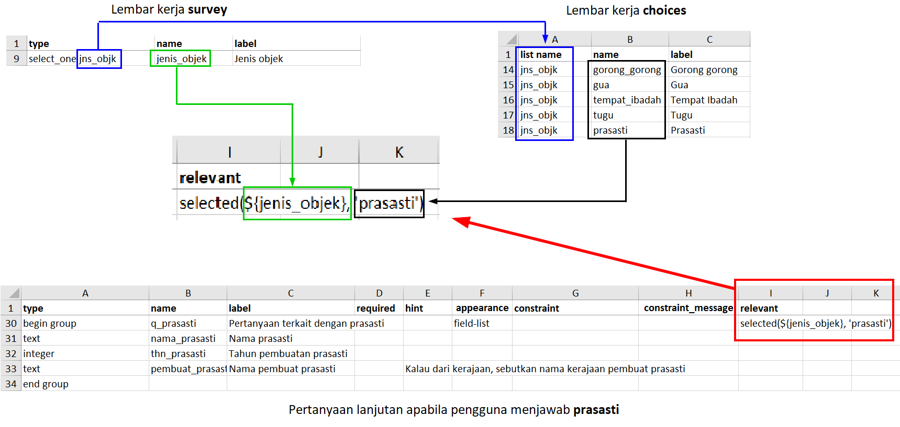
            

            
<i>Contoh pembuatan fitur relevant</i>

## III. Pembuatan form survey untuk aplikasi _OpenMapKit_

Selain menggunakan _ODK Collect_, untuk pengumpulan data di lapangan kita juga menggunakan _OpenMapKit_. Anda tentunya sudah memahami cara penggunaan _OpenMapKit_ untuk pengumpulan data di lapangan. Jika Anda belum mengetahuinya, Anda bisa membaca modul **Menggunakan Aplikasi OpenMapKit.** Sekarang kita akan belajar cara membuat formulir survei untuk digunakan di _OpenMapKit_.

Secara umum, pembuatan formulir survei untuk _OpenMapKit_ mengikuti aturan seperti formulir survei _ODK Collect_. Pembuatan formulir survei ini pun bisa dilakukan dalam berkas yang sama dalam pembuatan _ODK Collect_. Ada beberapa pengaturan standar yang harus kita ikuti agar formulir survei yang kita buat bisa digunakan untuk _OpenMapKit_.

1. Empat lembar kerja/_sheet _utama

    Secara umum, kebutuhan lembar kerja untuk membuat _OpenMapKit_ tidak jauh berbeda dengan format _ODK Collect_. Lembar kerja yang dibutuhkan oleh _ODK Collect_ adalah **survey, choices,** & **settings**. Namun untuk _OpenMapKit_, kita harus **menambahkan lembar kerja baru bernama** **osm**. 
    

      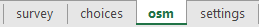
    

    
<i>Lembar kerja utama untuk OpenMapKit</i>

    Lembar kerja **osm** berisikan tentang pertanyaan dan pilihan jawaban yang akan muncul pada _OpenMapKit_. Pada lembar kerja inilah kita harus memasukkan semua daftar pertanyaan yang akan muncul di _OpenMapKit_. Sementara itu, tiga lembar kerja lainnya mengikuti pengaturan dalam pembuatan _ODK Collect_.

2. Tipe pertanyaan utama

    Agar pertanyaan yang kita buat berhasil dimunculkan ke dalam _OpenMapKit_, kita harus memasukkan tipe pertanyaan khusus, yaitu **osm**. Dengan memasukkan pertanyaan ini ke dalam lembar kerja **survey**, sistem akan memunculkan semua pertanyaan di _OpenMapKit_ yang telah kita buat pada lembar kerja **osm**.
    Tipe pertanyaan ini harus diikuti dengan variabel yang nantinya akan terhubung dengan variabel yang ada pada kolom **list name** di lembar kerja **osm.**
    

      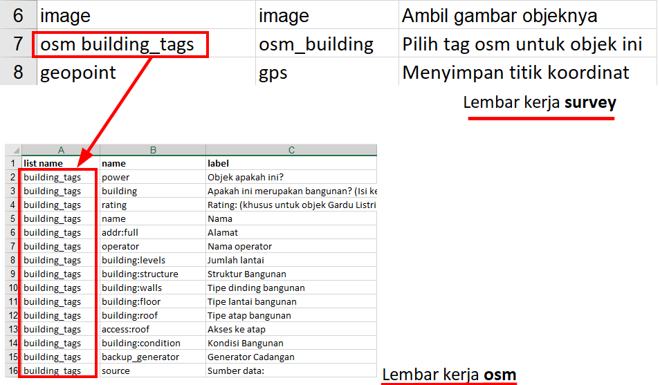
    

    
<i>Tipe pertanyaan osm dengan variabel yang sama di lembar kerja osm</i>

3. Tiga kolom utama

    Pada lembar kerja **osm**, kita harus memasukkan tiga kolom utama, yaitu kolom **list name**, **name**, dan **label**. Kolom **list name** berisi tentang pertanyaan dan pilihan jawaban. Kolom **name** berisi tentang variabel unik yang mengikuti standar _key_ dan _value_ dari _OpenStreetMap._ Untuk daftar _key_ dan _value,_ Anda bisa melihat pada modul **Model Data _OpenStreetMap_** atau bisa langsung menuju situs [https://wiki.openstreetmap.org/wiki/Map_Features](https://wiki.openstreetmap.org/wiki/Map_Features) dan [https://wiki.openstreetmap.org/wiki/Id:Indonesian_Tagging_Guidelines](https://wiki.openstreetmap.org/wiki/Id:Indonesian_Tagging_Guidelines).
    

      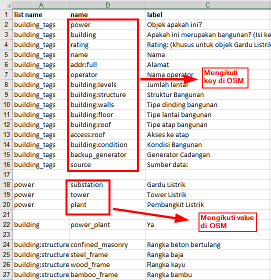
    

    
<i>Kolom **name** mengikuti aturan key dan value pada OSM</i>

4. Pertanyaan dan pilihan jawaban didalam satu lembar kerja

    Tidak seperti pembuatan formulir survei untuk _ODK Collect_ yang setiap pertanyaan dan pilihan jawaban terpisah pada lembar kerja berbeda, untuk pembuatan formulir survei _OpenMapKit_ ini kita harus memasukkan semua pertanyaan dan pilihan jawaban di dalam satu lembar kerja.

## IV. Latihan Membuat Formulir Survei _ODK Collect_ dan _OpenMapKit_

Sampai saat ini kita sudah memahami bagaimana cara membuat formulir survei untuk aplikasi _ODK Collect_ dan _OpenMapKit_. Sekarang kita akan mencoba membuat formulir survei yang bisa digunakan untuk kedua aplikasi ini.

Bayangkan Anda saat ini ingin melakukan kegiatan pengumpulan data tempat ibadah dengan menggunakan _ODK Collect_ dan _OpenMapKit_. Beberapa data yang Anda ingin kumpulkan adalah:

*   Nama _surveyor_
*   Berada di lokasi rawan bencana atau tidak
*   Koordinat titik lokasi obyek survei
*   Nama tempat ibadah
*   Jenis agama untuk tempat ibadah

Dari data tersebut, Anda berhasil mengidentifikasi mana saja jenis pertanyaan yang masuk ke dalam formulir survei _ODK Collect_ dan mana saja jenis pertanyaan yang masuk ke dalam formulir survei _OpenMapKit_. Pertanyaan yang masuk kedalam _ODK Collect_ adalah **nama surveyor, rawan bencana,** & **koordinat titik lokasi obyek survey**. Sementara itu pertanyaan yang masuk ke dalam _OpenMapKit_ adalah **nama tempat ibadah** & **jenis agama untuk tempat ibadah**. 

Pertama-tama, kita harus membuat formulir survei untuk _ODK Collect_. Seperti syarat yang sudah Anda pelajari sebelumnya, dalam berkas _spreadsheet_ kita harus dibuat empat lembar kerja, yaitu **survey, choices, settings** & **osm.**

Setelah itu, pada lembar kerja **survey** kita harus memberikan kolom utama kita, yaitu kolom **type, name** & **label**. Jenis tipe pertanyaan yang harus kita buat untuk formulir survei ini adalah **text, select_one** & **geopoint**. 
    

      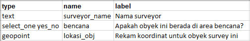
    

    
<i>Tipe pertanyaan untuk lembar kerja **survey**</i>

Pada lembar kerja **choices **kita memasukkan pilihan jawaban untuk tipe pertanyaan **select_one **yang sudah kita buat pada lembar kerja **survey**. Disini kita harus membuat tiga kolom utama yaitu **list_name, name, **& **label**.
    

      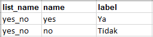
    

    
<i>Pilihan jawaban yang dimasukkan pada lembar kerja choices_</i>

Karena kita ingin menggunakan _OpenMapKit_ untuk pengumpulan data lapangan kita, kita harus menambahkan tipe pertanyaan yang nantinya akan mengarahkan kita ke aplikasi _OpenMapKit_, tipe pertanyaan yang harus kita masukkan adalah **osm**. Pada lembar kerja **osm **kita memasukkan semua pertanyaan yang berkaitan dengan _OpenMapKit_. Pada variabel **name** kita harus mengacu kepada _key_ dan _value_ di wikipedia _OpenStreetMap_.
    

      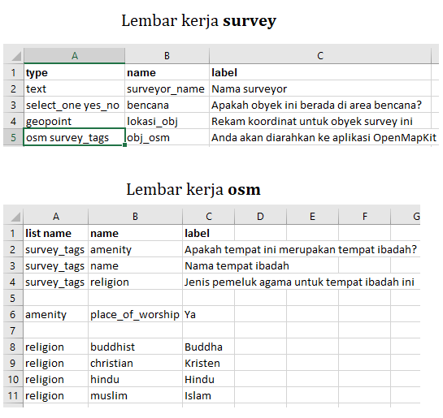
    

    
<i>Isi lembar kerja survey dan osm</i>

Terakhir, pada lembar kerja **settings** kita memasukkan id formulir kita dan judul formulir kita. Pada lembar kerja ini, hanya dibutuhkan dua kolom utama, yaitu **form_id** dan **title.**
    

      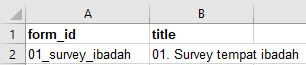
    

    
<i>Contoh pengaturan pada lembar kerja settings</i>

**RINGKASAN**

Selamat! Saat ini Anda telah berhasil membuat formulir survei untuk aplikasi _ODK Collect_ dan _OpenMapKit_. Untuk lebih mengetahui jenis pertanyaan yang dapat dibuat pada _ODK Collect_, Anda bisa langsung mengakses halaman [http://xlsform.org](http://xlsform.org). Pembuatan formulir yang tepat akan memudahkan para surveyor dalam mengumpulkan data di lapangan.

